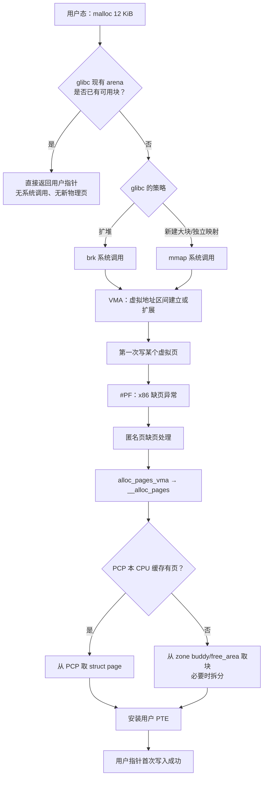
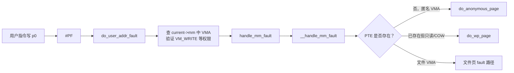
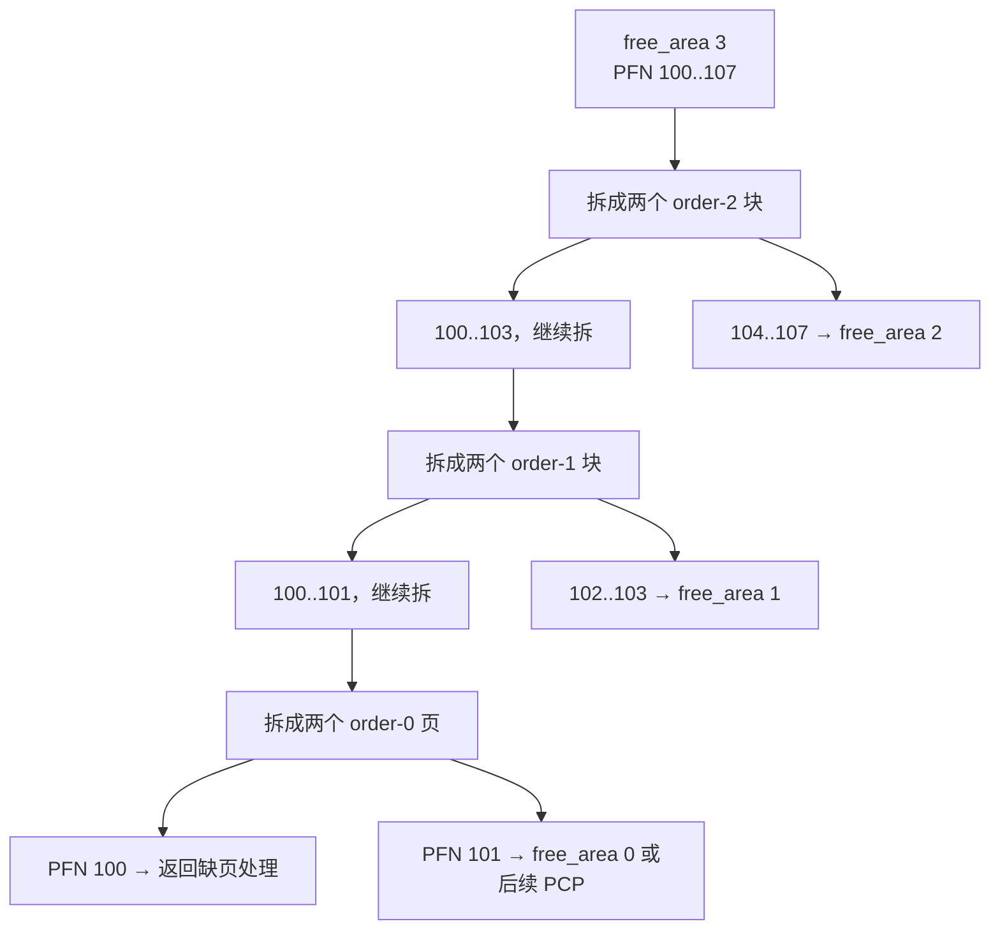
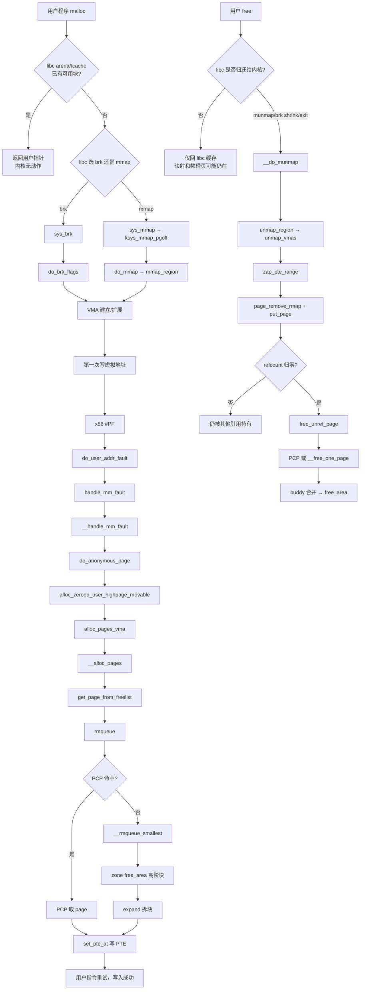

# 从用户态 `malloc` 到 buddy：内存申请与释放

> [!abstract] 这一篇解决什么问题
>
> 你已经理解了启动期如何建立 `pgdat → zone → free_area[]`、`zonelist[]` 与 `PFN → struct page`。下一步是理解：一个普通用户进程（例如 Bash 启动的程序）要一块内存时，这些结构怎样真正被使用；它释放后，页又怎样回到 PCP 或 buddy。

> [!warning] 先纠正一个直觉
>
> `malloc()` **不是内核系统调用**，也不等于“立刻拿到物理页”。它先是 libc 的用户态分配器动作；内核通常先只记录一个虚拟地址区间（VMA）。普通匿名页多在**第一次访问，尤其第一次写入**时，因缺页异常才向 buddy 申请物理页。

---

## 0. 先建立三层模型

同一句“申请 12 KiB 内存”，会依次经过三个不同层次；不要把它们压成一个动作。



| 层次 | 关键对象 | 这个层次回答什么 |
|---|---|---|
| libc | arena、tcache、heap、mmap 阈值 | 应用拿到哪一段用户虚拟地址？ |
| 虚拟内存 | `mm_struct`、`vm_area_struct`、页表 | 这个地址是否合法、可读写吗？ |
| 物理页分配 | `zonelist`、`zone`、PCP、`free_area[]`、`struct page` | 第一次触页时，到哪个 node/zone 拿哪一页？ |

本仓库是内核源码树，不包含 glibc 的 `malloc` 实现。因此本文把 libc 当作入口边界，之后每一步都对应本仓库中的代码。

---

## 1. 先用一个具体场景贯穿全文

用户程序：

```c
char *p = malloc(12 * 1024);
p[0] = 'A';
p[8192] = 'B';
free(p);
```

假设：普通 4 KiB 页面、匿名私有映射、没有 `mlock`、没有 THP、默认 NUMA 内存策略。则 `p[0]` 与 `p[8192]` 分别可能触发两次匿名页缺页；每次通常申请一个 order-0 页。

> [!tip] 这不是唯一结果
>
> libc 可能已经缓存了块，因此 `malloc`/`free` 可能完全没有系统调用。透明大页、`calloc`、`fork` 后写入、文件映射、`MAP_POPULATE`、内存压力和 NUMA policy 都会改写局部路径。本文先建立最常见的普通匿名页主线，再在后面列出分支。

---

## 2. 第一阶段：`malloc` 先得到的是虚拟地址，不是物理页

### 2.1 libc 到内核的两条入口

glibc 对“要向内核要更多地址空间”通常有两类方式：

```text
小块或 heap 扩展：malloc → brk(new_end)
较大独立块：     malloc → mmap(MAP_PRIVATE | MAP_ANONYMOUS, ...)
```

这不是固定大小阈值：glibc 的 arena、tcache、碎片状态、版本与运行历史都会影响选择。不要把“128 KiB 必走 mmap”当作内核规则。

### 2.2 `brk`：扩展进程 heap 的边界

x86-64 的 `mmap` 系统调用入口在 [arch/x86/kernel/sys_x86_64.c](/Users/xuyu/Desktop/code/linux5.15_comment/arch/x86/kernel/sys_x86_64.c:90)，而 `brk` 的通用实现位于 [mm/mmap.c](/Users/xuyu/Desktop/code/linux5.15_comment/mm/mmap.c:192)。其关键骨架如下：

```c
SYSCALL_DEFINE1(brk, unsigned long, brk)
{
        struct mm_struct *mm = current->mm;
        ...
        newbrk = PAGE_ALIGN(brk);
        oldbrk = PAGE_ALIGN(mm->brk);

        if (oldbrk == newbrk) {
                mm->brk = brk;
                goto success;
        }

        if (brk <= mm->brk) {
                mm->brk = brk;
                ret = __do_munmap(mm, newbrk, oldbrk-newbrk,
                                  &uf, true);
                ...
        }

        if (do_brk_flags(oldbrk, newbrk-oldbrk, 0, &uf) < 0)
                goto out;
        mm->brk = brk;
}
```

这里的 `mm->brk` 是逻辑 heap 末端。向上增长时 `do_brk_flags()` 建立或扩展一段匿名 VMA；向下缩小时才可能进入 `__do_munmap()`，拆掉页表映射并释放相关页。

### 2.3 `mmap`：新建一段独立 VMA

`mmap` 最终进入 [do_mmap()](/Users/xuyu/Desktop/code/linux5.15_comment/mm/mmap.c:1404)，再进入 [mmap_region()](/Users/xuyu/Desktop/code/linux5.15_comment/mm/mmap.c:1716)。对匿名私有映射，它会创建 `vm_area_struct`：

```c
addr = get_unmapped_area(file, addr, len, pgoff, flags);
...
vm_flags = calc_vm_prot_bits(prot, pkey) |
           calc_vm_flag_bits(flags) |
           mm->def_flags | VM_MAYREAD | VM_MAYWRITE | VM_MAYEXEC;
...
vma = vm_area_alloc(mm);
vma->vm_start = addr;
vma->vm_end = addr + len;
vma->vm_flags = vm_flags;
vma->vm_page_prot = vm_get_page_prot(vm_flags);
...
vma_set_anonymous(vma);
vma_link(mm, vma, prev, rb_link, rb_parent);
```

此刻通常成立的是：

```text
VMA 已存在：地址范围、权限、匿名属性已记录
PTE 多数仍不存在：该虚拟页还没对应具体 PFN
struct page 尚未分配：buddy 还可能完全没被碰到
```

这正是“虚拟内存承诺”和“物理内存实际占用”不同的地方。

---

## 3. 第二阶段：第一次写入触发 x86 缺页

假设 `p[0] = 'A'`。CPU 用该虚拟地址查页表，发现末级 PTE 不存在，于是产生 `#PF`。

### 3.1 x86 入口到通用 MM

入口是 [do_user_addr_fault()](/Users/xuyu/Desktop/code/linux5.15_comment/arch/x86/mm/fault.c:1220)。它先确认地址、权限、异常上下文与 VMA，随后调用：

```c
fault = handle_mm_fault(vma, address, flags, regs);
```

调用位置在 [arch/x86/mm/fault.c](/Users/xuyu/Desktop/code/linux5.15_comment/arch/x86/mm/fault.c:1397)。通用入口 [handle_mm_fault()](/Users/xuyu/Desktop/code/linux5.15_comment/mm/memory.c:4773) 再进入 `__handle_mm_fault()`，沿 PGD/P4D/PUD/PMD/PTE 的层级走到缺失层。



本文主线进入匿名页函数 [do_anonymous_page()](/Users/xuyu/Desktop/code/linux5.15_comment/mm/memory.c:3715)。

### 3.2 第一次读与第一次写不完全相同

对匿名私有内存，首次**只读**可能映射共享 zero page；首次**写**需要一个可写的私有物理页。因为我们的场景是 `p[0] = 'A'`，会走物理页申请。

匿名页函数中的关键调用是：

```c
page = alloc_zeroed_user_highpage_movable(vma, vmf->address);
if (!page)
        goto oom;
...
entry = mk_pte(page, vma->vm_page_prot);
entry = pte_sw_mkyoung(entry);
if (vma->vm_flags & VM_WRITE)
        entry = pte_mkwrite(pte_mkdirty(entry));
set_pte_at(vma->vm_mm, vmf->address, vmf->pte, entry);
```

来源：[mm/memory.c](/Users/xuyu/Desktop/code/linux5.15_comment/mm/memory.c:3768)。这段做了两件完全不同的事：

1. `alloc_zeroed_user_highpage_movable()` 取得一个 `struct page *`，背后才会进入物理页分配器；
2. `set_pte_at()` 把该页的 PFN 写入当前进程的页表，使虚拟地址开始指向这个物理页。

> [!important] 一页的“归属”有两条关系
>
> `struct page` 记录“这个 PFN 属于哪个 node/zone、当前引用和状态如何”；PTE 记录“当前进程的哪个虚拟地址映射到这个 PFN”。前者启动期已建立基本身份，后者是缺页时才建立的进程映射关系。

---

## 4. 第三阶段：从 VMA 到 `zonelist`，再到 PCP/buddy

### 4.1 `alloc_zeroed_user_highpage_movable()` 的实际入口

该宏由 [arch/x86/include/asm/page.h](/Users/xuyu/Desktop/code/linux5.15_comment/arch/x86/include/asm/page.h:37) 提供，最终进入 `alloc_pages_vma()`。默认 NUMA policy 下，`alloc_pages_vma()` 位于 [mm/mempolicy.c](/Users/xuyu/Desktop/code/linux5.15_comment/mm/mempolicy.c:2070)，最终调用：

```c
page = __alloc_pages(gfp, order, preferred_nid, nmask);
```

因此本例的一次普通 4 KiB 匿名写缺页，可以先记为：

```text
do_anonymous_page()
  → alloc_zeroed_user_highpage_movable()
    → alloc_pages_vma(..., order = 0, VMA, address)
      → __alloc_pages(gfp, 0, preferred_nid, nodemask)
```

`alloc_pages_vma()` 的价值是：它不只是“给一页”，它会把 VMA 地址、NUMA policy、首选 node 和 nodemask 带入后续分配。

### 4.2 `__alloc_pages()`：构造分配上下文，扫描 zonelist

核心函数在 [mm/page_alloc.c](/Users/xuyu/Desktop/code/linux5.15_comment/mm/page_alloc.c:6644)。其正常快路径是：

```c
struct page *__alloc_pages(gfp_t gfp, unsigned int order,
                           int preferred_nid, nodemask_t *nodemask)
{
        ...
        ac = (struct alloc_context) {
                .zonelist = node_zonelist(preferred_nid, gfp),
                .nodemask = nodemask,
                .migratetype = gfp_migratetype(gfp),
                ...
        };
        ...
        page = get_page_from_freelist(alloc_gfp, order,
                                      alloc_flags, &ac);
        if (likely(page))
                goto out;
        ... /* 慢路径：回收、压缩、OOM 等 */
}
```

现在把初始化教程里的结构代回来看：

```text
preferred_nid
  ↓
node_zonelist(preferred_nid, gfp)
  ↓
NODE_DATA(nid)->node_zonelists[...]._zonerefs[]
  ↓
每一项 zoneref 指向一个已经存在的 struct zone
  ↓
zone->per_cpu_pageset 或 zone->free_area[]
```

`zonelist` 因此不是“页库”，而是一次分配的**候选 zone 搜索顺序**。

### 4.3 `get_page_from_freelist()`：逐个过滤候选 zone

[get_page_from_freelist()](/Users/xuyu/Desktop/code/linux5.15_comment/mm/page_alloc.c:5090) 会线性遍历 `ac->zonelist` 中的 `zoneref`。对每个候选 zone，它会考虑：

- GFP 标志允许的最高 zone；
- `nodemask` / cpuset 是否允许该 node；
- watermark 是否允许当前分配；
- 是否需要保留低端 zone；
- 本次请求的 `order`、迁移类型以及各种分配标志。

通过检查后，才调用：

```c
page = rmqueue(ac->preferred_zoneref->zone, zone, order,
               gfp_mask, alloc_flags, ac->migratetype);
```

所以一个 `GFP_KERNEL` 风格的普通用户匿名页，并不是固定“从 Normal 拿一页”。它先从本 node 的 zonelist 起点找，受 zone 类型、NUMA 距离、watermark、cpuset 等限制；Normal 不可用时，才按预建路线回退。

---

## 5. 第四阶段：为什么通常先经过 PCP，而不是 `free_area[]`

对于普通 order-0 页面，`rmqueue()` 优先走每 CPU 页缓存（PCP）。代码在 [mm/page_alloc.c](/Users/xuyu/Desktop/code/linux5.15_comment/mm/page_alloc.c:4517)：

```c
if (likely(pcp_allowed_order(order))) {
        page = rmqueue_pcplist(preferred_zone, zone, order,
                               gfp_flags, migratetype, alloc_flags);
        goto out;
}
```

PCP 的意义是避免每次 4 KiB 分配都争用 `zone->lock`。对某一个 CPU 来说，它先检查本 CPU、当前 zone、当前迁移类型对应的局部链表。

```mermaid
flowchart LR
    R[rmqueue order-0] --> PCP{当前 CPU 的 PCP list 有页？}
    PCP -- 有 --> TAKE[摘下一个 struct page
返回给缺页处理]
    PCP -- 空 --> REFILL[rmqueue_bulk：从 buddy 批量搬页进 PCP]
    REFILL --> BUDDY[zone->free_area[order]]
    BUDDY --> TAKE
```

PCP 取页的底层动作在 [__rmqueue_pcplist()](/Users/xuyu/Desktop/code/linux5.15_comment/mm/page_alloc.c:4168)：

```c
if (list_empty(list)) {
        alloced = rmqueue_bulk(zone, order, batch, list,
                               migratetype, alloc_flags);
        pcp->count += alloced << order;
        if (unlikely(list_empty(list)))
                return NULL;
}

page = list_first_entry(list, struct page, lru);
list_del(&page->lru);
pcp->count -= 1 << order;
return page;
```

这里的关键理解是：**PCP 不是另一种物理内存，它只是从 buddy 暂存到当前 CPU 的一小批空闲页。** 因而某页暂时在 PCP 时，你不会在 `zone->free_area[]` 里看到它。

---

## 6. 第五阶段：PCP 没页时，buddy 如何取块、拆块

当 PCP 无法满足请求，`rmqueue_bulk()` 会在锁保护下从 buddy 拿块。核心查找函数是 [__rmqueue_smallest()](/Users/xuyu/Desktop/code/linux5.15_comment/mm/page_alloc.c:2668)：

```c
for (current_order = order; current_order < MAX_ORDER;
     ++current_order) {
        area = &(zone->free_area[current_order]);
        page = get_page_from_free_area(area, migratetype);
        if (!page)
                continue;

        del_page_from_free_list(page, zone, current_order);
        expand(zone, page, order, current_order, migratetype);
        set_pcppage_migratetype(page, migratetype);
        return page;
}
```

它从所需 `order` 开始向上寻找最小可用块。如果找到了更大的块，调用 [expand()](/Users/xuyu/Desktop/code/linux5.15_comment/mm/page_alloc.c:2411) 把多余半块逐级放回较小 order 的空闲链表。

例如应用缺页需要一个 order-0 页，但 `free_area[0]` 空、`free_area[3]` 有 `[100,108)` 这 8 页块：

```text
拿到 order-3: [100,108)
拆为 order-2: 返回候选 [100,104)，把 [104,108) 放回 free_area[2]
拆为 order-1: 返回候选 [100,102)，把 [102,104) 放回 free_area[1]
拆为 order-0: 返回 PFN 100，把 [101,102) 放回 free_area[0]
```



buddy 返回的是块首页的 `struct page *`。对 order-0，它就是一个 4 KiB 页的描述符；对 order-k，它代表连续 `2^k` 页块的首页。

---

## 7. 第六阶段：安装 PTE，用户代码终于能写成功

拿到 `struct page *page` 后，匿名缺页路径会：

1. 清零页内容，满足匿名页首次可见为零的语义；
2. 建立匿名页反向映射关系；
3. 构造带 PFN、权限、young/dirty 位的 PTE；
4. 将 PTE 写入进程页表；
5. 更新 RSS、memcg 等统计；
6. 返回缺页异常，CPU 重试原指令。

因此用户代码中的这一句：

```c
p[0] = 'A';
```

看起来只是一条 store 指令，实际首次执行时可能完成：VMA 校验、物理页分配、页表写入、TLB 处理、页引用关系与统计更新。

但下一次写 `p[1]`，如果仍在同一 4 KiB 页内，就不会再申请物理页；PTE 已经存在。

---

## 8. 释放：先分清 `free()`、`brk` 收缩、`munmap()` 与进程退出

很多人会误以为：

```c
free(p);
```

必然立刻发生：`struct page → buddy free_area[]`。这通常不成立。

### 8.1 最常见：libc 自己缓存块

对小块，`free()` 常只把块还给 libc 的 tcache/arena。此时：

```text
用户程序不再使用这个块
但 VMA 仍存在
PTE 仍可能存在
物理页仍被该进程映射
内核不会立刻看到 munmap
```

这就是为什么程序 `free()` 后，RSS 不一定立刻下降。

### 8.2 真正释放虚拟映射：`munmap` 或 heap 收缩

较大的独立 mmap 块，glibc 可能调用 `munmap()`。`brk` 如果实际缩小 heap，也会进入相同的 `__do_munmap()` 核心路径。

主调用关系：

```text
munmap syscall
  → __vm_munmap()
    → __do_munmap()
      → unmap_region()
        → unmap_vmas()
          → zap_page_range()
            → zap_pte_range()
              → page_remove_rmap()
              → 延迟 TLB 回收收集 page
              → put_page()
```

`unmap_region()` 在 [mm/mmap.c](/Users/xuyu/Desktop/code/linux5.15_comment/mm/mmap.c:2640)，`__do_munmap()` 在 [mm/mmap.c](/Users/xuyu/Desktop/code/linux5.15_comment/mm/mmap.c:2796)。

真正逐个清 PTE 的代码在 [zap_pte_range()](/Users/xuyu/Desktop/code/linux5.15_comment/mm/memory.c:1304)，其匿名普通页关键片段是：

```c
ptent = ptep_get_and_clear_full(mm, addr, pte, tlb->fullmm);
tlb_remove_tlb_entry(tlb, pte, addr);
...
rss[mm_counter(page)]--;
page_remove_rmap(page, false);
...
__tlb_remove_page(tlb, page);
```

这一步应这样理解：

```text
清 PTE：进程虚拟地址不再指向该 PFN
清 rmap：这个 PFN 少了一个进程映射关系
减 RSS：该进程常驻页统计下降
延迟 TLB 处理：保证 CPU 不再缓存旧翻译后，才能安全回收
```

### 8.3 `put_page()` 后也未必回 buddy

`put_page()` 的含义是“放弃一个引用”。只有引用计数降到零，该页才可进一步释放。若页仍被另一个进程共享、被 GUP pin、在 page cache、被内核对象引用，物理页不能回 buddy。

普通匿名页最终释放的一条常见路径为：

```text
put_page_testzero(page)
  → __put_page(page)
    → __put_single_page(page)
      → free_unref_page(page, 0)
```

[__put_page()](/Users/xuyu/Desktop/code/linux5.15_comment/mm/swap.c:114) 会区分设备页、compound 页与普通页。批量释放页时，`release_pages()` 最终调用 `free_unref_page_list()`，见 [mm/swap.c](/Users/xuyu/Desktop/code/linux5.15_comment/mm/swap.c:879)。

`free_unref_page()` 通常优先把 order-0 页放回当前 CPU 的 PCP，而不是马上拿 `zone->lock` 放入全局 buddy；PCP 达到高水位或 CPU drain 时，才批量归还 buddy。

```mermaid
flowchart LR
    U[free / munmap / 进程退出] --> PTE[清 PTE 与 rmap]
    PTE --> RC{page refcount
是否变为 0？}
    RC -- 否 --> KEEP[仍被共享/引用
不能释放物理页]
    RC -- 是 --> PCP[free_unref_page
通常先回当前 CPU PCP]
    PCP --> DRAIN{PCP 是否需要 drain？}
    DRAIN -- 否 --> CACHE[暂存在 PCP]
    DRAIN -- 是 --> BUDDY[回 zone buddy]
    BUDDY --> MERGE[__free_one_page
寻找同阶伙伴并合并]
    MERGE --> FL[zone->free_area[]]
```

---

## 9. 最终回 buddy：伙伴合并发生在哪里

无论启动期 `memblock_free_all()` 还是运行期页释放，最终都可能进入 `__free_one_page()`。它检查 buddy：

```text
buddy_pfn = pfn XOR (1 << order)
```

只有满足至少这些条件时才能合并：伙伴 PFN 有效、在同一 zone、伙伴确实空闲、伙伴 order 相同、迁移类型兼容等。

```text
释放 PFN 100，order 0
伙伴 = 100 XOR 1 = 101

若 101 是同 zone 的 order-0 buddy 空闲页：
  合并成 [100,102)，order 1
  再看伙伴 = 100 XOR 2 = 102

若 102..103 又是同阶空闲 buddy：
  合并成 [100,104)，order 2
```

最终块首页挂入：

```text
zone->free_area[order].free_list[migratetype]
```

这时才回到了你已学习过的初始化结果：`free_area[]` 不再只是空链表，而是又有了真正可分配库存。

---

## 10. 一张完整主线调用图

下面这张图是本文的“背诵版”，覆盖普通匿名私有页、首次写入、order-0、最终真的发生 unmap 的场景。



---

## 11. 结构体在这条路径中的职责对照

| 结构 | 何时已存在 | 本文中何时使用 | 不要误解成 |
|---|---|---|---|
| `mm_struct` | `exec`/进程建立时 | `current->mm` 保存整个进程虚拟地址空间 | 一页物理内存 |
| `vm_area_struct` | `brk`/`mmap` 建立映射时 | 缺页时判断地址是否合法、可读写、匿名还是文件 | 已经分配的每一页 |
| `pg_data_t` / pgdat | 启动期 `alloc_node_data()` | `NODE_DATA(nid)` 提供 node 的 zone 和 zonelist | 页表 PGD |
| `struct zonelist` | 随 pgdat 内嵌；启动期 build 填充 | `__alloc_pages()` 决定搜哪些 zone | 页库存 |
| `struct zone` | 随 pgdat 内嵌；启动期初始化 | watermark、PCP、buddy `free_area[]` 的拥有者 | 一个固定物理连续区间总是全可用 |
| `struct page` | `sparse_init()` 准备 vmemmap 后备 | 缺页取得页、PTE 映射、引用计数、释放回收 | 物理页里的用户数据 |
| `pgd_t/pte_t` | 内核根页表早期已有；进程页表按需建立 | 将用户 VA 翻译到 PFN | pgdat 或 buddy 元数据 |

---

## 12. 你现在最该顺着读的函数顺序

不要试图从 `mm/page_alloc.c` 第一行读到最后一行。按下面顺序，每个函数只回答一个问题。

1. [mm/mmap.c: `SYSCALL_DEFINE1(brk)`](/Users/xuyu/Desktop/code/linux5.15_comment/mm/mmap.c:192) —— heap 扩展时，内核到底改了什么？
2. [mm/mmap.c: `do_mmap()`](/Users/xuyu/Desktop/code/linux5.15_comment/mm/mmap.c:1404) 与 [mmap_region()](/Users/xuyu/Desktop/code/linux5.15_comment/mm/mmap.c:1716) —— VMA 如何建立？
3. [arch/x86/mm/fault.c: `do_user_addr_fault()`](/Users/xuyu/Desktop/code/linux5.15_comment/arch/x86/mm/fault.c:1220) —— 缺页如何进入通用 MM？
4. [mm/memory.c: `do_anonymous_page()`](/Users/xuyu/Desktop/code/linux5.15_comment/mm/memory.c:3715) —— 匿名写缺页如何申请页、安装 PTE？
5. [mm/mempolicy.c: `alloc_pages_vma()`](/Users/xuyu/Desktop/code/linux5.15_comment/mm/mempolicy.c:2070) —— VMA 地址怎样影响 NUMA 首选 node？
6. [mm/page_alloc.c: `__alloc_pages()`](/Users/xuyu/Desktop/code/linux5.15_comment/mm/page_alloc.c:6644) —— zonelist 如何成为本次分配的路线？
7. [mm/page_alloc.c: `get_page_from_freelist()`](/Users/xuyu/Desktop/code/linux5.15_comment/mm/page_alloc.c:5090) —— zone 如何被逐个过滤？
8. [mm/page_alloc.c: `rmqueue()`](/Users/xuyu/Desktop/code/linux5.15_comment/mm/page_alloc.c:4517) —— 为什么普通页先走 PCP？
9. [mm/page_alloc.c: `__rmqueue_smallest()`](/Users/xuyu/Desktop/code/linux5.15_comment/mm/page_alloc.c:2668) 与 [expand()](/Users/xuyu/Desktop/code/linux5.15_comment/mm/page_alloc.c:2411) —— 高阶块怎样拆分？
10. [mm/mmap.c: `__do_munmap()`](/Users/xuyu/Desktop/code/linux5.15_comment/mm/mmap.c:2796) 与 [mm/memory.c: `zap_pte_range()`](/Users/xuyu/Desktop/code/linux5.15_comment/mm/memory.c:1304) —— 释放映射时如何清 PTE、降引用？
11. [mm/swap.c: `release_pages()`](/Users/xuyu/Desktop/code/linux5.15_comment/mm/swap.c:879) —— refcount 为零后怎样进入 `free_unref_page`？

---

## 13. 建议的调试实验：不要先对着 Bash 下断点

直接调 Bash 会遇到 shell 本身、动态加载器、readline、环境变量和 libc arena 的大量噪音。第一轮应该写一个极小程序：

```c
#include <stdlib.h>
#include <unistd.h>

int main(void)
{
        char *p = malloc(12288);
        p[0] = 1;
        p[8192] = 2;
        free(p);
        return 0;
}
```

观察时分三轮：

| 轮次 | 断点/观察点 | 想验证什么 |
|---|---|---|
| A | `do_mmap`、`SYSCALL_DEFINE1(brk)` | libc 这一次到底选了哪条虚拟地址路径？ |
| B | `do_user_addr_fault`、`do_anonymous_page` | `malloc` 返回后，第一次写是否才分配页？两次相隔 8 KiB 的写会否触发两次缺页？ |
| C | `__alloc_pages`、`rmqueue`、`__rmqueue_smallest` | 页面来自 PCP 还是 buddy；若进入 buddy，order 与 zone 是什么？ |

> [!note] 关于 `free()` 的实验预期
>
> 小块 `free()` 很可能根本不会命中 `__do_munmap()`。这不是实验失败，而是你亲眼验证了 libc 缓存与内核物理回收是两层事情。若想稳定观察 `munmap`，应使用更大的独立分配，或在程序里直接调用 `mmap` / `munmap`；但具体大小仍由 libc 和环境决定。

---

## 14. 本文主线之外的分支地图

| 场景 | 与本文主线的分叉点 | 下一步再学什么 |
|---|---|---|
| `fork()` 后子进程写页 | PTE 已存在但写保护 | `do_wp_page()`、`wp_page_copy()`、COW |
| 文件 `mmap` | `__handle_mm_fault()` 不进匿名页 | 文件系统 `->fault`、page cache |
| 申请失败 | `__alloc_pages()` 快路径失败 | `__alloc_pages_slowpath()`、watermark、direct reclaim、compaction、OOM |
| 透明大页 | PMD 级缺页或 hugepage 路径 | `do_huge_pmd_anonymous_page()`、split/collapse |
| NUMA policy | `alloc_pages_vma()` 改首选 node/nodemask | bind/interleave/preferred policy |
| 内核 `kmalloc` | 不经用户 VMA 和用户页表 | SLUB → `alloc_slab_page()` → buddy |

---

## 15. 学完这一篇应能回答的问题

- `malloc()` 返回成功，为什么 `free -m` 或 RSS 不一定立刻变化？
- `brk`/`mmap` 完成后，为什么还可能没有新的 `struct page` 被分配？
- 第一次写匿名页时，为什么会进入 x86 `#PF`？
- `zonelist`、`zone->free_area[]`、PCP 分别负责“找哪里”“全局库存”“本 CPU 快缓存”的哪一层？
- 为什么同一个 `free(p)` 有时只是 libc 缓存，有时会导致 `munmap → zap_pte_range → put_page`？
- 为什么清掉 PTE 后，物理页也不一定立刻回 buddy？

如果这些都能清楚回答，下一篇就应该进入 `__alloc_pages_slowpath()`：当 zonelist 上所有合格 zone 都拿不到页时，内核如何判断水位线、唤醒/等待 kswapd、直接回收、内存压缩以及最终 OOM。
