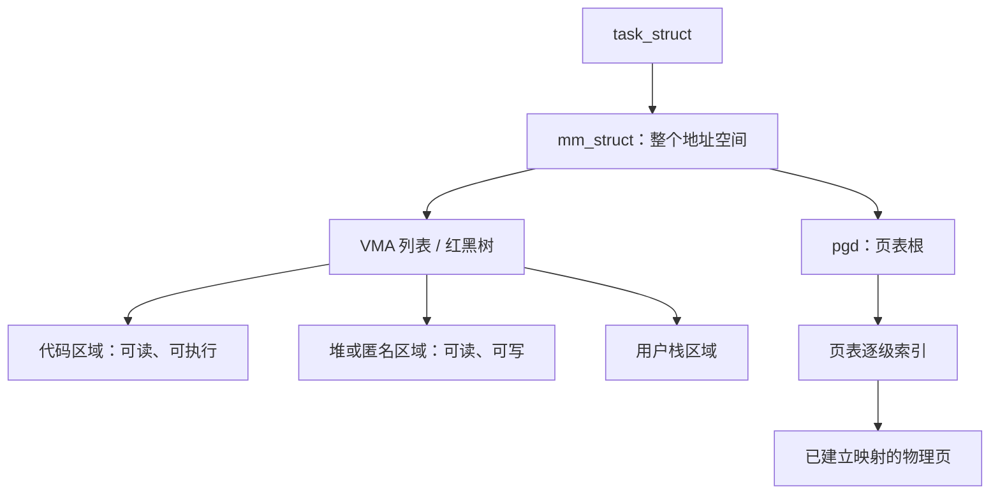
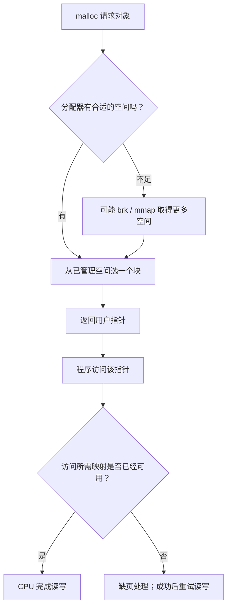
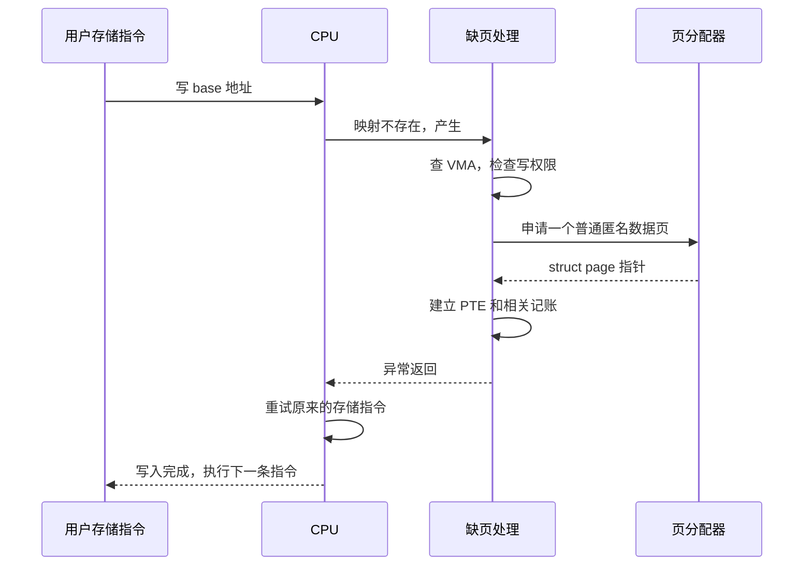
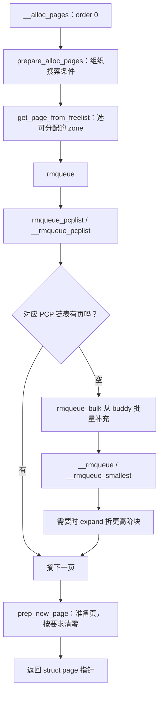
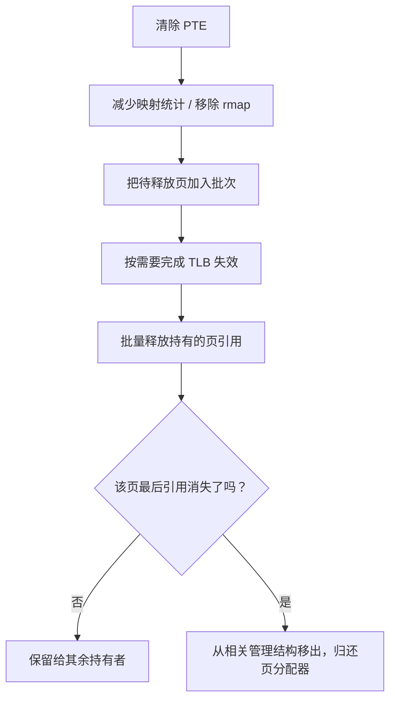
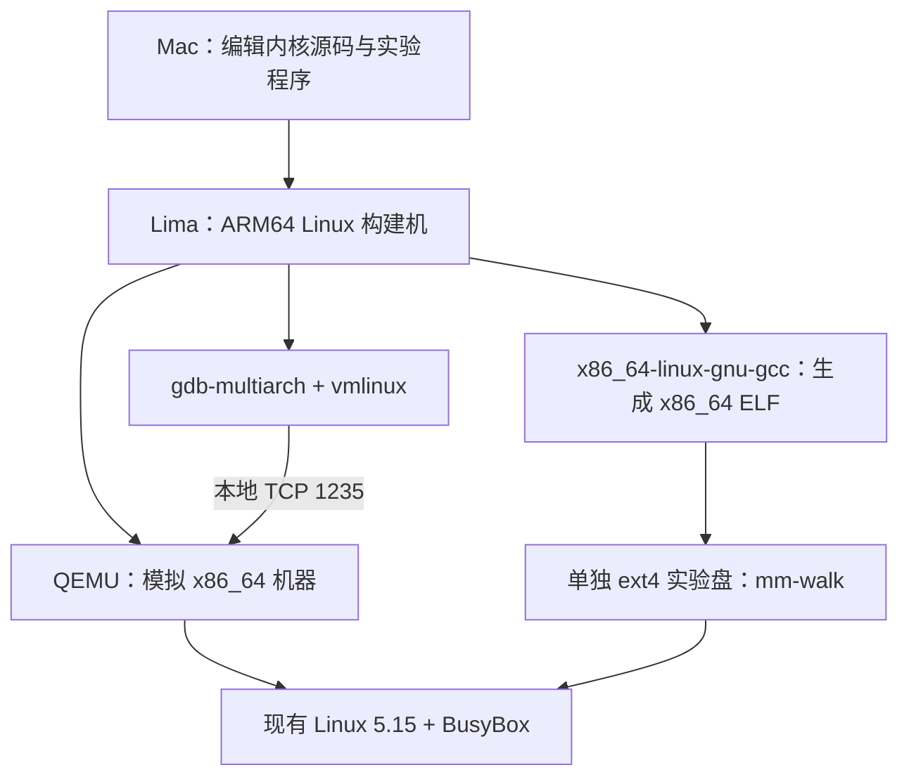

# 跟着一个小程序：从虚拟地址到物理页，再到释放

这篇接在 [内存初始化教程](MM-ZONE-BUDDY-INIT-STUDY.md) 后面。初始化回答“系统怎样把 RAM 组织成可分配的页”；这一篇回答“一个程序怎样用到那些页，又怎样归还”。旧文档保留，本篇可以独立阅读。

**主线只有五个动作：启动程序 → 取得地址 → 写这个地址 → 建立物理映射 → 释放。** 每走到一个动作，再引入它需要的数据结构，不要求你先背完全部结构体。

本文区分三种材料：标为“状态图”的箭头表示状态变化；标为“调用树”的缩进表示源码中的调用关系；标为“摘录”的代码保留相关源码语句并省略旁支，不能当作完整函数复制编译。用户态分配器不在本内核仓库中，不把 glibc 的实现细节伪装成本仓库源码。

## 阅读路线与目录

第一遍读 1–8 节，只追问“这一步改变了什么”；第二遍用 9–11 节亲手做实验；第三遍用 12 节调用树和 13 节索引回到源码。第一次不要从总调用树开始逐行背。

| 章节 | 你要带着的问题 |
|---|---|
| [1. 五张连续照片](#s1) | 申请、使用、释放到底是不是一回事？ |
| [2. 程序出生时](#s2) | main 之前有什么？mm、VMA、PGD 是谁？ |
| [3. malloc 交给我什么](#s3) | 指针怎么选？arena 与缺页什么关系？ |
| [4. 先取得三页地址](#s4) | mmap、brk 怎样改变地址空间？ |
| [5. 第一次写入](#s5) | CPU 为什么进内核？缺页怎样找到 VMA？ |
| [6. 物理页从哪里来](#s6) | 初始化好的 node、zone、PCP、buddy 怎么用？ |
| [7. 把物理页接到地址上](#s7) | PTE、PFN、struct page 分别是什么？ |
| [8. 释放的三层含义](#s8) | free、munmap、归还 buddy 有什么不同？ |
| [9. 在现有环境中运行](#s9) | 在哪编译，怎样放进 QEMU？ |
| [10. 跟着 GDB 看](#s10) | 怎样只停在我的程序、我的地址上？ |
| [11. 练习与实测记录](#s11) | 如何判断自己真正理解了？ |
| [12. 核心调用关系全集](#s12) | 忘了某一步，从哪里往下追？ |
| [13. 源码定位表](#s13) | 结构体和关键函数放在哪？ |

<a id="s1"></a>
## 1. 先看五张连续照片

设程序要三个普通页，每页 4096 字节，合计 12288 字节。为了先看清内核，我们先直接使用 `mmap`；学完后再把 `malloc` 放回入口。

```c
/* 理解用核心片段；带错误处理和暂停点的完整程序在 user-memory/mm-walk.c。 */
unsigned char *p = mmap(NULL, 3 * 4096, PROT_READ | PROT_WRITE,
                       MAP_PRIVATE | MAP_ANONYMOUS, -1, 0);
p[0] = 'A';
p[8192] = 'B';
munmap(p, 3 * 4096);
```

假设成功返回 `p = 0x700000000000`。这是教学地址，每次运行以程序打印的地址为准。

```text
照片 S0：还没有调用 mmap
  进程已有代码、数据、栈等；本次待申请区间尚未由本次调用建立。

照片 S1：mmap 返回
  虚拟地址： [700000000000, 700000003000)  合法、允许读写
  数据页：   第0页 [尚无]  第1页 [尚无]  第2页 [尚无]

照片 S2：执行 p[0] = 'A'
  第0页虚拟地址 ──PTE──> 物理页甲，第一页第0字节变成 A
  第1页、第2页仍无独立数据页（本篇页号从 0 开始）。

照片 S3：执行 p[8192] = 'B'
  第0页 ──> 物理页甲     第1页 [尚无]     第2页 ──> 物理页乙
  甲、乙不要求在物理 RAM 中相邻。

照片 S4：munmap 返回
  本次区间不再属于程序；旧地址不能再解引用。
  已建立映射被拆除；满足释放条件的物理页可被重新分配。
```

这里的“尚无”专指**该虚拟页尚无独立匿名数据页**，不是说内核处理申请完全不花物理内存。VMA 元数据、页表、程序自己的栈都会用内存。


**本节要记住：申请地址范围、分配物理页、建立映射是可以分开发生的三件事。** 本篇主实验无 `MAP_POPULATE`、无 `mlock`，当前镜像关闭 THP。预先填充、共享映射、文件映射不套用这张简图。

<a id="s2"></a>
## 2. 程序出生时：不是等第一次 malloc 才有虚拟内存

### 2.1 在 shell 输入程序路径，发生什么

你在 shell 中运行 `/mnt/mm-lab/mm-walk`，shell 会安排执行这个 ELF 文件。常见过程涉及创建子进程，再执行 `execve`；具体 shell 可能用 fork、vfork 或优化后的 exec 路径，因此不把某一种写死。

`execve` 的关键是**换成新程序的地址空间与执行内容**，并非必须再创建一个新的 PID。内核根据 ELF 描述建立代码、数据等映射，准备栈上的参数和环境变量，最终让 CPU 到用户态入口执行。静态 C 程序还要经过 C 运行库启动代码，才到 `main`。

```text
shell 安排执行
  → execve 进入内核
  → 创建并准备新的 mm
  → ELF 加载器建立程序映射、准备栈
  → 安装新的进程地址空间
  → 用户态 _start / C 运行库启动
  → main
  → 你写的 malloc 或 mmap
```

上面是理解顺序，不是 ELF 加载器内部逐行顺序；例如临时栈的准备和新 mm 的安装都有自己的阶段。准确入口见第 12 节。

### 2.2 第一个结构：mm_struct，管理一个地址空间

内核用 `task_struct` 描述任务，普通用户任务的 `task->mm` 指向它使用的 `mm_struct`。同一进程的多个线程通常共享这个 mm，所以不要机械地理解成“每个线程一个 mm”。

在 [include/linux/mm_types.h](../../include/linux/mm_types.h) 的 `struct mm_struct` 中，先只读这些字段：

```c
/* 字段摘录，省略其他成员。 */
struct vm_area_struct *mmap;
struct rb_root mm_rb;
pgd_t *pgd;
/* 以下字段在结构体后部。 */
unsigned long start_brk, brk, start_stack;
```

| 字段 | 人话解释 | 不要混淆 |
|---|---|---|
| `mmap` | VMA 链表的入口 | 这是字段名，不是 mmap 函数 |
| `mm_rb` | 按地址查找 VMA 的红黑树 | 当前是 5.15，不是新版 Maple Tree |
| `pgd` | 这个地址空间的顶级页表入口 | 不是物理内存管理的 pgdat |
| `start_brk`、`brk` | brk 堆区域起点和当前边界 | 不代表全部 malloc 内存 |
| `start_stack` | 初始用户栈位置记录 | 不代表所有栈页已分配 |

`mm_alloc()` 在 [kernel/fork.c](../../kernel/fork.c) 分配 mm，随后调用同文件的 `mm_init()` 初始化，并由 `mm_alloc_pgd()` 分配页表根。**这里的 mm_init 是每个地址空间的初始化，与启动阶段 init/main.c 中同名的 mm_init 不是同一函数。**

### 2.3 第二个结构：VMA，描述一段“允许怎么用”的地址

`vm_area_struct` 也在 [include/linux/mm_types.h](../../include/linux/mm_types.h)。

```c
/* 字段摘录。 */
unsigned long vm_start;
unsigned long vm_end;
struct vm_area_struct *vm_next, *vm_prev;
struct rb_node vm_rb;
struct mm_struct *vm_mm;
pgprot_t vm_page_prot;
unsigned long vm_flags;
```

其中 `[vm_start, vm_end)` 是左闭右开区间。例如 `[0x1000,0x4000)` 包含三个 4 KiB 页，不包含 `0x4000`。`vm_flags` 描述读写执行等属性；`vm_mm` 指回所属地址空间。

VMA 本身是一小块**内核元数据**，它记录地址区间，不是那段用户内存的数据容器。一次 mmap 可能创建新 VMA，也可能与兼容的相邻 VMA 合并；一次 munmap 可能让一个 VMA 消失，也可能切掉其中一部分。



两条分支回答不同问题：**VMA 说“这个地址是否合法、权限是什么”；页表说“CPU 怎样把它翻译成物理地址”。** 合法 VMA 完全可以包含尚无有效 PTE 的页。

### 2.4 虚拟地址空间不是已经买下的整片 RAM

你可以把进程的虚拟空间想成一本有很多页码的目录。某些页码区间已登记用途；许多页码没有登记；登记过的页码也不要求现在都有物理页承载。

两个进程可以同时使用数值相同的虚拟地址，因为各自有不同页表。地址数值要结合“哪个进程的地址空间”才有意义。

**检查自己：main 开始前是否已有 mm、代码映射和用户栈？有。是否因此全部虚拟空间都有物理页？没有。**

<a id="s3"></a>
## 3. malloc 返回的究竟是什么：先把 arena 放对位置

### 3.1 返回的是一个指针值，不是一个内核结构体

```c
char *p = malloc(32);
```

成功时 `p` 保存可用于访问至少 32 字节的用户虚拟地址，例如 `0x5555555602a0`。程序可以访问 `p[0]` 到 `p[31]`。长度由你保留；指针值本身没有携带 VMA、物理页号或数组长度。失败返回 `NULL`。

假设指针数值如上：

```text
p          = 0x5555555602a0    一个虚拟字节地址
所在页起点 = 0x555555560000    按 4096 字节向下对齐
页内偏移   = 0x2a0
有效对象   = [p, p + 32)      不代表整个 4 KiB 页都归这个对象
```

编译器把 `p[0] = 'A'` 变成一条或若干条机器指令，最终的存储指令使用这个虚拟地址。正常翻译成功时，CPU 自己完成地址转换，不需要每次访问都调用内核。

### 3.2 arena 是用户态分配器的管理范围

glibc 把从系统取得的内存组织起来，按用户请求提供小块；arena 是其管理分配状态的概念，chunk 是它管理的块。不同 arena 和缓存的详细组织本轮不用背。

```text
一段已经由内核允许访问的用户地址区域
┌────────────────────────────────────────────────┐
│ 分配器元数据 │ 对象 A │ 空闲块 │ 对象 B │ 余量   │
└────────────────────────────────────────────────┘
                 ↑ malloc 返回对象可用部分的指针

内核主要看 VMA 和页，不会为这里每个小对象各建一个 VMA。
glibc 主要管理对象块，不会自己从 zone->free_area 中摘 struct page。
```

glibc 可能复用已有块，也可能扩展 brk 堆，或通过 mmap 取得区域；独立 mmap 大块与 arena 管理的小块不是同一种释放路径。选择阈值会受版本、运行历史和参数影响，不能把“超过固定多少字节必定 mmap”作为实验前提。此处用户态行为依据 [GNU Allocator 官方说明](https://www.gnu.org/software/libc/manual/2.35/html_node/The-GNU-Allocator.html)，本仓库不包含对应 libc 源码。

### 3.3 最关键：arena 复用和缺页不是二选一



这张图把“怎样选对象地址”和“怎样完成访问”分开。甚至 malloc 在返回前，为维护自己位于用户内存中的元数据，就可能已经访问过相关页并触发缺页。因此：

| 现象 | 可以得出的结论 | 不能得出的结论 |
|---|---|---|
| malloc 未调用新的 brk/mmap | 可能复用了已有空间 | 绝不发生缺页 |
| malloc 成功返回 | 得到了符合接口约定的对象地址 | 每个数据页都已驻留 |
| `p[0]` 没出现新缺页 | 本次访问的映射可用 | 后面所有页都可用 |
| free 后又拿到同一数值地址 | 分配器可能复用了块 | 旧对象仍然有效 |

曾经驻留的页未来也可能被换出；主实验没有内存压力，先不展开这一旁支。

### 3.4 地址是不是随机返回的

不是随便生成一个整数。用户态复用时，分配器从自己合法管理的范围中选块。需要新区域时，内核考虑已有 VMA、对齐、地址空间范围、地址提示以及布局策略，寻找可用区间。ASLR 影响布局中的基址，但不能绕过合法性和冲突检查。

`mmap(NULL, ...)` 表示没有指定优先地址，让内核选择；并不表示强制从零开始。非空普通地址参数一般是提示；本教程不使用会改变冲突处理语义的 `MAP_FIXED`。

此外，`nokaslr` 针对内核随机化，**不能据此推断用户进程地址固定**。本次两次启动的 mmap 地址实际不同。

### 3.5 为什么不用 malloc(12288) 直接演示“整整三个页”

malloc 指针通常不按页对齐。若返回页内偏移 `0x10`，长 `0x3000` 的对象覆盖 `[...0010,...3010)`，跨越四个虚拟页。glibc 元数据还可能提前触页。这会把你当前最想理解的规律遮住。

所以先用**页对齐的匿名 mmap**观察三页，再运行同一个程序的 malloc 模式理解差异。这不是换了学习目标，而是先把干扰因素拆开。

<a id="s4"></a>
## 4. S1：先取得一段地址，内核改变了什么

### 4.1 把 mmap 的参数读成人话

```c
mmap(NULL, 12288, PROT_READ | PROT_WRITE,
     MAP_PRIVATE | MAP_ANONYMOUS, -1, 0);
```

| 参数 | 本实验含义 |
|---|---|
| `NULL` | 让内核选择虚拟起点 |
| `12288` | 三个 4 KiB 页的长度 |
| `PROT_READ | PROT_WRITE` | 允许读、写，不要求可执行 |
| `MAP_PRIVATE` | 私有映射语义；以后若 fork，写入隔离另有 COW 机制 |
| `MAP_ANONYMOUS` | 没有普通文件作为数据来源，首次有效读取得零内容 |
| `-1, 0` | 匿名映射不指定文件，偏移为零 |

失败结果是 `MAP_FAILED`，不是 malloc 的 `NULL`。完整程序分别检查。

### 4.2 进入内核后，最重要的三个函数

入口在 [arch/x86/kernel/sys_x86_64.c](../../arch/x86/kernel/sys_x86_64.c)，再到 [mm/util.c](../../mm/util.c) 和 [mm/mmap.c](../../mm/mmap.c)。

```text
mmap 系统调用
  → ksys_mmap_pgoff
  → vm_mmap_pgoff：取得修改地址空间需要的锁
  → do_mmap：检查长度、确定地址、转换权限标志
  → mmap_region：建立或合并 VMA，更新地址空间记录
```

`do_mmap` 中，`get_unmapped_area()` 负责沿对应布局策略寻找区间。`mmap_region` 里，条件合适时 `vma_merge()` 复用邻居；否则 `vm_area_alloc(mm)` 创建描述对象，设置起止地址、权限，然后 `vma_link()` 挂入 mm 的索引。

```c
/* mmap_region 中的新 VMA 路径摘录；中间有其他分支和检查。 */
vma = vm_area_alloc(mm);
/* ... */
vma->vm_start = addr;
vma->vm_end = addr + len;
vma->vm_flags = vm_flags;
vma->vm_page_prot = vm_get_page_prot(vm_flags);
```

这一步完成后，“这个区间可以读写”已成立。本实验的数据页不在这里逐页申请，不会因为长 12288 就在 mmap_region 中循环取三页。

### 4.3 如果 malloc 选择 brk 呢

brk 路径移动 `mm->brk`，修改已有堆边界。源码在 `SYSCALL_DEFINE1(brk)`。

```c
/* brk 系统调用中的原语句摘录。 */
newbrk = PAGE_ALIGN(brk);
oldbrk = PAGE_ALIGN(mm->brk);
```

随后分三类：

| 情况 | 核心动作 |
|---|---|
| 新旧地址仍在同一个页对齐边界内 | 更新 brk 字节边界，不必改变 VMA |
| 堆增大并跨过页边界 | 检查范围，再 `do_brk_flags()` 建立或合并堆 VMA |
| 堆缩小并释放整页范围 | `__do_munmap()` 撤销相应区间 |

`do_brk_flags()` 也会尝试 `vma_merge()`，必要时 `vm_area_alloc()`。它为主线提供的是合法堆范围；通常仍不等于已经把所有匿名数据页放进页表。

注意 libc `brk` 包装与原始内核 brk 返回约定不同：内核通常返回实际堆边界，libc 包装将成功/失败转换成接口约定的结果。你学习 malloc 时先观察“堆边界是否变化”，无需自行调用原始 brk。

### 4.4 S1 后的结构快照

```text
mm
 ├─ VMA 索引：包含 [base, base+0x3000)，允许 R/W
 └─ pgd → 若干页表层次
          本次三个数据页的有效映射尚未建立

用户变量 p：只保存 base 这个数值
```

**检查自己：内核允许访问，为什么 CPU 还可能缺页？因为许可记录 VMA 和实际翻译页表不是同一张表。**

<a id="s5"></a>
## 5. S2：第一次写入，CPU 怎样找到内核

### 5.1 `p[0] = 'A'` 不是再次调用 malloc

当 CPU 执行存储指令时，先尝试地址翻译。TLB 未命中本身不等于缺页：CPU 可以遍历已有页表找到有效映射。只有遇到不存在的映射或权限等问题，才发生相应页故障。

本实验第一次写新匿名页时没有有效映射，x86 产生 `#PF`。故障地址由 CR2 提供，错误码说明是用户访问、写访问、映射不存在等。CPU 转到内核异常入口，而不是用户程序主动调用一个“缺页函数”。



### 5.2 先判断“该不该帮你补页”

[arch/x86/mm/fault.c](../../arch/x86/mm/fault.c) 的核心路径是：

```text
exc_page_fault
  → handle_page_fault
  → do_user_addr_fault
  → handle_mm_fault
```

`do_user_addr_fault` 查找包含故障地址的 VMA，处理地址范围和权限判断等。`find_vma` 返回的候选可能只是后面的 VMA，不能仅凭返回非空就认为地址被覆盖；内核还要检查边界，特定栈场景另有扩展处理。

合法的新匿名写入进入补页流程；越界或无写权限通常导致信号，不能理解成“缺页一定会给你分配一页，所以任意指针都能写”。

### 5.3 第三个结构：vm_fault，一次故障的工作单

`struct vm_fault` 位于 [include/linux/mm.h](../../include/linux/mm.h)。它把本次处理所需参数聚在一起：

| 成员 | 本次含义 |
|---|---|
| `vma` | 故障地址所属的合法区间 |
| `address` | 按页对齐后的故障虚拟地址 |
| `flags` | 写故障、用户故障等处理标志 |
| `pgoff` | 在映射中的页偏移信息 |
| `pmd`、`pte` | 正在操作的页表位置 |
| `ptl` | 修改 PTE 使用的锁 |

它通常是 `__handle_mm_fault()` 中创建的局部工作对象，不是永久记录一个进程所有故障的大表。

```c
/* __handle_mm_fault 的初始化摘录。 */
struct vm_fault vmf = {
    .vma = vma,
    .address = address & PAGE_MASK,
    .flags = flags,
    /* 其余字段见源码 */
};
```

`__handle_mm_fault` 找到并按需补齐上层页表，然后到 `handle_pte_fault`。本次既没有已有 PTE，也没有文件后端，因此选择 `do_anonymous_page()`。

### 5.4 匿名读和匿名写，需要分清

`do_anonymous_page()` 在 [mm/memory.c](../../mm/memory.c) 中含这段判断：

```c
/* 原条件及构造语句摘录。 */
if (!(vmf->flags & FAULT_FLAG_WRITE) &&
        !mm_forbids_zeropage(vma->vm_mm)) {
    entry = pte_mkspecial(pfn_pte(my_zero_pfn(vmf->address),
                                vma->vm_page_prot));
    /* ... 安装共享零页的映射 ... */
}
```

第一次只读，可以映射共享只读零页；以后写它还需要写保护处理，取得私有可写页。本实验**直接第一次写**，因此走分配私有匿名数据页的路径。不要把“首次访问”无条件替换成“必定申请自己的数据页”。

<a id="s6"></a>
## 6. 从故障处理到你已经学过的 buddy

### 6.1 真正申请匿名数据页的那行代码

在 `do_anonymous_page()` 中：

```c
page = alloc_zeroed_user_highpage_movable(vma, vmf->address);
if (!page)
    goto oom;
```

这个名字看起来很长，拆开读：为用户匿名内存申请一页、内容要清零、按可迁移页策略处理。它在 x86 上是宏，不是必须存在独立栈帧的函数：

```c
/* arch/x86/include/asm/page.h */
#define alloc_zeroed_user_highpage_movable(vma, vaddr) \
    alloc_page_vma(GFP_HIGHUSER_MOVABLE | __GFP_ZERO, vma, vaddr)
```

随后 [include/linux/gfp.h](../../include/linux/gfp.h) 把单页请求转换为 `alloc_pages_vma(..., 0, ...)`。**order=0 表示 2⁰=1 页，不是零页。** `__GFP_ZERO` 是清零要求，不是上节的“共享零页”。

这里数据页的标志是 `GFP_HIGHUSER_MOVABLE | __GFP_ZERO`。紧随其后的 `mem_cgroup_charge(..., GFP_KERNEL)` 是另一项记账操作，不能因看到它就把数据页申请标志写成 GFP_KERNEL。

### 6.2 NUMA 策略把请求交给页分配器

当前配置启用了 NUMA，`alloc_pages_vma()` 位于 [mm/mempolicy.c](../../mm/mempolicy.c)。它根据 VMA/进程内存策略确定偏好的 node 和允许节点集合，然后调用 `__alloc_pages()`。默认策略下先按本地偏好理解；并不是每次都扫描并选“剩余内存最多的节点”。

这时再想起初始化学过的对象：

| 对象 | 初始化时做什么 | 这次申请时做什么 |
|---|---|---|
| `pg_data_t / pgdat` | 描述 node，组织其中各 zone | 提供节点中的 zone、zonelist |
| `zonelist` | 建好可选 zone 的搜索顺序 | 按策略遍历候选 zone |
| `zone` | 建立区域管理结构、页数和水位等 | 判断此处能否满足分配 |
| `per_cpu_pages`，简称 PCP | 建立 CPU 本地页缓存 | 小阶分配优先从合适缓存取页 |
| `free_area[order]` | 各阶 buddy 空闲块链表 | 缓存不足时找块、拆块 |
| `struct page` | 为物理页建立描述信息 | 标记并跟踪这次分配出去的页 |

它们不是每次 malloc 时重新初始化一套。进程拥有自己的地址空间描述，物理页分配器是系统设施。

### 6.3 alloc_context：这次分配的搜索条件

`__alloc_pages()` 在 [mm/page_alloc.c](../../mm/page_alloc.c) 中创建局部 `struct alloc_context ac`；结构定义在 [mm/internal.h](../../mm/internal.h) 第 140 行。`prepare_alloc_pages()` 填好条件，例如 `zonelist`、`highest_zoneidx`、`nodemask`、`migratetype`、`preferred_zoneref`。

你可以把它看成“本次找页说明”：从哪里开始找、哪些 zone 合适、按哪类迁移属性寻找。它既不是 VMA，也不是页表，调用结束后不作为永久映射保存。

`get_page_from_freelist()` 遍历候选 zone、做水位等检查，并调用 `rmqueue()` 真正取页。看见名字 freelist，不要误以为它直接就从 buddy 摘一个节点；其中还会走 PCP。

### 6.4 PCP 命中与 buddy 补货



这是主线关系图；`rmqueue_bulk` 返回后还会把补货页挂入 PCP，再由 PCP 摘出请求页。一个程序只请求一页，也可能引起多页从 buddy 移到 PCP，所以 `/proc/buddyinfo` 的变化不必恰好等于程序数据页数量。

PCP 是每 CPU、每 zone 的管理机制，不是每个进程私有的缓存。教程独立启动器选一个 vCPU，方便你观察；原来的调试启动器仍保持原样。

### 6.5 buddy 拆块：用一个对齐正确的例子

假设 order 0、1、2 都没有合适块，但 order 3 有一块，从 **PFN 96** 开始。order 3 块有 8 页，起点必须按 8 页对齐；96 合法，100 不合法。

```text
起始：order 3  [96 97 98 99 100 101 102 103]

拆为两块 order 2：
  保留向下拆 [96 97 98 99]     右半 [100 101 102 103] 入 order 2

拆为两块 order 1：
  保留向下拆 [96 97]           右半 [98 99] 入 order 1

拆为两块 order 0：
  返回候选 [96]               右半 [97] 入 order 0
```

`__rmqueue_smallest()` 从请求阶开始向上找合适非空链表，取出块，再调用 `expand()` 拆到目标阶。上例解释的是**一次取块中的拆分**；实际 PCP 批量补货可能继续消耗其余小块，不保证函数返回后仍恰好保留图中的三个空闲块。

`free_area[order].nr_free` 数的是这一阶的块数；折算页数要乘 `2^order`。迁移类型维度先记为“同一阶还按用途性质分链表”，本轮不展开跨类型回退算法。

### 6.6 如果当前拿不到页

快速路径失败可能进入 `__alloc_pages_slowpath()`，涉及回收、重试等，也可能失败。申请物理页失败会影响故障结果。这是主线出口边界；本篇不展开回收、压缩、OOM 算法，避免把一条新手路线扩散成整个内存管理子系统。

**检查自己：第一次匿名写是否一定能看到 expand？不一定，PCP 可能有页，buddy 也可能已有目标阶块。**

<a id="s7"></a>
## 7. 有物理页还不够：把 PTE 建立起来

### 7.1 第四个结构：struct page，是描述页的，不是页内容

`struct page` 定义在 [include/linux/mm_types.h](../../include/linux/mm_types.h)。你在初始化时已接触过它：常规 RAM 页有对应描述信息，PFN 可以转换到描述对象。

现在只关注：

| 成员或概念 | 作用 |
|---|---|
| `flags` | 页状态等位信息 |
| `_refcount` | 引用计数，决定是否仍有人持有该页 |
| `_mapcount` | 普通页映射计数的内部存储，常规语义有偏置 |
| `lru` 等联合体成员 | 在不同生命周期用于链表组织，不能同时当作所有用途 |
| PFN | 物理页号，是索引概念，不是直接等于 struct page 地址 |

对普通页，内部 `_mapcount` 初始常为 `-1`，有效映射数量通常按其值加一理解。它和 `_refcount` 不是同一个数；“映射移除”不必然意味着“最后引用消失”。

```text
struct page 的内核地址：描述对象放在哪里
PFN：被描述的物理页是哪一页
PFN << PAGE_SHIFT：那一页的物理起始地址
用户指针：当前进程通过哪个虚拟地址访问它
```

### 7.2 页表页和用户数据页是两种用途

处理故障时，内核可能既要申请“放页表项的物理页”，又要申请“放 A、B 等用户数据的物理页”。`do_anonymous_page` 前部的 `pte_alloc()` 就是在按需准备页表层次。

因此单步进入 `__alloc_pages()` 后，先看调用栈和分配标志，确认是页表页还是我们想看的匿名数据页；不能把看到的第一笔物理页分配自动认作数据页。


图按 Linux 抽象层级画。四级硬件配置会折叠其中层次；这次现有镜像配合 `-cpu max` 实测 `__pgtable_l5_enabled = 1`，即启用五级页表。不要从“x86_64”三个字直接推出固定四级。主线的 4 KiB 数据页不因此改变。

### 7.3 do_anonymous_page 的后半段

取得已清零页后，代码准备 PTE，建立匿名页反向映射和统计，然后安装：

```c
/* do_anonymous_page 中按执行顺序摘录；省略锁、竞态重查和错误处理。 */
__SetPageUptodate(page);
entry = mk_pte(page, vma->vm_page_prot);
entry = pte_sw_mkyoung(entry);
if (vma->vm_flags & VM_WRITE)
    entry = pte_mkwrite(pte_mkdirty(entry));
/* ... */
inc_mm_counter_fast(vma->vm_mm, MM_ANONPAGES);
page_add_new_anon_rmap(page, vma, vmf->address, false);
lru_cache_add_inactive_or_unevictable(page, vma);
/* setpte: */
set_pte_at(vma->vm_mm, vmf->address, vmf->pte, entry);
```

读到这里先分四件事：**准备页状态 → 组成页表项 → 登记页的归属和统计 → 发布页表项**。`anon_vma`/rmap 为从物理页追溯映射提供组织信息，LRU 为以后回收做管理；这一遍知道其目的即可。

实际源码在页表锁下重查 PTE，防止另一个执行者已处理同一地址；失败和竞争路径会撤销多余分配。摘录没有表达全部并发条件，不能照它实现缺页函数。

### 7.4 用一个数算出“写到了哪里”

假设虚拟页 `0x700000000000` 对应 PFN `0x12340`：

```text
用户访问地址 = 0x700000000023
页内偏移     = 0x23
物理页基址   = 0x12340 << 12 = 0x12340000
实际物理地址 = 0x12340000 + 0x23 = 0x12340023
```

PTE 保存用于翻译的 PFN 和权限等编码，不是直接保存一个 C 语言 `struct page *`。上面的数值只用于算术演示，不是本次运行捕获的物理页号。

### 7.5 返回用户态，原来的指令重试

缺页处理成功返回后，CPU 重试原来的写指令。这一次翻译可用，A 才写进去。随后同页上的访问通常不再因“映射不存在”缺页；第三页第一次写仍需独立处理。

本路径源码特别注明新 PTE 原来不存在，无需因这次安装一概执行旧映射失效操作；不要背成“每装一个 PTE 都必须同样刷新 TLB”。撤销旧映射时的要求将在下一节出现。

<a id="s8"></a>
## 8. S4：释放到底释放哪一层

### 8.1 先看三种“归还”

| 操作 | 归还给谁 | 你能确定什么 |
|---|---|---|
| `free(p)` | 用户态分配器 | 对象生命周期结束，旧指针不可再使用 |
| `munmap(base,len)` | 撤销进程对区间的映射 | 区间被取消，关联映射拆除 |
| 页最终入 PCP/buddy | 系统页分配器 | 页满足重新分配条件 |

小块 free 常由分配器保留以便复用，VMA 和物理映射可能仍在；独立 mmap 块的 free 可以进一步触发 munmap。不要用“小块 free 没看到 munmap”判断释放代码没执行，也不要继续读写已 free 的对象验证它是否“还活着”。

### 8.2 本实验显式 munmap 的流程

`__do_munmap()` 先检查范围，必要时拆分首尾 VMA，把待撤销区间从 mm 的 VMA 索引中分离，然后调用 `unmap_region()` 处理映射，并释放相应 VMA 描述。

```text
munmap(base, 3*4096)
  → __vm_munmap
  → __do_munmap
       ├─ 边界检查、必要的 VMA 拆分、摘除
       ├─ unmap_region
       │    ├─ unmap_vmas：撤掉范围内的映射
       │    ├─ free_pgtables：清理可释放的页表层次
       │    └─ tlb_finish_mmu：完成批量 TLB / 页释放工作
       └─ remove_vma_list：释放撤销部分的 VMA 描述
```

如果只撤销中间一页，原来一个 VMA 可能变成左右两个。页表页可能仍服务邻近地址，所以不能说每次 munmap 都把沿途全部页表页和 pgd 释放掉。进程还在运行，它还需要其余地址空间。

### 8.3 第五个结构：mmu_gather，先集中收集，再安全归还

释放映射不是“清 PTE 后立刻把物理页丢给别的进程”这么简单。CPU 可能缓存着旧翻译。内核用 `mmu_gather` 组织本轮撤销需要的 TLB 处理、页与页表释放工作；结构定义见 [include/asm-generic/tlb.h](../../include/asm-generic/tlb.h) 第 252 行，相关实现见 [mm/mmu_gather.c](../../mm/mmu_gather.c)。

| 关键成员 | 本轮撤销时记录什么 |
|---|---|
| `mm` | 正在处理哪个地址空间 |
| `start`、`end` | 本轮需要处理的地址范围信息 |
| `fullmm` | 是否整个地址空间的撤销 |
| `freed_tables` | 是否涉及页表层次的释放 |
| `active`、`local`、`__pages` | 批量收集待释放页的组织和本地缓冲 |



批次满时也可以在遍历中刷新和释放，不一定全等到最后的 `tlb_finish_mmu`。

`zap_pte_range()` 的普通 present 页路径在 [mm/memory.c](../../mm/memory.c)：

```c
/* 有效普通页路径摘录。 */
ptent = ptep_get_and_clear_full(mm, addr, pte, tlb->fullmm);
tlb_remove_tlb_entry(tlb, pte, addr);
/* ... 排除没有普通 struct page 等情况 ... */
rss[mm_counter(page)]--;
page_remove_rmap(page, false);
if (unlikely(__tlb_remove_page(tlb, page))) {
    /* 批次需要刷新时的处理 */
}
```

本次第 1 个未写虚拟页没有对应私有数据页可退，不能因为区间长三页就说一定释放三页数据 RAM。

### 8.4 什么时候真正进入 PCP 和 buddy

普通页批量释放主路经过 `free_pages_and_swap_cache()`、`release_pages()`。后者检查引用，只有最后引用消失的适用普通页才进入待归还链表，再调用 `free_unref_page_list()`。

`free_unref_page_commit()` 把页挂到对应 PCP 链表并更新计数。达到回吐条件时，`free_pcppages_bulk()` 把一批页交给 `__free_one_page()` 做 buddy 合并。被隔离等特殊页另有旁路；本篇只跟常规页。

因此 **munmap 完成不等于你立刻在 buddy 某阶链表上看到那个页**。它可能在 PCP；全局还有其他分配与释放在发生。

还有一个调试陷阱：`release_pages()` 也用于释放 LRU 暂存引用。`unmap_region` 开头的 `lru_add_drain()` 就可能先触发一次。**命中 release_pages 不等于已经走到解除映射后的最终归还**，要看 `bt`。

### 8.5 buddy 合并：为什么不是把相邻页随便拼起来

同一阶伙伴计算的核心是：

```text
buddy_pfn = pfn XOR (1 << order)
```

例如页 96 在 order 0 的伙伴是 97，合并为 `[96,98)`；升到 order 1 后，伙伴块从 98 开始；再升到 order 2，伙伴块从 100 开始。只有伙伴空闲、阶数一致且满足 zone、隔离等约束时才继续合并。

```text
96 + 97             → order 1 块 [96,98)
[96,98) + [98,100)   → order 2 块 [96,100)
[96,100)+[100,104)   → order 3 块 [96,104)
```

这是满足条件时的算法例子，不承诺本次两个用户数据页刚好是伙伴，也不承诺 munmap 当场触发完整合并。

物理页释放后，原有 `struct page` 描述通常仍存在，只改变状态和链表归属；不是每次 free 都销毁它，下次再创建。进程级 VMA、mm 的释放与这一点要分开。释放也不应理解为“当场把 RAM 中每个旧字节擦成零”；本篇匿名分配要求零内容，由分配与映射路径保证新使用者应看到的内容。

### 8.6 程序退出时呢

即便忘记 free，进程地址空间在最后使用者退出时仍要回收。普通退出主线：

```text
do_exit → exit_mm → mmput
  → 最后一个 mm_users 消失时 __mmput
       → exit_mmap：撤销这个 mm 的全部用户映射
       → mmdrop：减少 mm 自身的引用
            → 最后引用时 __mmdrop：包括释放页表根与 mm
```

`exit_mmap()` 自己组织 `unmap_vmas / free_pgtables / tlb_finish_mmu`，**不是通过对全部范围调用 __do_munmap 来实现**。线程共享 mm 时，要看最后使用者，不能说任意线程退出都释放整个地址空间。

<a id="s9"></a>
## 9. 在你现有架构里编译、放入、启动小程序

### 9.1 先确认三层机器，避免编译错平台



当前目标系统启动的是 BusyBox `/bin/sh`，并没有完整 Bash、编译器或开发库。源码在 Mac 上可编辑，但不要用 Mac 默认编译器产出 Mach-O，也不要用 Lima 默认 ARM64 编译器产出 ARM64 ELF 给 x86_64 guest 运行。

实验使用静态 x86_64 ELF，把所需 C 运行库链接进去，不依赖目标根文件系统上已有动态加载器和 glibc 共享库。**不用为这个用户程序重编内核，更不用编成内核模块。**

### 9.2 本文配套文件

| 文件 | 用途 |
|---|---|
| [mm-walk.c](user-memory/mm-walk.c) | 两种模式、五个暂停点；volatile 写入，检查错误 |
| [build.sh](user-memory/build.sh) | 在已有 Lima 中静态交叉编译，生成独立 ext4 数据盘 |
| [run.sh](user-memory/run.sh) | 用现有 bzImage/rootfs 启动实验，可选 GDB 暂停模式 |

输出在 `out/x86-lab/user-memory/`：`mm-walk` 是带调试信息的可执行文件，`lab.ext4` 是装它的盘。磁盘没有分区表，因此 guest 挂载 `/dev/sdb`，不是 `/dev/sdb1`。

独立启动器的两块盘都使用 QEMU 临时快照，目标内修改不写回原镜像；实验盘在 guest 另以只读方式挂载。它使用 512 MiB、一个 vCPU、TCG 和现有内核，不改原 `direct` 启动器。退出 QEMU 后，下次需重新挂载。

### 9.3 第一步：在 Mac 终端构建

```bash
cd /Users/xuyu/Desktop/code/linux5.15_comment
$HOME/.local/bin/limactl start linux-x86-builder
bash tools/x86-lab/user-memory/build.sh
```

若实例已运行，可以跳过 start。现有 bootstrap 已准备交叉编译器、QEMU、e2fsprogs、gdb-multiarch；脚本不会替你安装软件。成功输出应含 `ELF 64-bit ... x86-64 ... statically linked ... debug_info`。

修改 mm-walk.c 后：先退出本实验 QEMU，重新执行 build，再启动。**不要为了换一个用户程序跑完整 build/build.sh**；后者还会重建根文件系统镜像，属于另一项工作。

### 9.4 第二步：在 Mac 终端启动

```bash
bash tools/x86-lab/user-memory/run.sh
```

等 BusyBox 的 `~ #` 提示符。此时键盘输入送给目标 x86_64 Linux。

### 9.5 第三步：在目标 Linux 中挂载并运行

```sh
mkdir -p /mnt/mm-lab
mount -o ro /dev/sdb /mnt/mm-lab
/mnt/mm-lab/mm-walk mmap
```

挂载的意义是把第二块盘的文件树接到 `/mnt/mm-lab`，不是把 C 源码“挂进内核”。执行 ELF 时，目标内核负责加载这个程序。程序已经在 Lima 编译好，目标内不用 gcc。

每次只按一次 Enter，读输出后再继续：

| 停在这里 | 已完成 | 下一次 Enter 将做什么 |
|---|---|---|
| S0 | 程序启动，尚未执行目标申请 | mmap 三页 |
| S1 | mmap 返回，打印 base/end/mincore | 写偏移 0 |
| S2 | 已写第一页 | 写偏移 2×页大小 |
| S3 | 已写第三页 | munmap |
| S4 | 已撤销目标区间 | 从 main 返回并退出 |

`resident pages [0,1,2]` 由 `mincore()` 查询，三位表示这三个虚拟页当时的驻留信息。它不会像读取 p 的内容那样替你先写入目标页。这里只在明确的匿名 mmap 场景使用它，不能把它当成所有场景下“私有页数量”或“缺页次数”的通用测量器。

程序中的打印、输入和 mincore 本身也会运行系统调用并使用其他内存，所以不要把整进程缺页计数全部归因于这两次写。

### 9.6 第四步：再运行 malloc 版本

```sh
/mnt/mm-lab/mm-walk malloc
```

它申请相同字节数，在相同偏移写入，最后 free。这里故意不对未页对齐的 malloc 对象直接使用上述 mincore 查询。观察返回指针的页内偏移，并在后面的 GDB 实验中看两次写是否真的缺页、free 是否进入 munmap；**不预设结果一定与 mmap 相同**。

### 9.7 想看 maps，前台程序又占着 shell 怎么办

第一次按前台步骤走完。第二次可使用一个命名管道给程序逐步送 Enter，让 shell 留在手上：

```sh
mkfifo /tmp/mm-step
exec 3<>/tmp/mm-step
/mnt/mm-lab/mm-walk mmap <&3 &
pid=$!
```

等 S0 出现，先 `cat /proc/$pid/maps`；用下列命令推进一次，再等对应阶段输出：

```sh
printf '\n' >&3
cat /proc/$pid/maps
```

S1 的 maps 中找**覆盖程序打印区间**的匿名可读写范围，可能与相邻兼容区域合并，不要求 maps 中恰好单独一行等于三个页。S1 到 S3 的 VMA 可以完全不变，但数据页驻留状态变化。S4 再看，目标区间已撤销。推进到退出后清理：

```sh
wait "$pid"
exec 3>&-
rm /tmp/mm-step
```

`cat` 自身也会启动进程和产生内存活动；观察目标 pid 即可，别以全局计数严格一一对应。该管道观察法是可选操作，不是首次实验前置条件。

这条观察法也已在当前 BusyBox 中跑通。一次 S1 实测输出中的目标行是：

```text
7f0ca6557000-7f0ca655a000 rw-p 00000000 00:00 0
```

起止地址相减为 `0x3000`，即三页。`r`、`w` 是可读可写，第三位 `-` 表示不可执行，`p` 表示 private，不是“物理页已经 present”。所以这行已经出现而 mincore 仍为 `000` 完全正常。S4、程序仍存活时，这一行已经消失，而代码、heap、stack 等映射仍然存在。

退出本实验 QEMU：按 `Ctrl-A`，松开，再按 `x`。这会结束该模拟器；临时快照里的改动随之丢弃，实验 ELF 与数据盘仍在 Mac 共享目录。

<a id="s10"></a>
## 10. 沿用现有 GDB：只跟踪我的地址

### 10.1 这次调的是内核，两个 ELF 不要选反

`out/x86-lab/vmlinux` 是内核符号文件；`out/x86-lab/user-memory/mm-walk` 是用户程序 ELF。观察 `handle_mm_fault`、buddy、munmap 时，加载前者。QEMU gdb stub 控制整台目标机，停下时 guest shell 也会停，这不是用户态 gdbserver 调试。

用户态 malloc 源码逐行调试还需要匹配 libc 源码/调试信息和适合的用户态调试环境；静态 ELF 带应用自己的 `-g3` 不代表系统 libc 也带完整源码级信息。本轮先把已可运行的**内核主线调试**做好。

### 10.2 双终端启动

先退出上一个实验 QEMU，避免重复运行。**Mac 终端 A**：

```bash
cd /Users/xuyu/Desktop/code/linux5.15_comment
bash tools/x86-lab/user-memory/run.sh --debug
```

启动会暂停，暂时没有正常内核启动日志，因为 `-S` 等待调试器。

**Mac 终端 B**：通过 Lima 运行调试器，端口不需要转发到 Mac。

```bash
cd /Users/xuyu/Desktop/code/linux5.15_comment
$HOME/.local/bin/limactl shell linux-x86-builder \
  gdb-multiarch -q out/x86-lab/vmlinux
```

随后在 **GDB 提示符**中输入：

```gdb
set pagination off
set substitute-path /home/xuyu.guest/x86-linux-lab-work/linux-src /Users/xuyu/Desktop/code/linux5.15_comment
target remote :1235
continue
```

上面的构建目录已与当前环境核对。若你以后换了 Lima 用户或内核构建目录，用 `info source` 看 DWARF 记录，调整替换规则。`.gdbinit` 自动加载被拒的提示不影响这里的基本命令，无需全局关闭 safe-path 保护。

原 IDE/CLion 工作流可以继续使用，但这个新启动器默认端口是 **1235**，没有为 Mac 建 SSH 隧道；若 IDE 在 Mac，需自行沿原 `direct/run-debug.sh` 的转发方式建立 1235 隧道。本篇实测路径是终端 B 中的 Lima GDB。不要把 Mac 的 localhost 与 Lima 的 localhost 混为一谈。

### 10.3 在 S1 才下条件断点，避开启动期海量缺页

回终端 A，挂载实验盘并运行 mmap 模式，S0 按一次 Enter，停在 S1。抄下打印的 base。

到终端 B 按 `Ctrl-C` 暂停目标。**把下面地址换成你这一次的实际 base**：

```gdb
set $base = 0x7feaa28af000
break handle_mm_fault if address == $base
continue
```

回终端 A，按一次 Enter 触发第一次写。此时 GDB 应命中。`address` 条件可以过滤绝大多数无关缺页；不同进程仍可能使用相同数值地址，首次命中要结合用户现场、VMA 和调用时机确认，得到 mm 后可用 mm 再限制后续断点。

```gdb
p/x address
p/x vma->vm_start
p/x vma->vm_end
set $mm = vma->vm_mm
p/x $mm->pgd
bt 5
```

你要回答：故障地址是否等于 base？它是否落在 VMA 中？栈里是否确实是 x86 用户地址缺页路径？不要只看函数名字。

### 10.4 进入匿名页处理，看到物理页描述对象

下面编号假设这是全新会话，刚才断点是 1；已有断点时先 `info breakpoints`，按实际编号调整。

```gdb
disable 1
break do_anonymous_page
continue
p/x vmf->address
p/x vmf->flags
```

确认地址仍是 base 后：

```gdb
disable 2
break mm/memory.c:3772
continue
p page
p page->_refcount
p page->_mapcount
```

当前源码中 3772 在数据页申请之后。本次优化内核将断点解析到了 3783 行 `mk_pte` 附近，仍能观察局部 `page`。这比从外面无条件断 `__alloc_pages` 更容易确认“拿到的是本次匿名数据页”。

在这个时刻，新页可能已有引用但还没添加用户映射，所以 `_refcount=1`、`_mapcount=-1` 并不矛盾。你停在流程的哪一行，决定应该看到哪一种状态。

想继续深入 PCP/buddy，可在另一次运行命中 do_anonymous_page 后，先在 `alloc_pages_vma` 下断点，再沿 `__alloc_pages → get_page_from_freelist → rmqueue` 单步。宏和内联函数不一定有独立断点位置；先用 `info functions`、`list` 确认，再按源码行停。不要一次启用所有高频页分配断点。

### 10.5 继续到同一个区间的释放

在上一步停止处保存好 `$mm`、`$base` 后：

```gdb
disable 3
break __do_munmap if mm == $mm && start == $base
continue
```

回终端 A，等出现 S2 后按 Enter 写第三页；等 S3 后再按 Enter 释放。GDB 命中后：

```gdb
p/x start
p len
bt 5
```

长度应是 12288，起点应是 base。随后根据问题选择 `unmap_region`、`zap_pte_range` 或 `tlb_finish_mmu` 往下跟。不要把任意一次 release_pages 停止都当作最后归还，见第 8.4 节。

观察完 `disable breakpoints`、`continue`，让终端 A 走完 S4。退出 QEMU 后 GDB 连接会结束，再 `quit` 退出调试器。只退出 GDB而不继续目标，可能让目标停留在暂停状态。

### 10.6 常见卡点对应表

| 现象 | 先检查 |
|---|---|
| A 中没有启动日志 | `--debug` 正在等待 GDB 的 continue |
| `target remote` 连不上 | 是否在 Lima GDB、是否端口 1235、QEMU 是否仍运行 |
| 断点停在 current.h | 优化和内联导致源码位置映射，检查函数名、参数与 bt；不一定走错 |
| 局部变量 `<optimized out>` | 换到有效作用域/源码行；不能以此认定变量不存在 |
| 没有名为 `current` 的变量 | current 是内核宏；先用已取得的 vma->vm_mm，不直接 `p current` |
| 每次继续都停在别的页申请 | 缩小断点时机，先定位本次 do_anonymous_page；页表也会分配页 |
| 改了 C 程序但 guest 还是旧输出 | 退出 QEMU、build 实验盘、重新启动挂载 |
| ELF 明明存在却无法执行 | 确认 x86_64 ELF、静态链接、正确盘与路径，不拿 ARM/Mac 文件运行 |
| 旧指针还能读到值 | free 后这样验证违反对象生命周期，不是正确性证据 |

不要在首次触页之前用调试器反复读写用户缓冲区。调试器检查用户地址的行为与正常程序访问不同，也容易扰乱你想观察的时间顺序。先看 VMA、地址数值与故障现场。

<a id="s11"></a>
## 11. 本次实测记录，以及怎样学到“能自己解释”

### 11.1 已实际验证的内容（2026-09-07）

使用仓库已有 Linux 5.15 镜像、Lima 的 x86_64 交叉编译器，静态程序以 `-Wall -Wextra -Werror` 编译成功。QEMU 中挂载第二块盘后，mmap 和 malloc 两个模式均经过 S0–S4 正常返回 shell。

一次 mmap 运行输出：

```text
PID=86 page_size=4096 mode=mmap bytes=12288
base=0x7f553c8bf000 end(exclusive)=0x7f553c8c2000
resident pages [0,1,2]: 000
resident pages [0,1,2]: 100
resident pages [0,1,2]: 101
released; the old pointer must no longer be dereferenced
```

同轮 malloc 模式返回 `0xc89780`，对象末尾为 `0xc8c780`，页内偏移 `0x780`，整个对象跨四个虚拟页。两次写只涉及包含偏移 0 与 8192 的两个页；该运行验证了程序成功执行，并没有据此声称 malloc 一定调用了 brk，或 free 一定发生了内核撤销。

另一次 GDB 会话中，首次写入实测：

```text
handle_mm_fault:
  address       = 0x7feaa28af000
  vma->vm_start = 0x7feaa28af000
  vma->vm_end   = 0x7feaa28b2000
  mm->pgd       = 0xff11000003e10000

bt:
  handle_mm_fault
  do_user_addr_fault
  handle_page_fault
  exc_page_fault
  asm_exc_page_fault

do_anonymous_page，mk_pte 前:
  page          = 0xffd40000000acdc0
  _refcount     = 1
  _mapcount     = -1

__do_munmap:
  start         = 0x7feaa28af000
  len           = 12288
```

这些是不同会话，不把它们的地址混在一起。`page` 输出是内核描述对象地址，**不是 PFN，也不是用户地址**。本次未把每一次 PCP 补货、buddy 合并都录成逐步轨迹；相关详细调用树是当前源码核对结果，不冒充运行命中记录。另一次管道控制实验验证了 S1 的 maps 区间出现与 S4 的区间消失，记录见第 9.7 节。

现有 vmlinux 的调试信息与所用 bzImage 是同一已有构建产物；基本断点已验证。若你以后改源码，旧镜像不会自动同步，必须重新构建内核才能验证新内核行为。

### 11.2 三轮学习，每轮只解决一类问题

| 轮次 | 实际动作 | 到什么程度就可以进入下一轮 |
|---|---|---|
| 第一轮：状态 | 前台跑 mmap 模式，画 S0–S4 | 能解释 000→100→101，而不说成“申请三页物理页” |
| 第二轮：源码 | 对着 4–8 节，每段只读对应核心函数 | 能说明每步改 VMA、PTE、page 还是 free list |
| 第三轮：验证 | GDB 捕获首写和 munmap，再跑 malloc 模式 | 能解释为什么 malloc 的触页和 free 行为可能不同 |

每读一个函数，写四句话：输入是什么？判断什么？改哪个对象？把什么交给下一步？例如 `do_anonymous_page`：输入是一次匿名故障；区分读/写和已有状态；准备页、映射与统计；把结果交回故障上层，让 CPU 重试。

### 11.3 五个不扩大范围的小练习

1. 把第二次写改为 `p[1]`。预期仍是第一页驻留；同页第二次普通写不应再因该页尚未映射而缺页。
2. 保持第二次写为 `p[8192]`。解释为什么中间一页仍可不驻留，以及虚拟连续为何不要求物理连续。
3. 在另一个明确的 mmap 实验中先读后写。只读可走共享零页；随后写可能进入写保护路径，而非重复 do_anonymous_page。不要读取未初始化 malloc 对象来替代此练习。
4. 用 malloc 模式记录指针页内偏移：`地址 & 0xfff`。判断长度 12288 究竟跨几页，解释为什么不能照搬页对齐例子。
5. 在 S4 保持程序未退出，观察 maps。解释“目标 mmap 区间消失”与“整个 mm 被销毁”为什么不同。

### 11.4 自测题（先回答，再展开）

<details>
<summary>malloc 返回 0x...，是否意味着内核刚刚新建一个 VMA？</summary>

不一定。分配器可能复用已有块；即使调用 mmap，也可能合并 VMA。对象和 VMA 不是一一对应。
</details>

<details>
<summary>一个合法可写 VMA 内为何会发生写缺页？</summary>

VMA 记录合法范围和权限，PTE 记录实际翻译。前者存在不保证后者已建立。
</details>

<details>
<summary>第一次匿名读是否必须取一个私有页？</summary>

不必须。通常可安装共享只读零页；第一次写才需要自己的可写页。本篇主要演示直接首次写。
</details>

<details>
<summary>mapcount 归零就能立刻入 buddy 吗？</summary>

不能。还要考虑引用、TLB 处理及释放流程。真正可回收的普通页也可能先进入 PCP。
</details>

<details>
<summary>PGD 和 pgdat 是一回事吗？</summary>

不是。PGD 是页表根层级；pgdat 是 NUMA 节点的物理内存管理描述。mm 使用前者完成进程翻译，页分配器使用后者组织物理资源。
</details>

<a id="s12"></a>
## 12. 核心调用关系全集：用于回查

这里的“全集”指本篇选择的核心路径：进程 exec、地址申请、匿名首次写、普通页分配、解除映射和退出。不是 Linux 所有内存分支、错误处理及每一个辅助函数的完整展开。缩进表示父函数中的调用；标注“宏/内联”的节点可能不出现在回溯栈中。

### 12.1 建立程序地址空间

```text
execve 的系统调用入口 / do_execve 包装
└─ do_execveat_common
   ├─ alloc_bprm
   │  └─ bprm_mm_init
   │     ├─ mm_alloc
   │     │  └─ mm_init                    [kernel/fork.c，进程 mm 初始化]
   │     │     └─ mm_alloc_pgd
   │     └─ __bprm_mm_init                [准备临时栈等]
   └─ bprm_execve
      └─ exec_binprm
         └─ search_binary_handler
            └─ fmt->load_binary          [函数指针；ELF 选择 load_elf_binary]
               └─ load_elf_binary
                  ├─ begin_new_exec
                  │  └─ exec_mmap        [切换到新 mm]
                  ├─ ELF 段映射、栈和 brk 等设置 [多处操作，详见源码]
                  └─ 准备用户态入口
```

此树只保留与本篇地址空间前置条件相关的边。fork 的继承/COW 与 exec 的新映像不能混成“fork 当场复制全部物理页”。

### 12.2 虚拟地址申请

```text
用户 malloc                               [libc 边界，非内核函数]
├─ 复用已有块                              [可以不进入地址申请系统调用]
├─ 可能扩展 brk
│  └─ brk 系统调用                         [mm/mmap.c]
│     ├─ 增长：do_brk_flags
│     │  ├─ vma_merge
│     │  └─ 必要时 vm_area_alloc / vma_link
│     └─ 缩小：__do_munmap
└─ 可能 mmap                               [程序也能直接调用 mmap]
   └─ mmap 系统调用                        [arch/x86/kernel/sys_x86_64.c]
      └─ ksys_mmap_pgoff
         └─ vm_mmap_pgoff
            └─ do_mmap
               ├─ get_unmapped_area       [地址选择]
               └─ mmap_region
                  ├─ vma_merge
                  └─ 必要时 vm_area_alloc / vma_link
```

### 12.3 首次匿名写故障

```text
CPU #PF
└─ asm_exc_page_fault                      [汇编异常入口]
   └─ exc_page_fault
      └─ handle_page_fault                 [内联]
         └─ do_user_addr_fault             [查区间、权限等]
            └─ handle_mm_fault
               └─ __handle_mm_fault
                  ├─ 按需建立上层页表
                  └─ handle_pte_fault
                     └─ do_anonymous_page [本次：无 PTE，匿名，首次写]
                        ├─ pte_alloc       [宏；需要时分配页表页]
                        ├─ anon_vma_prepare
                        ├─ alloc_zeroed_user_highpage_movable [宏]
                        │  └─ alloc_page_vma [宏]
                        │     └─ alloc_pages_vma
                        │        └─ __alloc_pages
                        ├─ mem_cgroup_charge
                        ├─ 构造 entry / 设置页状态
                        ├─ page_add_new_anon_rmap
                        ├─ lru_cache_add_inactive_or_unevictable
                        └─ set_pte_at       [安装 PTE]
```

### 12.4 页分配器内部：PCP 与 buddy

```text
__alloc_pages
├─ prepare_alloc_pages                     [填写 ac]
├─ get_page_from_freelist
│  ├─ 遍历 zonelist、检查候选 zone 与水位
│  ├─ rmqueue
│  │  ├─ 可走 PCP：rmqueue_pcplist
│  │  │  └─ __rmqueue_pcplist
│  │  │     ├─ 缓存空：rmqueue_bulk
│  │  │     │  └─ __rmqueue
│  │  │     │     └─ __rmqueue_smallest
│  │  │     │        └─ expand             [只有取到更高阶才拆]
│  │  │     └─ 从补好或已有的 PCP 链表摘页
│  │  └─ 其他阶/条件：直接 __rmqueue 等路径
│  └─ prep_new_page
│     └─ post_alloc_hook                   [含按标志初始化/清零]
└─ 快速分配失败时：__alloc_pages_slowpath   [本篇只定位边界]
```

### 12.5 munmap 的批量解除与归还

```text
munmap 系统调用
└─ __vm_munmap
   └─ __do_munmap
      ├─ 必要的 __split_vma / 区间摘除
      ├─ unmap_region
      │  ├─ lru_add_drain                  [会先整理暂存引用]
      │  ├─ tlb_gather_mmu
      │  ├─ unmap_vmas
      │  │  └─ unmap_single_vma
      │  │     └─ unmap_page_range
      │  │        └─ zap_p4d_range
      │  │           └─ zap_pud_range
      │  │              └─ zap_pmd_range
      │  │                 └─ zap_pte_range
      │  │                    ├─ ptep_get_and_clear_full
      │  │                    ├─ page_remove_rmap
      │  │                    └─ __tlb_remove_page [加入批次]
      │  ├─ free_pgtables
      │  └─ tlb_finish_mmu
      │     └─ tlb_flush_mmu
      │        ├─ tlb_flush_mmu_tlbonly
      │        └─ tlb_flush_mmu_free
      │           └─ tlb_batch_pages_flush
      │              └─ free_pages_and_swap_cache
      │                 └─ release_pages
      │                    └─ free_unref_page_list [普通页最后引用释放]
      │                       └─ free_unref_page_commit
      │                          ├─ 放入 PCP
      │                          └─ 达条件：free_pcppages_bulk
      │                             └─ __free_one_page [buddy 合并]
      └─ remove_vma_list
```

这条链中 `unmap_page_range` 不是 `zap_page_range`；后者是另一个接口。普通页批量路径也不能简化成实际调用边 `zap_pte_range → put_page → __put_page`。单页 `put_page/__put_page` 是另一种引用释放入口，与这里的批量处理需区分。

### 12.6 退出

```text
do_exit
└─ exit_mm
   └─ mmput
      └─ 最后 mm_users 时：__mmput
         ├─ exit_mmap
         │  ├─ unmap_vmas
         │  ├─ free_pgtables
         │  ├─ tlb_finish_mmu
         │  └─ 逐个 remove_vma
         └─ mmdrop
            └─ 最后 mm_count 时：__mmdrop
               ├─ mm_free_pgd
               └─ free_mm
```

<a id="s13"></a>
## 13. 源码定位与后续学习边界

行号为生成本篇时的当前源码行号，后续注释改动可能使它们移动。链接指向文件，在编辑器搜函数名最稳妥。syscall 宏展开后的 GDB 符号可能显示为 `__x64_sys_* / __se_sys_* / __do_sys_*`，不代表多了一套不同的功能。

| 对象 / 函数 | 文件与起始位置 | 回查目的 |
|---|---|---|
| `struct page` | [include/linux/mm_types.h](../../include/linux/mm_types.h)，70 | 物理页描述、计数、联合体 |
| `struct vm_area_struct` | 同上，321 | 区间起止、flags、mm |
| `struct mm_struct` | 同上，404 | VMA 索引、pgd、brk |
| `struct vm_fault` | [include/linux/mm.h](../../include/linux/mm.h)，531 | 一次故障的参数 |
| `zone / pglist_data` | [include/linux/mmzone.h](../../include/linux/mmzone.h) | 回接初始化中的物理组织 |
| `mm_alloc_pgd / mm_init / mm_alloc` | [kernel/fork.c](../../kernel/fork.c)，638 / 1036 / 1095 | 每个 mm 的建立 |
| `bprm_mm_init / begin_new_exec` | [fs/exec.c](../../fs/exec.c)，363 / 1238 | exec 的新地址空间 |
| `load_elf_binary` | [fs/binfmt_elf.c](../../fs/binfmt_elf.c)，823 | ELF 程序映像 |
| `mmap` syscall | [arch/x86/kernel/sys_x86_64.c](../../arch/x86/kernel/sys_x86_64.c)，90 | x86_64 mmap 入口 |
| `vm_mmap_pgoff` | [mm/util.c](../../mm/util.c)，506 | 地址申请锁与通用入口 |
| `brk / do_mmap / mmap_region` | [mm/mmap.c](../../mm/mmap.c)，194 / 1404 / 1716 | 区间建立 |
| `do_brk_flags` | 同上，3022 | 堆边界扩大 |
| `do_user_addr_fault / exc_page_fault` | [arch/x86/mm/fault.c](../../arch/x86/mm/fault.c)，1220 / 1497 | x86 用户缺页入口 |
| `handle_mm_fault / __handle_mm_fault` | [mm/memory.c](../../mm/memory.c)，4773 / 4617 | 通用故障分派、页表 |
| `handle_pte_fault / do_anonymous_page` | 同上，4513 / 3715 | 本实验的首次匿名写 |
| `alloc_zeroed_user_highpage_movable` | [arch/x86/include/asm/page.h](../../arch/x86/include/asm/page.h)，37 | 确认真实 GFP 标志 |
| `alloc_page_vma` | [include/linux/gfp.h](../../include/linux/gfp.h)，605 | 确认 order 0 |
| `alloc_pages_vma` | [mm/mempolicy.c](../../mm/mempolicy.c)，2085 | NUMA 策略入口 |
| `__alloc_pages / prepare_alloc_pages` | [mm/page_alloc.c](../../mm/page_alloc.c)，6644 / 6418 | ac 与页分配入口 |
| `get_page_from_freelist / rmqueue` | 同上，5090 / 4517 | zone 搜索、实际取页 |
| `__rmqueue_pcplist` | 同上，4168 | PCP 与批量补货 |
| `__rmqueue_smallest / expand` | 同上，2668 / 2411 | buddy 找阶与拆分 |
| `__do_munmap / unmap_region` | [mm/mmap.c](../../mm/mmap.c)，2796 / 2640 | 区间撤销组织 |
| `zap_pte_range / unmap_vmas` | [mm/memory.c](../../mm/memory.c)，1304 / 1619 | 清映射、批量收集 |
| `tlb_flush_mmu / tlb_finish_mmu` | [mm/mmu_gather.c](../../mm/mmu_gather.c)，246 / 312 | TLB 与批量释放顺序 |
| `free_pages_and_swap_cache` | [mm/swap_state.c](../../mm/swap_state.c)，312 | 批量释放入口 |
| `release_pages` | [mm/swap.c](../../mm/swap.c)，886 | 检查最后引用、整理释放列表 |
| `free_unref_page_list / free_unref_page_commit` | [mm/page_alloc.c](../../mm/page_alloc.c)，3979 / 3922 | 归还 PCP |
| `free_pcppages_bulk / __free_one_page` | 同上，1442 / 1058 | PCP 回吐、buddy 合并 |
| `exit_mm / do_exit` | [kernel/exit.c](../../kernel/exit.c)，434 / 727 | 地址空间退出 |
| `exit_mmap / __mmput / __mmdrop` | [mm/mmap.c](../../mm/mmap.c)，3124；[kernel/fork.c](../../kernel/fork.c)，1107 / 694 | 全地址空间回收 |

当前先完成“地址 → 映射 → 数据页 → 撤销”的闭环。之后最自然的下一课是 **fork 后的 COW**：为什么父子进程先共享页，写时怎样复制。文件映射与 page cache、内存压力下的回收与 swap、SLUB 的内核对象分配，再分专题学习；它们有各自入口，不应挤进这一次首次匿名写实验。
