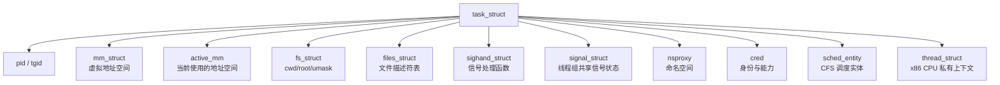
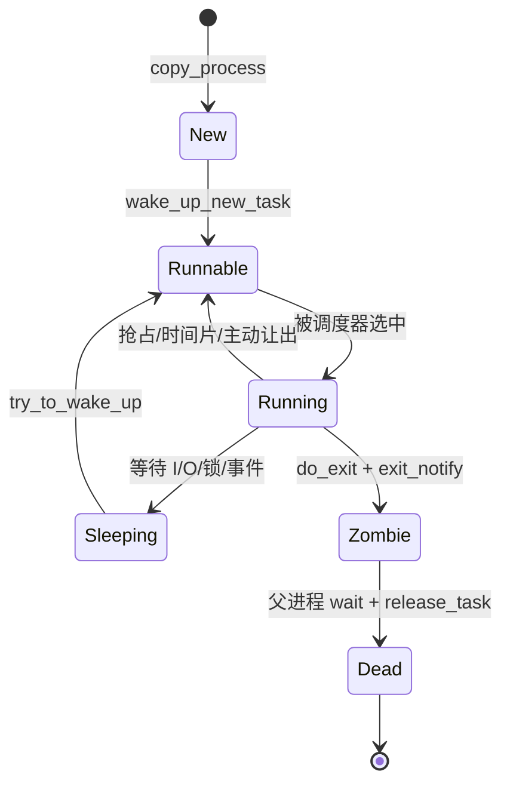

# 00. 总览：内核眼里的“进程”到底是什么

## 1. 用户口中的进程，内核口中的 task

Linux 的核心调度对象是 `task_struct`。用户空间习惯把共享同一进程资源的一组线程称为“进程”，但内核里每个线程通常都有自己的 `task_struct` 和 PID。

- **PID**：内核 task 的标识；线程也有自己的 PID（用户态常称 TID）。
- **TGID**：线程组 ID；主线程的 PID 等于 TGID，`getpid()` 通常看到 TGID。
- **线程组**：多个 task 共享 `mm`、`files`、`sighand`、`signal` 等资源形成。
- **进程描述符**：`task_struct`，它不是进程的全部内容，而是把各类资源连接起来的中心节点。

## 2. 生命周期全景

注意：内核的 `TASK_RUNNING` 同时涵盖“正在 CPU 上运行”和“可运行、正在运行队列中等待”，不能把它机械翻译成“此刻正在执行”。进程创建中还有一个不可被普通观察稳定捕获的 `TASK_NEW` 过渡状态。

## 3. 五类容易混淆的“创建”

| 动作 | 新 task_struct | 新 PID | 新 mm_struct | 主要语义 |
|---|---:|---:|---:|---|
| `fork()` | 是 | 是 | 是 | 复制进程，页面先 COW |
| `vfork()` | 是 | 是 | 否，临时共享 | 父等待子 exec/exit，限制严格 |
| `clone(CLONE_VM...)` | 是 | 是 | 可共享 | 由 flags 精确选择资源 |
| `pthread_create()` | 是 | 是/TID | 否，共享 | libc 最终借助 clone 系统调用 |
| `execve()` | 否 | 否 | 替换为新的 | 当前 task 换程序映像 |

所以经典 shell 启动程序的模型是：shell 先 `fork()` 得到新 task，子 task 再 `execve()` 替换自己；不是 `execve()` 直接造出一个新进程。

## 4. 四层观察视角

| 层次 | 你看到的东西 | 典型入口 |
|---|---|---|
| libc/API | `fork`, `pthread_create`, `execve`, `waitpid` | glibc/musl 包装层 |
| 系统调用 | `__x64_sys_clone`, `__x64_sys_execve` 等 | `arch/x86/entry` 生成/汇编入口 |
| 通用内核 | `kernel_clone`, `copy_process`, `do_execveat_common`, `schedule` | `kernel/`, `fs/`, `mm/` |
| 架构层 | `copy_thread`, `switch_mm_irqs_off`, `__switch_to_asm` | `arch/x86/` |

源码学习时必须同时保留这四层。只读系统调用宏，会错过真正的通用实现；只读通用 C，又会错过寄存器、内核栈、页表寄存器的切换。

## 5. 建议按四周拆开

### 第一周：出生

- 静态阅读 `init_task`、`rest_init`、`kernel_clone`。
- GDB 观察 PID 0 创建 PID 1、PID 2。
- 画出 `task_struct` 到资源对象的指针图。

### 第二周：复制与换身

- 对比 `fork()`、`clone()`、线程创建的 flags。
- 观察 `copy_mm()` 的共享/复制分支和 COW 缺页。
- 跟一次 `execve()`，确认 PID 不变、`mm` 变化。

### 第三周：运行与切换

- 阅读 `wake_up_new_task()`、`__schedule()`、`context_switch()`。
- 用 tracepoint 看 `sched_process_fork`、`sched_switch`、`sched_process_exit`。
- 在 x86-64 上理解 CR3/PCID、内核栈与 callee-saved registers。

### 第四周：死亡与系统化

- 跟 `do_exit()`、`exit_notify()`、`do_wait()`、`release_task()`。
- 区分 zombie、orphan、subreaper。
- 独立讲完“shell 启动一个 ELF 程序直到它退出”的全链路。

## 6. 每章的验收方式

不要用“代码看完了”作为完成标准，使用这些证据：

1. 能手画调用树，关键函数不少于 10 个。
2. 能解释每一步改变的核心对象及引用计数。
3. 能给出一个反例，例如“exec 不会创建 PID”。
4. 能在 GDB 或 trace 中看到至少一个对应事件。
5. 能说明这个结论是通用逻辑还是 x86-64 特有逻辑。

## 7. 第一遍可以暂时跳过的细枝末节

`copy_process()` 同时处理审计、perf、cgroup、seccomp、NUMA、io_uring、rseq、uprobe 等子系统。它们都重要，但第一遍应先牢牢掌握：task/stack、调度属性、资源对象、线程上下文、PID、父子/线程组关系、唤醒。第二遍再沿错误回滚标签反向学习资源释放顺序。
