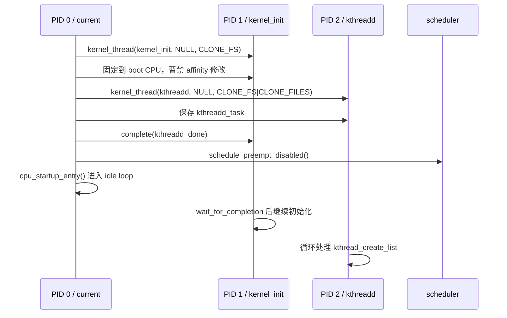

# 01. 启动期：0 号、1 号与 2 号进程

## 1. PID 0 不是 `fork()` 出来的

`init_task` 在编译期静态定义于 `init/init_task.c:64`。它已经连接好初始栈、凭据、文件表、信号结构、命名空间和调度实体。关键初值包括：

```c
.stack        = init_stack,
.flags        = PF_KTHREAD,
.mm           = NULL,
.active_mm    = &init_mm,
.real_parent  = &init_task,
.parent       = &init_task,
.group_leader = &init_task,
.comm         = INIT_TASK_COMM,
```

这解释了四件事：

- PID 0 是内核启动上下文本身逐渐“变成”的 idle task，不走普通 fork 入口。
- 它没有用户地址空间，所以 `mm == NULL`。
- CPU 仍要执行内核代码，因此临时使用内核地址空间 `active_mm == &init_mm`。
- 它的父、组长都指向自己，是进程树的特殊根节点。

`init_mm` 在 `mm/init-mm.c:26` 静态定义，`pgd = swapper_pg_dir`，代表启动内核页表语境。这里已经能看到进程与内存的第一处关键连接：**用户进程用 `mm` 表示自己的地址空间；纯内核线程没有 `mm`，但调度运行时仍需 `active_mm`。**

## 2. `start_kernel()` 先把“可创建、可调度”的基础设施铺好

主入口在 `init/main.c:932`。与进程主线最相关的先后关系是：

```text
start_kernel
├─ setup_arch                 建立体系结构、早期页表与内存布局
├─ setup_per_cpu_areas        建立每 CPU 数据
├─ mm_init                    slab/vmalloc 等内存设施
├─ sched_init                 初始化 runqueue 和调度器
├─ fork_init                  建 task_struct slab、最大线程数等
├─ proc_caches_init           建 mm/files/fs/sighand/signal 等缓存
├─ signals_init               信号队列缓存
└─ arch_call_rest_init
   └─ rest_init
```

顺序不是装饰：`kernel_thread()` 最终会申请 `task_struct`、内核栈和许多资源对象，也会调用 `sched_fork()`，所以内存分配器和调度器必须先可用。

## 3. `rest_init()`：三岔路口

核心源码在 `init/main.c:688`：



### 为什么先创建 PID 1，再创建 PID 2？

源码注释直接给出约束：必须先 spawn init，让它拿到 PID 1；但不能让它在 kthreadd 准备好之前自由创建内核线程。因此：

1. 先创建 `kernel_init`，占到 PID 1。
2. PID 1 一进入 `kernel_init()` 就等待 `kthreadd_done`。
3. PID 0 创建 `kthreadd`，它自然拿到 PID 2。
4. PID 0 保存 `kthreadd_task` 后完成 completion，PID 1 才能继续。

这是一个“先分配身份、再放行执行”的启动期同步协议。

## 4. PID 1 的两次身份变化

PID 1 刚创建时仍是内核线程上下文，入口函数是 `kernel_init()`。它先完成剩余内核初始化：

```text
kernel_init
├─ wait_for_completion(kthreadd_done)
├─ kernel_init_freeable
│  ├─ workqueue_init
│  ├─ smp_init / sched_init_smp
│  ├─ do_basic_setup
│  │  └─ do_initcalls            驱动与各级 initcall
│  ├─ wait_for_initramfs
│  └─ console_on_rootfs
├─ free_initmem / mark_readonly
└─ run_init_process
   └─ kernel_execve
```

随后依次尝试 ramdisk init、命令行 `init=`、`CONFIG_DEFAULT_INIT`、`/sbin/init`、`/etc/init`、`/bin/init`、`/bin/sh`。一旦 `kernel_execve()` 成功：

- task/PID 仍然是 PID 1；
- `mm` 从无用户地址空间变为新 ELF 对应的地址空间；
- `PF_KTHREAD` 等标志在 `begin_new_exec()` 中清除；
- 从内核创建的任务正式承载用户态 init。

所以“PID 1 被创建”和“用户态 init 被装入”是两个不同事件。

## 5. PID 2：`kthreadd` 到底是什么

`kthreadd()` 位于 `kernel/kthread.c:657`。它做完 CPU/memory policy 与 cgroup 初始化后循环：

```text
无请求 -> TASK_INTERRUPTIBLE -> schedule()
有请求 -> 从 kthread_create_list 取 create_info
       -> create_kthread(create)
       -> 再检查队列
```

其他内核代码调用 `kthread_create*()` 时通常不是自己直接完成全部创建，而是把请求放到队列并唤醒 kthreadd。由 PID 2 统一创建的好处是新线程继承一个干净、可控的内核上下文，而不是随机调用者的危险状态。

常见混淆：

- `kthreadd`：PID 2，内核线程“创建管理者”。
- `kworker/*`：workqueue 的工作线程，通常由相关机制经 kthreadd 建立。
- idle task：每 CPU 一个，boot CPU 的 idle 是最初 PID 0；其他 CPU idle task 由 `fork_idle()` 准备，PID 数字语义特殊。

## 6. 启动阶段断点观察值

在 `rest_init` 断住时建议记录：

```gdb
p $lx_current().pid
p $lx_current().comm
p $lx_current().mm
p $lx_current().active_mm
b kernel_clone
b kernel_init
b kthreadd
```

预期主线：`rest_init` 的 `current` 是 PID 0；两次 `kernel_clone` 分别生成目标入口为 `kernel_init` 和 `kthreadd` 的 task；PID 0 最终不会退出，而是进入 idle。

## 7. 本章自检

1. 为什么 PID 0 的 `mm` 是 NULL 仍能执行内核代码？
2. 为什么 PID 1 必须在 PID 2 创建前占号，但又必须等待 PID 2？
3. PID 1 执行 `/sbin/init` 时为何 PID 不变？
4. `kthreadd` 与 `kworker` 是不是同一个东西？

答案线索：`active_mm`、completion、exec 替换映像、创建者与工作者。
