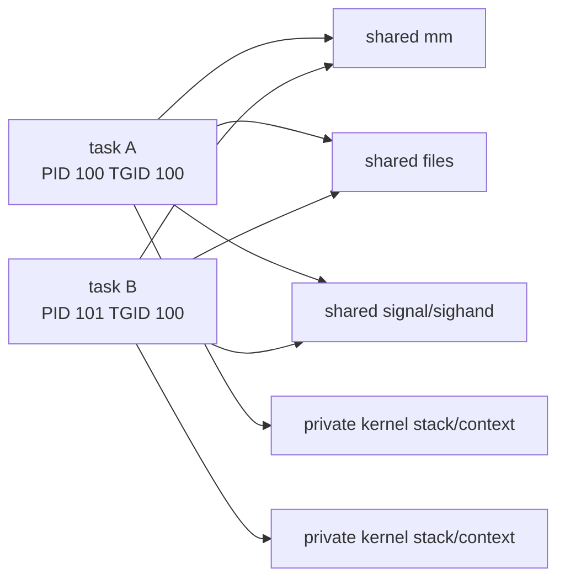

# 02. `task_struct`：进程资源的总枢纽

## 1. 不要把 `task_struct` 当成“大号进程对象”

定义从 `include/linux/sched.h:723` 开始。它混合了热路径字段、调度实体、身份关系、资源指针、统计与架构上下文。真正的大资源通常由指针引用，多个 task 是否共享它们由 clone flags 决定。

| 维度 | 关键字段 | 真实对象/含义 |
|---|---|---|
| 状态 | `__state`, `exit_state` | 可运行、睡眠、死亡阶段 |
| 栈与架构 | `stack`, `thread` | 内核栈与 `thread_struct` |
| 调度 | `prio`, `policy`, `se`, `rt`, `dl` | 调度策略及各调度类实体 |
| CPU 亲和性 | `cpus_ptr`, `cpus_mask` | 可在哪些 CPU 上运行 |
| 身份 | `pid`, `tgid`, `thread_pid`, `pid_links` | task、线程组与 PID 哈希关系 |
| 亲属 | `real_parent`, `parent`, `children`, `sibling` | 创建/等待/ptrace 语义 |
| 地址空间 | `mm`, `active_mm` | 用户地址空间与当前页表语境 |
| 文件 | `files`, `fs` | fd 表；cwd/root/umask |
| 信号 | `sighand`, `signal`, `pending` | handler 表、线程组状态、私有待处理信号 |
| 安全 | `cred`, `real_cred` | UID/GID/capabilities/LSM 凭据 |
| 隔离 | `nsproxy` | mount/UTS/IPC/net/cgroup/time 命名空间引用 |

## 2. 线程组为何既“多个 task”又“一个进程”

典型 pthread clone flags 会要求共享：

```text
CLONE_VM       -> 同一个 mm
CLONE_FILES    -> 同一个 fd table
CLONE_FS       -> 同一个 cwd/root/umask
CLONE_SIGHAND  -> 同一个 signal-handler table
CLONE_THREAD   -> 同一线程组，TGID 相同
```

但每个线程仍拥有独立的：

- `task_struct`、内核栈、PID/TID；
- 调度状态、优先级统计、CPU 上下文；
- 用户栈（它位于共享 `mm` 内，但栈区不同）；
- thread-local storage 指针与部分信号 pending 状态。



## 3. `mm` 与 `active_mm` 的精确区别

### 用户 task

通常 `task->mm == task->active_mm`，前者表示拥有的用户地址空间，后者表示 CPU 此刻使用的地址空间。

### 内核线程

`task->mm == NULL`。它不应该访问一个自己的用户地址空间；但 CPU 不可能没有页表，因此运行时会“借用”前一个用户 task 的 `active_mm`，或使用 `init_mm`。这叫 lazy TLB 相关机制，不代表内核线程拥有或可以随意操作该用户地址空间。

`context_switch()` 的逻辑可以概括为：

```text
next->mm != NULL: switch_mm_irqs_off(prev->active_mm, next->mm, next)
next->mm == NULL: next->active_mm = prev->active_mm，增加/转移引用，进入 lazy TLB
prev->mm == NULL 且 next 是用户 task: 清理 prev->active_mm 的借用关系
```

## 4. `mm_struct` 内部地图

定义在 `include/linux/mm_types.h:404`。学习进程时先抓住：

- `pgd`：页表顶层入口，x86-64 切换地址空间最终与 CR3/PCID 相关。
- `mmap`、`mm_rb`：VMA 组织结构；注意这是 5.15 的结构，更新内核可能已用 maple tree。
- `mm_users`：拥有/共享该地址空间的 task 数量语义。
- `mm_count`：`mm_struct` 本身与 lazy users 等低层引用语义。
- `mmap_lock`：地址空间映射变化的核心读写同步。
- `total_vm`、`rss_stat`：虚拟页量与驻留内存统计。
- `start_code/end_code/start_data/...`：进程映像边界信息。

`mm_users` 与 `mm_count` 不能混为普通“引用计数”。前者归零会触发高层地址空间清理，随后通过 `mmdrop()` 处理低层生存期。

## 5. PID、TGID、进程组和会话

| 名称 | 内核关系 | 用户态直觉 |
|---|---|---|
| PID | `PIDTYPE_PID` | 某个线程/task 的 ID |
| TGID | `PIDTYPE_TGID` | 通常意义上的进程 ID |
| PGID | `PIDTYPE_PGID` | job control 的进程组 |
| SID | `PIDTYPE_SID` | 会话 ID |

`struct pid` 还承载 PID namespace 下多级数字表示。`task_struct.pid` 是快捷数值字段，但严肃追踪需要看 `thread_pid`、`pid_links[]` 和 `struct pid`。

## 6. 父子关系不是只有一个 parent

- `real_parent`：通常是实际创建者或 reparent 后的收养者。
- `parent`：接收 `SIGCHLD`/wait 事件的对象，ptrace 会改变其观察关系。
- `children`：本 task 子进程链表表头。
- `sibling`：把自己挂到父亲 `children` 上的节点。
- `group_leader`：线程组组长。

因此 `/proc` 看到的 PPID、调试器看到的 parent、最初执行 fork 的 task，在 ptrace/reparent 等情形不一定永远是同一个概念。

## 7. 为什么创建时是“先复制 task，再纠正字段”

`dup_task_struct()` 先分配 task 与内核栈，再由 `arch_dup_task_struct()` 基本复制父 task。随后代码必须重设栈指针、引用计数、链表、锁、pending、统计、调度状态等。父对象中很多字段不能直接继承；这也是 `copy_process()` 很长、错误回滚很多的根本原因。

## 8. 建议实际打印

```gdb
p/x $lx_current()
p $lx_current().pid
p $lx_current().tgid
p $lx_current().real_parent->pid
p $lx_current().group_leader->pid
p $lx_current().mm
p $lx_current().active_mm
p $lx_current().files
p $lx_current().signal
p $lx_current().sighand
p $lx_current().nsproxy
```

这些 `$lx_current()` 表达式来自本仓库 `scripts/gdb`，需先加载 `vmlinux-gdb.py`。不要一开始打印完整 `task_struct` 后硬看数百字段。先记录上述 10 个指针/数值，再在 fork 前后做对照表。
