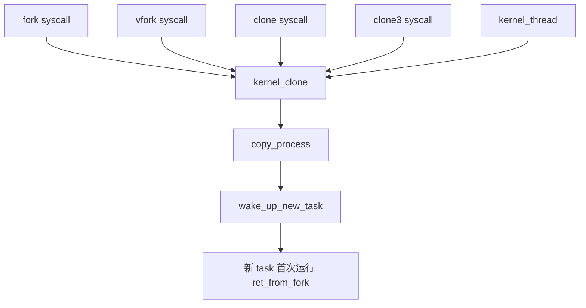
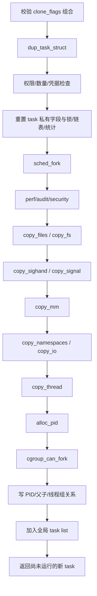

# 03. `fork/clone/clone3`：完整创建链路

## 1. 多个入口，一个核心

本仓库 `kernel/fork.c` 中的主线：



系统调用宏只负责把各 ABI 的参数整理为 `struct kernel_clone_args`。复杂工作集中在 `copy_process()`；`kernel_clone()` 则负责 fork event、vfork completion、唤醒和最终返回 PID。

## 2. 从用户态到通用 C 的边界

x86-64 用户程序执行 `syscall` 后会进入 `arch/x86/entry/entry_64.S` 的系统调用入口，保存用户寄存器形成 `pt_regs`，再分派到由 syscall 表/宏生成的 `__x64_sys_*` 包装函数。源码阅读时不必把宏展开全文，但要知道：

```text
userspace fork/clone3
-> x86 syscall entry
-> __x64_sys_fork / __x64_sys_clone3（生成的包装层）
-> __do_sys_* / SYSCALL_DEFINE body
-> kernel_clone
```

## 3. `copy_process()` 分阶段地图

函数入口在 `kernel/fork.c:1930`。以下顺序比背所有行更重要：



### 3.1 `dup_task_struct()`：壳与栈

位于 `kernel/fork.c:874`：

1. `alloc_task_struct_node()` 从 `task_struct_cachep` 分配描述符。
2. `alloc_thread_stack_node()` 分配内核栈。
3. 对内核栈做 memcg charge。
4. `arch_dup_task_struct()` 复制父 task 基础内容。
5. 恢复/重设 stack 相关字段。
6. `setup_thread_stack()`、清除 resched/syscall-work 状态、写栈尾魔数。

注意：每个线程都必须有独立内核栈，即使它们共享同一个用户地址空间。

### 3.2 `sched_fork()`：不是立即调度

它初始化新 task 的调度状态、优先级和调度类相关字段，并确保新 task 在真正唤醒前不可被错误运行。真正把新 task 变成调度候选者的是后面的 `wake_up_new_task()`。

### 3.3 `copy_*()`：flags 控制共享还是复制

| 函数 | 资源 | 常见共享 flag | 不共享时 |
|---|---|---|---|
| `copy_files` | fd table | `CLONE_FILES` | `dup_fd()` 复制表，file 对象增引用 |
| `copy_fs` | cwd/root/umask | `CLONE_FS` | `copy_fs_struct()` |
| `copy_sighand` | handler table | `CLONE_SIGHAND` | 分配并复制 action |
| `copy_signal` | thread-group signal state | `CLONE_THREAD` | 分配新 `signal_struct` |
| `copy_mm` | address space | `CLONE_VM` | `dup_mm()` + `dup_mmap()` |
| `copy_namespaces` | namespaces | 各 `CLONE_NEW*` | 按类型复制/创建 |
| `copy_io` | I/O context | `CLONE_IO` | 必要时新建 |

“复制 fd table”不等于复制打开文件内容；表项仍可能引用同一个 `struct file`，所以 fork 后父子共享 open file description 的文件偏移。

### 3.4 `copy_thread()`：架构相关的首次返回现场

通用层调用 x86 的 `copy_thread()`（`arch/x86/kernel/process.c:112`）。它在子 task 的内核栈上准备 `fork_frame`：

- 安排返回地址指向 `ret_from_fork`；
- 普通用户 fork 复制父 `pt_regs`，并把子进程返回值寄存器设为 0；
- 内核线程准备函数指针与参数；
- clone 可设置新用户栈和 TLS。

父进程从 `kernel_clone()` 得到子 PID；子进程并不是从 C 函数中“正常 return”出来，而是在第一次被调度时由预制栈帧进入 `ret_from_fork`，最终返回用户态或调用内核线程函数。

## 4. 分配 PID 与发布 task 为什么靠后

PID 在大部分可能失败的资源创建之后才通过 `alloc_pid()` 分配。随后在持锁区内：

- 设置 `pid/tgid/group_leader`；
- 建立 `real_parent/parent`；
- 连接 `PIDTYPE_PID/TGID/PGID/SID`；
- 挂入父 `children`、线程组和全局 `init_task.tasks` 链表；
- 完成 cgroup fork 等发布动作。

这是典型的“先构造不可见对象，全部成功后一次发布”设计，减少其他 CPU 看到半初始化 task 的机会。

## 5. `kernel_clone()` 最后的关键一步

`copy_process()` 成功返回 task 后，`kernel_clone()` 会做 trace/ptrace、可能写 parent_tid/pidfd，然后调用：

```c
wake_up_new_task(p);
```

`wake_up_new_task()` 位于 `kernel/sched/core.c:4439`，选择 CPU、把 `TASK_NEW` 变成 `TASK_RUNNING`、入运行队列并检查是否应抢占当前 task。至此“创建”才真正连接到“调度”。

## 6. `vfork()` 为什么危险而快

`vfork` 常带 `CLONE_VFORK | CLONE_VM`：子 task 暂时和父共享地址空间，父在 completion 上等待子 `exec` 或 `exit`。若子在此期间随意改栈或返回调用者，就可能破坏父执行现场，因此只能做非常受限的操作后立刻 exec/exit。

## 7. 错误路径也是学习资料

`copy_process()` 尾部大量 `bad_fork_cleanup_*` 标签按构造的逆序释放资源。这体现了资源获取栈：后获取的先释放。第二遍阅读建议从最后一个错误标签反向上看，它比正向主线更清楚地回答“哪些对象已经归新 task 所有”。

## 8. 三组对照实验

| 实验 | 观察 | 预期 |
|---|---|---|
| 普通 `fork()` | 父子 `task->mm` 指针 | 不同 `mm_struct`，物理页暂时可共享 |
| pthread | 两线程 `task->mm` 指针 | 相同 |
| `fork()` 后 `execve()` | 子进程 exec 前后 PID/mm | PID 不变，mm 改变 |

实验代码与断点见 `labs/`。
