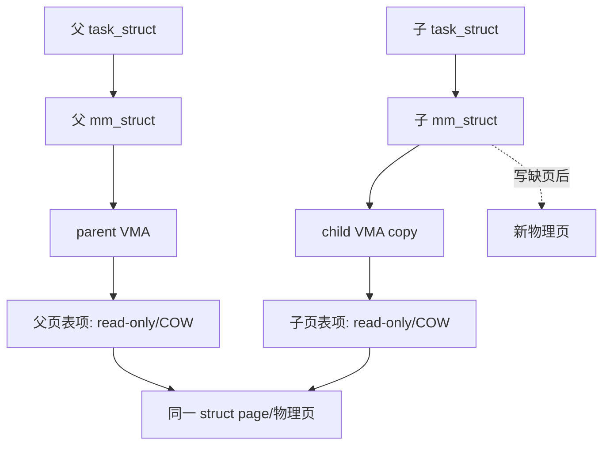
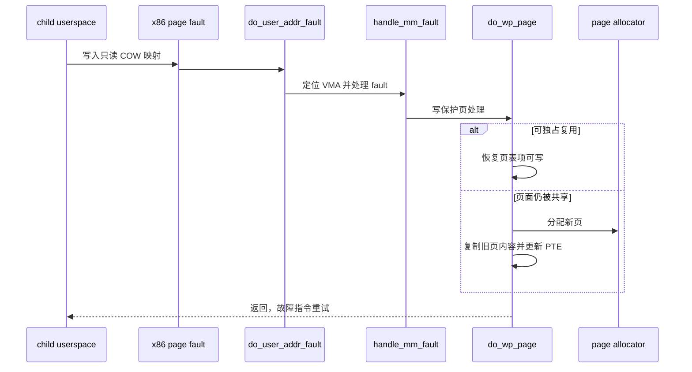

# 04. 进程与内存：从 `copy_mm()` 到 COW 缺页

## 1. 一张图看懂资源对象与物理页



普通 fork 会创建不同的 `mm_struct` 和 VMA/页表结构，但并不立刻复制所有匿名物理页。父子页表暂时指向相同物理页并撤销可写权限；某方写入时，缺页处理再决定复用还是复制，这就是 Copy-on-Write。

## 2. `copy_mm()` 的三个分支

源码在 `kernel/fork.c:1475`：

```text
先令 child->mm = child->active_mm = NULL
oldmm = current->mm
├─ oldmm == NULL        内核线程：保持 NULL，返回成功
├─ CLONE_VM             mmget(oldmm)，child 与 parent 共享同一 mm
└─ 普通 fork            dup_mm(child, oldmm)
                        └─ dup_mmap(newmm, oldmm)
最后 child->mm = child->active_mm = mm
```

`CLONE_VM` 是线程共享地址空间的核心开关。普通 fork 的 `dup_mm()`：

1. 分配一个新 `mm_struct`。
2. 暂时复制父 mm 的基础字段。
3. 调用 `mm_init()` 重建锁、引用计数、页表顶层等不能直接复制的成员。
4. 调用 `dup_mmap()` 复制 VMA 并建立页表/COW 关系。

## 3. `mm_init()` 为什么同时属于“进程初始化”

`kernel/fork.c:1036` 的 `mm_init()` 初始化：VMA 根、`mm_users/mm_count`、`mmap_lock`、页表锁、RSS、CPU mask、AIO、owner、notifier、TLB 状态、PGD 和架构 MM context。进程创建不是单纯分配 `task_struct`；新的地址空间对象也有完整的并发生命周期。

## 4. COW 真正发生在哪里

典型匿名私有页的写路径可用下图理解：



在本仓库继续追踪的入口关键词：

- `arch/x86/mm/fault.c:do_user_addr_fault`
- `mm/memory.c:handle_mm_fault`
- `mm/memory.c:do_fault` / `do_wp_page`
- `copy_page_range`、`copy_pte_range`：fork 页表复制与写保护相关

注意：文件私有映射、共享映射、huge page、KSM、userfaultfd 等会改变细节；上图是普通匿名私有页的教学主线。

## 5. fork 时“复制了什么、共享了什么”

| 层 | 普通 fork 的结果 |
|---|---|
| `task_struct` | 新对象 |
| `mm_struct` | 新对象 |
| VMA 元数据 | 为子地址空间复制/重建 |
| 页表页 | 为子建立页表层次与条目 |
| 匿名物理页 | 通常先共享并 COW |
| `struct file` | VMA/file 和 fd 可持有同一 file 引用 |
| 内核地址映射 | 所有进程共享同一内核映射语境（具体受 PTI 等影响） |

“页表复制”和“物理页复制”是两个动作，不能混称。

## 6. 调度切换与地址空间切换

`context_switch()` 在 `kernel/sched/core.c:4889`：

1. `prepare_task_switch()` 做调度切换前工作。
2. 根据 `next->mm` 选择用户地址空间切换或内核线程 lazy TLB 路径。
3. x86 的 `switch_mm_irqs_off()` 位于 `arch/x86/mm/tlb.c:488`，处理 CPU mm mask、TLB/PCID 与 CR3 相关状态。
4. `switch_to()` 再切 CPU 执行上下文。
5. `finish_task_switch()` 处理切出 task 的延迟清理等。

这里的顺序说明：**上下文切换既是 CPU 寄存器/栈切换，也是地址空间语境切换。** 同一进程的两个线程共享 mm，切换时可能不需要真正换到另一个用户页表；两个普通进程间切换则通常需要更新 MMU 语境。

## 7. exec 时地址空间如何换掉

`fs/exec.c:971` 的 `exec_mmap()` 在拿到新 mm 后：

```text
old_mm = current->mm
锁住 task
current->active_mm = new_mm
current->mm = new_mm
activate_mm(active_mm, new_mm)
解锁
mmput(old_mm)
```

这是 exec “PID/task 不换、地址空间换掉”的核心证据。新 mm 在提交前先离线构造；一旦越过 `begin_new_exec()` 的 point of no return，后续严重失败不能简单回到旧程序继续执行。

## 8. exit 时内存如何释放

`do_exit()` 调用 `exit_mm()`：task 解除 `mm` 关联并减少引用。只有最后一个共享者离开时，`mm_users` 才归零并进入 `__mmput()`，继而 `exit_mmap()` 拆 VMA/页表并释放相关资源。线程退出不一定销毁进程地址空间，因为同线程组其他 task 仍在引用它。

## 9. 建议观测变量

在 `copy_mm`、`dup_mm`、`exec_mmap`、`exit_mm` 处记录：

```gdb
p $lx_current().pid
p $lx_current().mm
p $lx_current().active_mm
p $lx_current().mm->pgd
p $lx_current().mm->mm_users.counter
p $lx_current().mm->mm_count.counter
```

跨断点比较的价值高于单次打印。若开启 KASLR，符号 GDB 仍可在 QEMU 启动前用未压缩 `vmlinux` 解析；地址本身每次启动可能变化。
