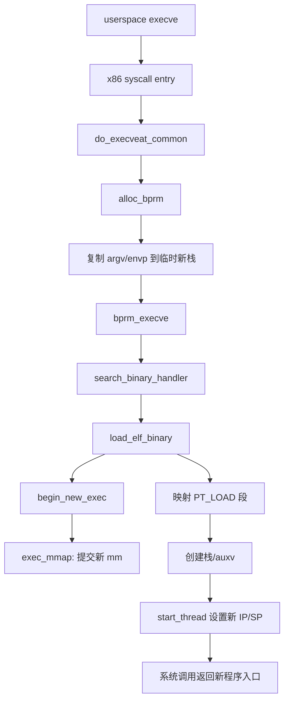
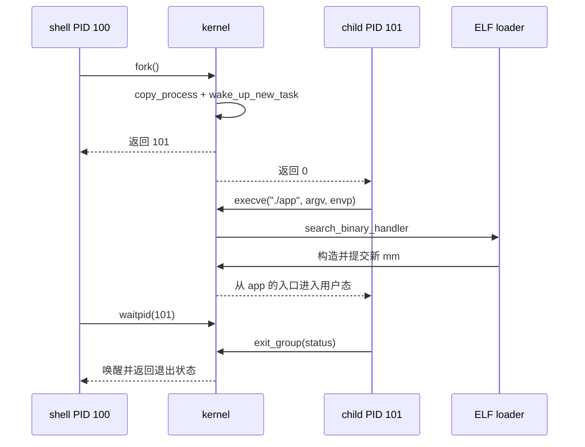

# 05. `execve()`：同一个进程换一副程序身体

## 1. 最关键的结论

`execve()` 成功时：

- 不创建新的 `task_struct`；
- 不分配新的 PID；
- 当前 task 改用新 `mm_struct`；
- 加载新 ELF 的代码、数据、解释器与用户栈；
- 重置一部分信号、线程、凭据和文件描述符语义；
- 最终从新程序入口返回用户态，而不是回到旧程序的 exec 调用下一行。

## 2. 从系统调用到 ELF loader

通用入口在 `fs/exec.c:1864`，ELF 处理在 `fs/binfmt_elf.c:823`。

## 3. `linux_binprm` 是 exec 的事务上下文

`struct linux_binprm` 暂存：待执行文件、凭据、参数/环境、临时 mm、新栈位置、解释器信息和 `point_of_no_return`。内核先构造尽可能完整的新映像，再提交到 current，避免一开始就摧毁旧进程后才发现文件不可执行。

但它不是无限可回滚事务：`begin_new_exec()` 设置 `point_of_no_return = true`，并执行 `de_thread()`、`exec_mmap()` 等不可逆操作。越过该点后的失败通常以致命信号结束当前 task。

## 4. 多线程进程 exec 会怎样

只有调用 exec 的线程继续。`begin_new_exec()` 中的 `de_thread()` 会处理同线程组其他线程，并确保执行者取得正确的线程组组长身份语义。这就是为什么不能把 exec 简化为“修改 PC 指针”：它还要收拢线程组、文件表、信号、凭据和地址空间。

## 5. ELF 并非把整个文件一次性读进内存

`load_elf_binary()` 解析 ELF header/program headers，验证格式，处理 `PT_INTERP` 动态链接器，按 `PT_LOAD` 建立文件映射，设置 brk，准备用户栈、argv/envp/auxv，最后设置入口寄存器。实际代码页通常由 demand paging 在首次访问时缺页装入。

动态链接程序的第一条用户指令往往进入 ELF interpreter（例如动态链接器），不是直接进入应用 `main()`。`main()` 之前还有 `_start`、运行时初始化和 libc 启动逻辑。

## 6. PID 1 的特殊 exec

`kernel_init()` 最后调用 `run_init_process()` -> `kernel_execve()`。这条路径不是用户态发起系统调用，但复用相同的 exec 核心语义。成功后，原本以内核入口运行的 PID 1 获得用户地址空间，执行 init/systemd。

## 7. 文件描述符和信号发生什么

- 标记 `FD_CLOEXEC` 的 fd 在 `do_close_on_exec()` 被关闭；其他 fd 通常保留。
- 捕获的信号处理方式按 exec 规则重置；被忽略信号等有各自 POSIX 语义。
- `unshare_files()` 确保执行期间不会错误地修改其他共享者的 fd table。
- setuid/capabilities/LSM 等新凭据由 binary credentials 流程计算并提交。

## 8. shell 启动一个应用的完整时序

## 9. GDB 验证重点

对启动期 PID 1：断 `kernel_execve`、`do_execveat_common`、`load_elf_binary`、`begin_new_exec`、`exec_mmap`。对任意用户程序：用条件断点限制 PID 或 comm，否则系统启动中的大量 exec 会让断点爆炸。

建议每次记三列：

| 断点 | `current->pid` | `current->mm` |
|---|---:|---|
| exec 入口 | 应保持 | old mm |
| `begin_new_exec` 前 | 应保持 | old mm |
| `exec_mmap` 提交后 | 应保持 | new mm |

如果目标是动态链接应用，再配合用户态 GDB 观察 `_start -> __libc_start_main -> main`，不要期待内核 GDB 自动替你解析 rootfs 中的用户 ELF 符号。
