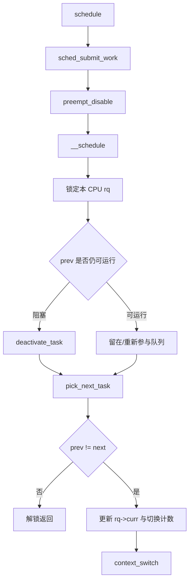
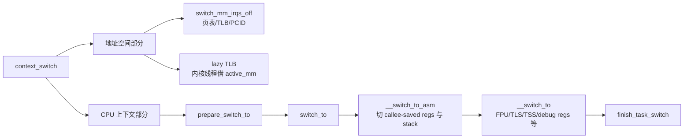

# 06. 调度与上下文切换：task 如何真正获得 CPU

## 1. 创建成功不等于已经执行

`copy_process()` 产出的 task 仍未作为普通 runnable task 运行。`kernel_clone()` 调用 `wake_up_new_task()`：设置 `TASK_RUNNING`、选择目标 CPU、入队并通过调度类检查是否需要抢占当前 task。

## 2. 调度发生的常见原因

- task 主动阻塞：等待 I/O、mutex、completion、waitqueue。
- task 主动调用 `schedule()`/让出。
- 周期时钟或唤醒导致 `TIF_NEED_RESCHED`，在允许抢占点调度。
- 更高优先级 RT/DL task 就绪。
- 系统调用/中断返回用户态前发现需要调度。

“时钟中断一来就一定切换”不准确。中断/调度器先更新状态并设置重调度需要，真正切换还受抢占状态、IRQ 上下文和调度点约束。

## 3. `schedule()` 到选中 next



关键源码：`kernel/sched/core.c:6165 __schedule()` 和 `:6359 schedule()`。

## 4. runqueue 与调度类

每个 CPU 有自己的 `struct rq`。task 按策略进入相应调度类：stop、deadline、real-time、fair、idle 等，类有优先次序。普通 `SCHED_NORMAL` task 走 CFS，在 5.15 中以 `sched_entity` 和红黑树时间线组织，核心直觉是优先运行虚拟运行时间较小的实体。

不要把 CFS 的 `vruntime` 当成真实运行纳秒的简单累计；它受 nice 权重缩放，并服务于公平比较。

## 5. `context_switch()` 分两半



`context_switch()` 位于 `kernel/sched/core.c:4889`；x86 的 `switch_to` 宏在 `arch/x86/include/asm/switch_to.h:47`，汇编体在 `arch/x86/entry/entry_64.S:225`，C 侧 `__switch_to` 在 `arch/x86/kernel/process_64.c:557`。

## 6. 为什么切换函数看起来“返回了另一个 task”

上下文切换会把 prev 的栈指针保存到其 `thread_struct`，装入 next 的栈指针。CPU 随后是在 next 的内核栈上继续执行。未来 prev 再被切入时，它才从当初 switch 的位置继续。因此一次 `switch_to(prev,next,last)` 跨越了两个 task 的时间线，`last` 用来表达实际切出的 task，不能按普通 C 调用“一进一出立即返回”理解。

## 7. 新 task 的第一次运行

新 task 没有“上次被切出的位置”，所以 fork 时提前构造了栈帧，返回地址为 `ret_from_fork`：

```text
被 pick_next_task 选中
-> switch_to 装入新 task 内核栈
-> ret_from_fork
   ├─ 内核线程：调用预设 fn(arg)
   └─ 用户 task：完成 schedule tail，恢复 pt_regs，返回用户态
```

这正是 x86 `copy_thread()` 与调度切换的接缝。

## 8. 用户态/内核态切换不等于进程切换

系统调用使同一个 task 从用户态进入内核态，通常 PID/current 不变，也未必调用调度器。进程上下文切换意味着 `current` 从 prev 变为 next。中断也可能在当前 task 上处理完直接返回，并没有换进程。

| 事件 | 特权级可能变化 | current 变化 | mm 变化 |
|---|---:|---:|---:|
| 普通 syscall 进入/退出 | 是 | 否 | 否 |
| 中断处理后原路返回 | 是 | 否 | 否 |
| 同进程线程切换 | 内核内发生 | 是 | 通常否 |
| 不同进程切换 | 内核内发生 | 是 | 通常是 |

## 9. 如何动态观察而不把系统停死

首选 tracepoint 看频繁调度事件，GDB 只断低频且有条件的目标：

```text
sched:sched_process_fork
sched:sched_wakeup_new
sched:sched_switch
sched:sched_process_exec
sched:sched_process_exit
```

在 `__switch_to` 或 `schedule` 下无条件软件断点会极高频，QEMU 多 CPU 时尤其难控制。先用 trace 找目标 PID，再加 GDB 条件断点；必要时以 `maxcpus=1` 简化第一轮。
