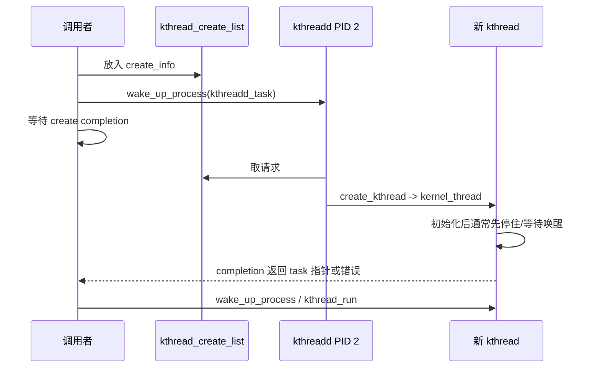
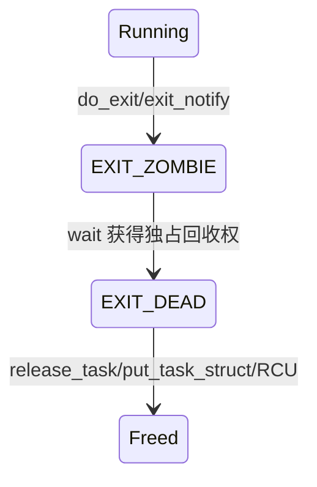

# 07. 内核线程、退出、等待与最终回收

## 1. 内核线程与用户线程的结构差异

两者都是 `task_struct`、都被调度、都有内核栈。关键差异是内核线程通常：

- `PF_KTHREAD` 置位；
- `mm == NULL`，运行时使用 `active_mm`；
- 首次从 `ret_from_fork` 进入预设内核函数，不返回用户态；
- 由 kthread API 管理 stop/park/freezer 等协议。

`kernel_thread(fn,arg,flags)` 在 `kernel/fork.c:2626` 把 `fn/arg` 装入 `kernel_clone_args` 并带 `CLONE_VM | CLONE_UNTRACED` 等语义，最终仍走 `kernel_clone()`。

## 2. `kthread_create()` 典型协议



`kthread_run()` 可以理解为 create + wake 的便捷组合，但失败返回错误指针，调用者必须检查。

## 3. 用户进程退出主链

系统调用 `_exit/exit_group` 最终进入 `do_exit()`（`kernel/exit.c:727`）：

```text
do_exit
├─ 标记 PF_EXITING，处理递归/原子上下文异常
├─ 同步统计、处理 thread-group live count
├─ exit_mm
├─ exit_sem / exit_shm
├─ exit_files / exit_fs
├─ exit_task_namespaces / exit_thread
├─ perf/cgroup/ptrace 等退出
├─ exit_notify                 通知父进程、重养子进程
├─ TASK_DEAD 前的最终清理
└─ do_task_dead
   └─ schedule                 永不再返回此 task
```

顺序体现依赖关系：例如使用用户地址的 futex/统计要在 mm 完全消失前处理；通知父进程前要把可见退出状态准备好。

## 4. zombie 不是“还在运行的尸体”

子进程退出后，其地址空间、文件等大部分资源已经释放，但父进程还需要读取 PID、退出码和统计，因此保留最小 task/exit 信息形成 zombie。父调用 `wait*()` 消费状态后，内核才通过 `release_task()` 解除 PID/链表关系并最终释放 task。



所以：

- zombie 不占用户地址空间，也不获得 CPU；
- 大量 zombie 会占 PID 和内核 bookkeeping；
- 修复点通常是父进程正确 wait，而不是“kill zombie”。

## 5. `wait` 做的不是简单 sleep

`wait4/waitid` 构造等待条件，扫描符合 PID/PGID/clone/状态选项的子任务：

- 子仍在运行且无目标状态：调用者可睡眠等待子状态变化；
- 子 stop/continue：按选项上报状态；
- 子 zombie：竞争并锁定回收权，复制退出状态/资源统计给用户，再 `release_task()`；
- `WNOHANG`：没有可报告事件时立即返回。

## 6. orphan 与 reparent

父进程先退出时，子不会悬空。`exit_notify()` 相关逻辑会把孩子重新挂接到合适的 reaper：同 PID namespace 的 child reaper（通常 namespace 内 PID 1）或 subreaper。PID namespace 使“哪个 init 负责收尸”成为分层概念。

## 7. 为什么 PID 1 不能普通退出

`do_exit()` 中若线程组最后一个成员是 global init，会 panic：系统失去最终用户空间管理者和孤儿回收者，无法维持正常语义。容器 PID namespace 内 init 也有特殊信号与回收职责，但与 global PID 1 的 panic 条件要区分。

## 8. 内核线程如何停止

规范 kthread 应周期检查 `kthread_should_stop()`。停止方调用 `kthread_stop()`：设置 stop bit、唤醒目标、等待其 `exited` completion，并取得线程函数返回值。线程函数若永不检查 stop 或永久卡在不可唤醒状态，停止方也会一直等待。

## 9. 全生命周期闭环


完整理解进程生命周期，必须同时看到“逻辑死亡”和“对象内存最终释放”之间可能存在等待、锁、引用计数与 RCU 延迟。
