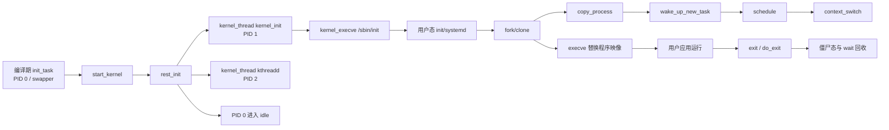
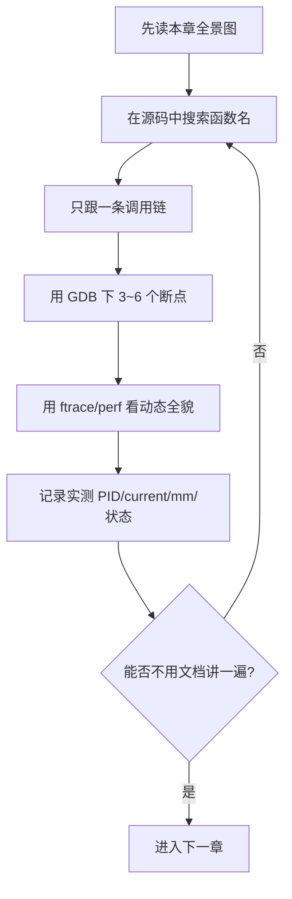

# Linux 5.15 进程全链路学习区

> 适用源码：当前仓库 Linux `5.15.0`，重点架构为 **x86-64**。  
> 学习目标：从“内核尚未创建普通进程”一路跟到“用户程序 fork/exec、被调度、退出并由父进程回收”。

## 先建立一句话总模型

Linux 不会在每次创建进程时凭空制造一套全新世界。它先静态准备 `init_task`（0 号 idle 任务），再通过统一的 `kernel_clone() -> copy_process()` 复制或共享资源，形成 PID 1、PID 2 和后续任务；`execve()` 不创建新 PID，而是在当前任务中替换地址空间和程序映像；调度器最终通过 `context_switch()` 同时切换地址空间与 CPU 寄存器上下文。

## 推荐学习顺序

| 阶段 | 文档 | 学完应该能回答 |
|---|---|---|
| 0 | [00-总览与学习路线.md](00-总览与学习路线.md) | 进程、线程、task、PID、地址空间分别是什么？ |
| 1 | [01-启动与0号1号2号进程.md](01-启动与0号1号2号进程.md) | PID 0/1/2 从哪里来？为什么顺序不能换？ |
| 2 | [02-task_struct与资源关系.md](02-task_struct与资源关系.md) | `task_struct` 如何连接内存、文件、信号、命名空间？ |
| 3 | [03-fork-clone完整创建链路.md](03-fork-clone完整创建链路.md) | `fork/clone/clone3` 如何汇入 `copy_process()`？ |
| 4 | [04-进程与内存管理联动.md](04-进程与内存管理联动.md) | `fork` 为什么快？COW 何时真正复制页面？ |
| 5 | [05-exec与用户程序启动.md](05-exec与用户程序启动.md) | 为什么 `execve` 不创建进程？ELF 怎么变成新地址空间？ |
| 6 | [06-调度与上下文切换.md](06-调度与上下文切换.md) | 谁触发调度？`prev` 到 `next` 究竟切了什么？ |
| 7 | [07-内核线程退出等待与回收.md](07-内核线程退出等待与回收.md) | kthreadd 如何工作？退出后为何会有 zombie？ |
| 8 | [08-GDB-QEMU与跟踪实验手册.md](08-GDB-QEMU与跟踪实验手册.md) | 如何在内网逐断点验证整条链路？ |
| 9 | [09-源码导航调用树与检查表.md](09-源码导航调用树与检查表.md) | 每个关键函数在哪里，下一层应该追谁？ |
| 10 | [11-关键源码逐段精读.md](11-关键源码逐段精读.md) | 关键几段源码每一句到底改变了什么？ |

配套实验在 [labs/README.md](labs/README.md)，术语与易错点在 [10-术语表与自测题.md](10-术语表与自测题.md)。

## 三条必须一直记住的主线

1. **身份线**：`task_struct -> pid/TGID -> parent/children -> task list`。
2. **资源线**：`task_struct -> mm/files/fs/sighand/signal/nsproxy/cred`；clone flag 决定共享还是复制。
3. **运行线**：task 创建后先进入 runqueue，调度器选中它，`switch_mm_irqs_off()` 切页表语境，`switch_to()` 切寄存器/栈。

## 阅读标记约定

- **源码事实**：能在本仓库给出的文件和函数中直接核对。
- **推导**：由若干源码事实组合出的解释，会明确写出条件。
- **实验观察**：依赖你的 `.config`、CPU、rootfs 或内核命令行，必须在目标环境实测。
- 文中的行号以当前工作树为准；若继续给源码加注释，行号会漂移，优先用函数名搜索。

## 当前仓库的调试准备度

当前 `.config` 已启用 `CONFIG_X86_64=y`、`CONFIG_DEBUG_INFO=y`、`CONFIG_GDB_SCRIPTS=y`、`CONFIG_SCHEDSTATS=y`、`CONFIG_FTRACE=y`，很适合做源码级学习。`CONFIG_KGDB` 未在检查结果中出现；本教程默认使用 QEMU `-s -S` + 主机 GDB，不依赖 KGDB。

## 一次学习循环

不要第一天就单步 `copy_process()` 的每一行。先确认入口、资源复制阶段、PID 挂接、唤醒四个路标，再逐层放大。
