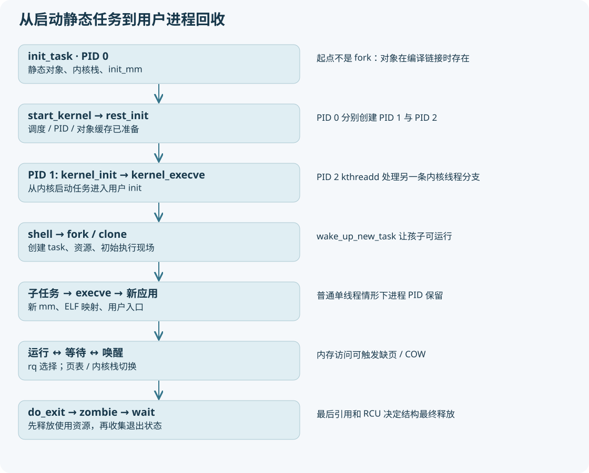

# 00 从“会分配内存”走向“会理解进程”

本教程直接对照本工作树 Linux 5.15.0，主线选 x86-64。源码中的中文注释可能是学习注释；判断行为时以实际 C/汇编语句为准。全貌指进程生命周期的主要路径及内存、调度关联，不意味着逐行覆盖安全模块、所有架构和所有调度策略。

## 先看一生，再看一行

你已经学过页、伙伴系统、slab、虚拟地址和内存申请。现在把问题变成：**这些内存归谁使用？谁在 CPU 上执行？停止执行以后怎么接着跑？** 三个问题分别落在 `mm_struct`、`task_struct` 和保存的执行上下文上。

想象 shell 运行一个小程序：shell 已经是进程；shell 创建一个子任务；子任务先继承 shell 的环境，再用 exec 装入程序；调度器轮流让它与别的任务运行；程序访问未准备好的页触发缺页；退出释放资源；shell 收集退出状态。磁盘上新增一个可执行文件本身，不会自动产生任务。

这套材料采用“双层阅读”：每章先给人话模型、关系图与最短链路，再给字段、真实源码精读、分支和断点。第一次只完成每章的检查题；第二次打开源码摘录逐行对照；第三次做实验并填观察表。别用背诵函数名替代验证指针和值。

## 词语先对齐

|词语|这里准确指什么|先排除的误会|
|---|---|---|
|程序|文件里的代码、数据和 ELF 元信息|磁盘文件不是进程|
|进程|通常指一个线程组及其资源视角|内核调度并不只调度组长|
|线程/task|一个可调度执行实体，通常对应一个 task_struct|线程也有自己的内核栈|
|用户态|CPU 执行受限的用户指令|不是一台独立 CPU|
|内核态|执行内核指令、处理系统调用/异常/中断|进内核不等于切换进程|
|current|当前 CPU 正在执行的 task|不是“最近创建的进程”|
|mm|用户虚拟地址空间的描述对象|不是一整块物理内存|
|上下文|让一个执行流能继续所需的寄存器、栈等状态|不等于复制全部内存|
|调度|从可运行任务中决定谁执行|唤醒不保证立刻执行|
|kthreadd|内核线程创建服务，通常 PID 2|不是所有用户进程的父亲|

## 建议的 15 次学习安排

|次序|阅读与实践|交付给自己的证据|
|---|---|---|
|1|00、01，重画全景图|能说清程序/task/mm 三个对象|
|2|02，静态 init_task 与启动初始化|init_task.mm/active_mm 的实际初始化|
|3|03，PID 1/2 及 completion|rest_init 两次创建与 kernel_init 等待位置|
|4|04，资源对象|画出两个 task 共享或独立的指针|
|5|05，fork 事务|给 copy_process 分 8 段并标错误回滚|
|6|06，子任务第一次执行|childregs->ax=0 与 ret_from_fork 的对应|
|7|07，COW|同虚拟地址、不同内容，页表证据另行记录|
|8|08，exec|同一进程身份下 mm 更换的观察|
|9|09，线程/vfork/文件共享|线程 TID 与 TGID，文件偏移结果|
|10|10，运行队列和 CFS|区分运行、就绪、阻塞与 zombie|
|11|11，真正切换|记录 prev/next、两个 sp 和 mm|
|12|12，睡眠唤醒|观察 pipe read 阻塞到写入唤醒|
|13|13，退出回收|退出后、wait 前、wait 后三张观察表|
|14|14、15，调试与内网迁移|在自己的 Linux/QEMU 重做全部实验|
|15|16，自测与总调用树|不看教程复述一次从 boot 到 wait|

## 文档与证据怎么使用

正文中的 `文件:函数` 是稳定入口；附录提供本次源码行号、原始代码和 SHA-256。行号会随注释变化，不是永恒编号。网页将章节、图和源码摘录打包在一起，不依赖 CDN、网络字体、在线 Mermaid 或服务器。MD 文档通过相对链接使用本目录 SVG。

每个实验的“预期”是你应检验的命题，不是本次已经观测的事实。实际执行结果看 `evidence/验证报告.md`。历史 `out/x86-lab/qemu-boot.log` 只表明之前有人启动过，不能证明本次教材的实验跑通。
