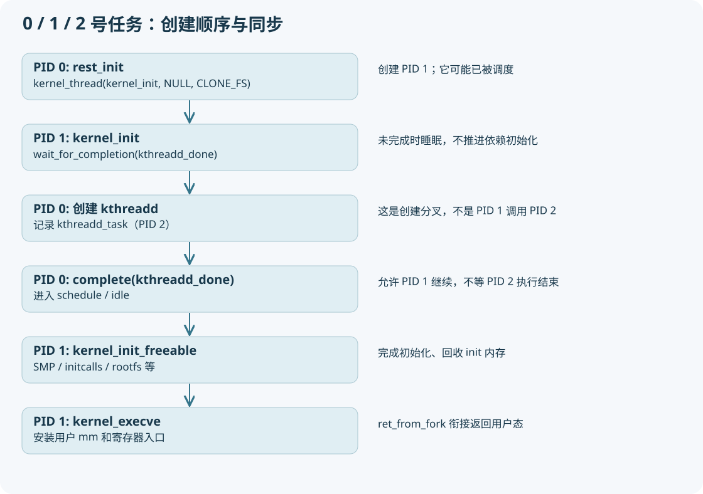

# 03 rest_init 如何分出 PID 1、PID 2 和 idle



## 按执行主体读 rest_init

此时 current 是 PID 0。`rcu_scheduler_starting` 推进 RCU 调度阶段，然后第一次 `kernel_thread(kernel_init, NULL, CLONE_FS)` 创建 PID 1。这里返回给 PID 0 的是新 PID，不是 kernel_init 的执行结果。

创建成功后，启动代码查找 PID 1 的 task，设置 `PF_NO_SETAFFINITY` 并暂时限制在 boot CPU，原因是 SMP 调度初始化尚未完成。后面的 `sched_init_smp` 才完善允许 CPU 的集合。不要把这个临时限制当作所有用户进程的固定亲和性。

第二次 `kernel_thread(kthreadd, NULL, CLONE_FS | CLONE_FILES)` 创建 PID 2，并设置全局 `kthreadd_task`。PID 1 必须先创建，否则初始命名空间里“init 是 PID 1”的预期会被破坏。

随后设置 `system_state=SYSTEM_SCHEDULING`，执行 `complete(&kthreadd_done)`，PID 0 调用一次 `schedule_preempt_disabled` 让执行推进，再进入 `cpu_startup_entry(CPUHP_ONLINE)`。

## PID 1 可能已经被调度，所以必须有门闩

`kernel_init` 的开头是 `wait_for_completion(&kthreadd_done)`，然后才调用 `kernel_init_freeable`。不能把等待位置写到后者里。本项目使用自愿抢占，PID 1 可能在第二次创建前已经运行，但会在 completion 上等待。

这是一种依赖协议：创建者发布 `kthreadd_task` 后发完成信号，使用者在信号后执行需要创建内核线程的初始化。它不要求 PID 2 已经完整跑完所有代码；保证关键发布已完成。completion 也不是忙等，不需要 PID 1 在 CPU 上循环检查。

## kernel_thread 在本版本里的参数长相

```c
struct kernel_clone_args args = {
    .flags = ((lower_32_bits(flags) | CLONE_VM |
               CLONE_UNTRACED) & ~CSIGNAL),
    .exit_signal = (lower_32_bits(flags) & CSIGNAL),
    .stack = (unsigned long)fn,
    .stack_size = (unsigned long)arg,
};
return kernel_clone(&args);
```

这段就是当前 `kernel/fork.c` 中的实现。不要在 GDB 输入 `p args->fn`，本版这里没有这样的成员。`stack` 在这条特殊创建路径里承载函数地址；`copy_thread` 根据 `PF_KTHREAD` 把它布置进初始寄存器框架。它不是用户新栈地址，也不能把这条含义强行套给用户 clone。

普通内核线程来源的 `current->mm` 是 NULL，所以 `copy_mm` 提前返回，子任务也没有用户 mm。`CLONE_VM` 不能凭空创建一个用户地址空间。

## PID 1 从内核函数变为用户程序

```text
kernel_init
  wait_for_completion(kthreadd_done)
  kernel_init_freeable
    smp_prepare_cpus / workqueue_init
    smp_init / sched_init_smp
    do_basic_setup（含 initcalls）
    wait_for_initramfs / console_on_rootfs
    按 rootfs 与 /init 可用性选择后续根文件系统流程
  async_synchronize_full
  free_initmem / mark_readonly / pti_finalize
  system_state = SYSTEM_RUNNING
  run_init_process
    kernel_execve
      bprm_execve → exec_binprm → search_binary_handler
        load_elf_binary 或脚本处理器再进入 ELF 装载
```

顺序意义：有些 init 函数和数据放在可回收的初始化区域，必须等相关异步任务结束再释放。不能在正常运行很久后仍期待 `kernel_init_freeable` 的初始化内存可用并下软件断点。

先尝试 initramfs 用户程序（通常 `/init`，可由 `rdinit=` 影响），随后 `init=`、配置默认值、`/sbin/init`、`/etc/init`、`/bin/init`、`/bin/sh` 等分支，具体看 `kernel_init` 和 `kernel_init_freeable`。`init=` 与 `rdinit=` 不是对所有启动方案都等价。

`begin_new_exec` 清除 `PF_KTHREAD` 等标志并关联新 mm。`kernel_execve` 成功后，本启动路径允许 kernel_init 返回；`ret_from_fork` 的内核线程分支返回后转入用户态返回路径。这是“最初没有用户态的 PID 1 如何进入第一个用户映像”的关键闭环。

## 本仓库的 init 不是默认 systemd

`tools/x86-lab/rootfs/init` 是 BusyBox shell 脚本。它挂载 dev/proc/sys/tmp，打印 banner，最终执行 `exec setsid cttyhack /bin/sh`。因此当前实验环境应以这个脚本和 BusyBox 实际行为为准，不能假定有 systemctl、完整 ps、bash 或动态链接器。

一般“exec 保持 PID”适用于同一调用进程；工具自身仍可能按会话状态决定是否 fork。请通过 `/proc/1/cmdline`、`ps` 实测最终 shell 身份。后面本学习包的自动实验 init 则明确保持 PID 1 做回收和关机。

检查题：为什么 PID 1 不是由 kthreadd 创建？因为它先由 PID 0 创建，而 kthreadd 是后建立的另一个分支。为什么 PID 1 一开始没有用户 mm，后来有？exec 装载并安装了新 mm。
