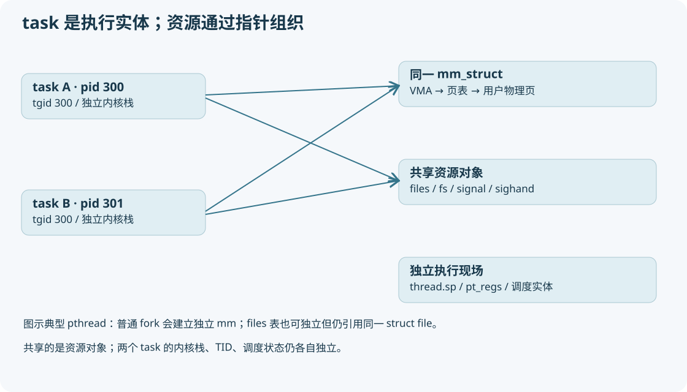

# 04 task_struct 是索引中心，不是装满一切的大箱子



## 先掌握 8 组字段

源码入口 `include/linux/sched.h:struct task_struct`。它含许多条件编译字段；不要凭网上某张固定字节布局图计算偏移，应使用 GDB `ptype /o struct task_struct`（若 GDB 支持）和当前调试符号。

|字段组|典型字段|含义与读法|
|---|---|---|
|身份|pid、tgid、comm|pid 标识 task；tgid 标识线程组；comm 是短名称，不能作为唯一身份|
|亲缘|real_parent、parent、children、sibling|真实父关系、信号/跟踪相关父关系、子列表及自身挂接节点|
|线程组|group_leader、thread_group、signal|多个 task 组成进程视角的组|
|运行|__state、on_rq、on_cpu、sched_class、se、rt、dl|状态、队列/CPU 标记、调度类和类私有实体|
|地址空间|mm、active_mm|用户空间拥有关系与当前页表上下文|
|执行现场|stack、thread、thread_info|内核栈、架构寄存器状态和线程标志|
|资源|files、fs、sighand、signal、cred、nsproxy|文件表、目录环境、信号、身份权限、命名空间|
|退出同步|exit_state、exit_code、exit_signal、clear_child_tid、vfork_done|退出观察、父通知、线程 join/vfork 协调|

本版实际调度状态字段叫 `__state`，不要照搬旧文档的 `p->state`。`TASK_RUNNING` 的数值为零，表示正在运行或可运行，不能仅凭它区分二者；还要看 rq->curr、on_cpu 和 CPU。`exit_state` 是另一组语义，不能把 EXIT_ZOMBIE 写进 __state。

## PID、TID、TGID 与命名空间

对于单线程进程，pid=tgid。pthread 创建后，每个线程有自己的 task 和 pid（用户常叫 TID），所有线程 getpid 通常相同，gettid 各不相同。

例如主线程 task.pid=300、tgid=300；第二线程 pid=301、tgid=300。工具默认以进程组视角显示 300，`/proc/300/task/301` 则能找到第二线程。内核 `struct pid` 在 `include/linux/pid.h` 里保存命名空间层次对应的 `upid`；数字身份不是全局唯一的裸整数。

`p->pid` 是内核内部初始 PID namespace 数字视角的一部分；`pid_vnr`、`task_pid_vnr` 等按 namespace 语义得到可见数字。容器中的 PID 1 可以对应宿主 PID 5000。`init_task` 的 PID 0 与容器 init 的 PID 1 是不同概念。

## 文件相关的两个层次

```text
父 task → files_struct A → fd[3] ─┐
                                ├→ 同一个 struct file → inode/path
子 task → files_struct B → fd[3] ─┘                 └→ f_pos
```

普通 fork 可得到两个文件描述符表，但表项会增加对同一个打开文件对象的引用。因此子进程读两个字节后，父进程继续读会看到偏移已经前进。这与内存页的 COW 无关。使用 `CLONE_FILES` 时连描述符表也共享：一边 close 会影响另一边对应的表项。

`files` 管 fd，`fs` 管 root/pwd/umask 等目录环境；“复制文件资源”不代表复制磁盘内容。`FD_CLOEXEC` 在 exec 时关闭相关描述符；普通 fork 不按这个标志关闭。

## 信号结构分两层

`sighand_struct` 主要是信号处理动作表；`signal_struct` 是线程组共享状态，包含组退出、统计等。各 task 还有私有 pending、blocked；signal 有组共享 pending。同一线程组为什么要共享地址空间和信号处理？处理函数地址属于某个地址空间，把函数指针共享给完全不同地址空间会破坏语义，所以 clone 标志有依赖校验。

`cred` 常用引用计数和写时替换方式管理，不能说 fork 一定逐字节深拷贝所有权限信息。`nsproxy` 指向一组 namespace；clone flags 可要求建立新 namespace。cgroup 与 namespace 不相同：前者偏资源控制/组织，后者偏可见性和隔离。

## task 与 mm 的两种引用数

`mm_users` 跟踪地址空间使用者的引用，典型用户是共享 mm 的任务；还可能有临时 mmget 引用，不能严格等同线程数量。最后一个 mm_users 消失时，`mmput` 触发 `exit_mmap` 等拆除用户映射。

`mm_count` 跟踪 mm 描述对象存续；mm_users 非零整体持有其基础引用，此外内核线程 active_mm 借用等可 `mmgrab` 增加 mm_count。`mmdrop` 归零才释放剩余 mm 结构/架构关联。用户映射拆完，不代表所有持有 mm 指针的人已经消失。

`task_struct`、内核栈、mm、页面各有自己的生命周期。打印一个仍存在的 zombie task 不能推断它还保留全部用户内存。

## GDB 阅读练习

```gdb
p init_task.pid
p init_task.mm
ptype struct task_struct
ptype struct mm_struct
# 正常内核运行阶段且已加载 scripts/gdb 辅助函数：
p $lx_current().pid
p $lx_current().tgid
p $lx_current().comm
p $lx_current().mm
p $lx_current().active_mm
p $lx_current().__state
```

一次只展开一层指针。`p *task` 全量输出通常被条件编译和大量锁字段淹没，先看上表里与你当前问题有关的字段。
