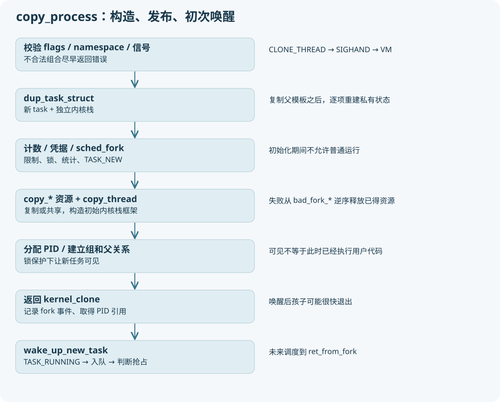

# 05 fork：从一次系统调用到一个完整但尚未运行的 task



## 用户 API 不一定对应同名系统调用

用户调用 libc `fork()`，库可能通过 `clone` 实现，也会协调 pthread atfork 和库内部锁。当前仓库包含内核，不包含你内网 glibc 的实现，不能凭内核源码断言实际 syscall 号。用 `strace -f -e trace=process ./程序` 或 GDB 断在 `kernel_clone` 观察，BusyBox rootfs 未必有 strace。

本树的 x86-64 `arch/x86/entry/syscalls/syscall_64.tbl` 包含 fork/vfork/clone/clone3/execve 的表项。`entry_SYSCALL_64 → do_syscall_64 → 系统调用包装器` 汇入 `kernel/fork.c` 的 SYSCALL_DEFINE 宏生成函数，最终统一为 `kernel_clone`。

```text
fork  → args.exit_signal=SIGCHLD ──────────────┐
vfork → args.flags=CLONE_VM|CLONE_VFORK ───────┤
clone → 从旧式参数构造 kernel_clone_args ────┼→ kernel_clone
clone3→ copy_clone_args_from_user + 校验 ────┘
kernel_thread → 特殊 stack/function 含义 ──────┘
```

## copy_process 分 8 段阅读

### 第 1 段：合法性与边界

检查 flags 组合、namespace、PIDFD 等约束：`CLONE_THREAD` 要求 `CLONE_SIGHAND`，`CLONE_SIGHAND` 要求 `CLONE_VM`。处理并发到来的组信号，防止 fork 边界两侧出现不合理的信号继承。非法组合在资源分配前尽早退出。

### 第 2 段：新任务对象和独立内核栈

`dup_task_struct(current,node)` 分配任务结构及栈，并执行架构复制。复制父 task 只是起点；里面的指针、锁、链表不能原样当作新的独立状态继续使用，所以后面逐项重新初始化。

每个线程也需要独立内核栈，因为两个线程可能同时执行系统调用，不能覆盖彼此的局部变量和返回地址。CONFIG_VMAP_STACK 等会影响内核栈分配方式；不能假定所有内核栈都按固定连续物理页形式分配。

### 第 3 段：限制、计数、凭据和私有字段

设置 `set_child_tid/clear_child_tid`，检查 RLIMIT_NPROC/ucounts、max_threads，执行 `copy_creds`。清理不该继承的 flags，建立空 children/sibling，重置信号 pending、时间统计与锁。限制失败常表现为 EAGAIN，不是只有内存不足 ENOMEM 一种 fork 失败。

### 第 4 段：调度器准备

`sched_fork` 初始化调度实体、设初始状态 TASK_NEW、选择/记录初始 CPU 相关信息。此时仍不能运行。TASK_NEW 是初始化中的保护，不是你能在 ps 中长期观察到的普通运行状态。

### 第 5 段：复制或共享资源

顺序入口包括 `copy_semundo → copy_files → copy_fs → copy_sighand → copy_signal → copy_mm → copy_namespaces → copy_io → copy_thread`。perf、audit、security、cgroup 等钩子也参与，不能在解释失败路径时删除它们。主线阅读先标出钩子目的，再聚焦资源分支。

copy 并不一律表示深复制：copy_mm 遇 CLONE_VM 增加旧 mm 引用；copy_files 遇 CLONE_FILES 共享表；copy_thread 构造的是未来执行现场。

### 第 6 段：PID 与线程组

`alloc_pid` 为目标 PID namespace 分配身份。普通新进程 `group_leader=p; tgid=pid`；CLONE_THREAD 继承 `current->group_leader/current->tgid`。`alloc_pid` 返回的是 struct pid 对象，不只是一个 int。

注意：在很早的 copy_process 入口，局部 p 还未初始化；即使稍后 p 已分配，pid 字段还可能没有完成新身份安装。不要用“入口处 p->pid 的值”证明子 PID。

### 第 7 段：对系统可见

在 tasklist_lock 等锁保护下，设置父关系、挂接 PID 与线程组、子链表/任务链表，更新计数。这一步让其他观察者能够找到任务，但仍未由这里执行用户指令。

### 第 8 段：返回或逆序回滚

成功返回 p；失败走 `bad_fork_*` 链，释放已经取得的资源、计数和引用。阅读 goto 标签时，从报错地点往后看哪些对象已存在，再看释放顺序，能学到所有权。错误返回是 `ERR_PTR`，调用者用 `IS_ERR/PTR_ERR` 解析，不能当普通 task 解引用。

## kernel_clone 完成发布与唤醒

```text
p = copy_process(...)
  → 检查 ERR_PTR
  → trace_sched_process_fork(current,p)
  → get_task_pid / pid_vnr
  → 可选 CLONE_PARENT_SETTID
  → 可选准备 vfork completion
  → wake_up_new_task(p)
  → 可选 ptrace 事件
  → 可选 wait_for_vfork_done
  → put_pid
  → 向父调用者返回 nr
```

为什么先取得 PID 引用、再唤醒？子任务被唤醒后可能很快退出；源码注释明确提醒 p 可能失效，不能随意在后面拿旧 task 指针继续访问。GDB 单步也会改变并发时序，记录地址后不能假定永远有效。

`wake_up_new_task` 把 TASK_NEW 改为 TASK_RUNNING，选择 CPU，激活入队，并判断是否抢占当前任务。它可能使子任务先于父任务返回用户态执行。父子打印先后不能作为创建顺序证据。

## fork 到底复制了什么

|内容|普通 fork|典型 pthread|
|---|---|---|
|task/内核栈|新对象|新对象|
|用户寄存器初值|复制并修改返回值|新栈/TLS 等按 clone 设置|
|mm/VMA|建立新对象|共享 mm/VMA|
|用户私有可写页|通常先共享并写保护，后 COW|共享同一映射，不靠 fork COW 隔离|
|files 表|新表，表项引用可共享|通常共享表|
|线程组|新组|原组|
|调度实体|独立|独立|

检查题：copy_process 成功就代表子进程执行了第一条用户指令吗？不代表。它还需要唤醒、被选择、首次上下文恢复并走返回用户态路径。
