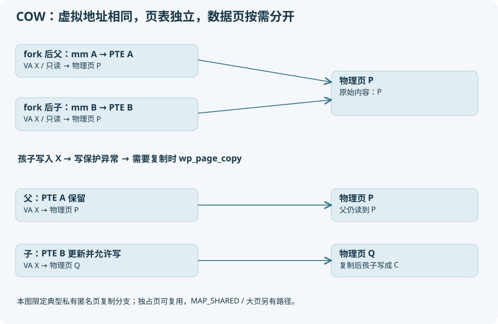

# 07 fork 把进程与内存管理接起来



## copy_mm 三选一

|条件|新 task 的结果|为什么|
|---|---|---|
|current->mm 为 NULL|mm/active_mm 保持本函数先设的 NULL|内核线程来源没有用户 mm 可复制|
|有旧 mm，且 CLONE_VM|mmget(oldmm)，使用同一 mm|线程式共享地址空间|
|有旧 mm，无 CLONE_VM|dup_mm 得到新 mm|普通 fork 地址空间独立|

`copy_mm` 不是复制所有内存的黑盒。`dup_mm` 分配 mm 描述对象，memcpy 部分父状态后用 `mm_init` 重新初始化锁、计数、页表等，再通过 `dup_mmap` 建立映射。

## VMA、页表、物理页分开看

VMA 是一个区间的规则，例如 `[0x400000,0x402000)` 可读可执行并映射某文件。页表把具体虚拟页翻译为物理页；物理页存真实字节。VMA 存在不代表其每一页已经分配物理页。

本版 mm 管理 VMA 使用链表和红黑树（如 mm->mmap/mm_rb），不是较新内核的 Maple Tree。`dup_mmap` 遍历旧 VMA，对应创建新 VMA、关联 anon_vma/文件映射并调用 `copy_page_range`。VM_DONTCOPY 区域可跳过，VM_WIPEONFORK 区域按 fork 擦除语义处理；所以也不是所有 VMA 原封不动复制。

`copy_page_range → copy_p4d_range → copy_pud_range → copy_pmd_range → copy_pte_range` 是普通页表下降路径，折叠层级由配置决定。大页、设备映射、未建立页表、按需重新 fault 的文件映射会走不同分支。

## COW 最重要的是“父亲也写保护”

`mm/memory.c:copy_present_pte` 检查 `is_cow_mapping(vm_flags)`，当原 PTE 可写时，对父 PTE 使用 `ptep_set_wrprotect`，对子 PTE 使用 `pte_wrprotect`。普通可写私有映射必须同时限制双方写入，否则父亲直接写共享物理页会偷偷改变孩子的数据。

VMA 仍然可以保留 VM_WRITE，表示**逻辑上允许程序写**；PTE 此刻只读，表示**要先经过缺页处理实现正确写入**。页表写保护不等于程序失去写权限。内核会区分这种合法 COW 与对只读代码页的非法写。

父子相同虚拟地址各查自己的页表，所以以后可以指向不同物理页。地址空间相同布局，不是同一个 mm。

## 写入发生后的路径

```text
用户 store 指令
  → x86 page fault 入口 / exc_page_fault
  → do_user_addr_fault：找到 VMA、检查地址与访问权限
  → handle_mm_fault → __handle_mm_fault
  → handle_pte_fault
  → do_wp_page（典型 present、写保护小页）
      ├─ 独占匿名页满足条件 → wp_page_reuse
      ├─ 共享可写映射 → wp_page_shared 等
      └─ 需要私有副本 → wp_page_copy
          分配页 → 复制内容 → 校验旧 PTE 是否仍有效
          更新映射/RSS/rmap/TLB 等 → 返回
  → 重试用户 store 指令
```

`wp_page_copy` 不能拿着旧的观察盲目覆盖页表：睡眠分配期间别的线程可能改变映射，因此需要重新加锁、核对 PTE。实际源码还涉及 memcg、mmu notifier、缓存和 TLB 同步，这是简单“分配+memcpy”的解释遗漏的正确性部分。

不是每次写保护异常都复制。`do_wp_page` 明确有独占匿名页复用分支。对未存在的私有文件映射进行写 fault 还可能走 `do_cow_fault`，THP 走大页分支。教学实验选一个已预写的小匿名私有页，尽量聚焦最典型路径。

## 三种常被混淆的写

|映射|fork 后孩子写|父亲是否应看见|
|---|---|---|
|MAP_PRIVATE 匿名页|普通 COW 私有化|不应看见孩子的新内容|
|MAP_SHARED 匿名/文件映射|共享语义，按映射规则更新|应可观察共享修改，需要同步|
|pthread 共享 mm 中普通变量|同一用户映射|可共享，但无同步读写可能是 C 数据竞争|

实验 `process_lab cow` 用管道保证先写后读；`threads` 用 pthread_join 建立同步。不能用两个线程无锁自增的偶然结果讲“共享内存正确性”。

## 如何把推断升级为证据

第一层：父子打印相同虚拟地址，孩子改成 C，父亲仍为 P。证明隔离的可见行为，**没有直接证明 PFN 最初相同**。

第二层：GDB 比较两个 task 的 mm、pgd；记录该地址 PTE 的可写位及物理帧（要正确处理层级、巨页、PTI）。内核调试中可沿 vmf->orig_pte 和更新后的 PTE 观察。

第三层：在目标 PID 和目标地址范围内命中 do_wp_page/wp_page_copy，记录 vmf->address、vma->vm_mm，走到页表更新后记录新映射。这样才能解释是复制还是复用。

`/proc/PID/smaps` 统计是页级/区域级辅助证据；minor fault 计数包括其他缺页，不能仅凭“增加 1”断言目标页 COW。`pagemap` PFN 可受权限限制，不应默认任何用户都能读出物理地址。

## 与 malloc 的最后一座桥

malloc 是 libc 分配器。它可能复用已有堆块，也可能通过 brk/mmap 扩大地址空间。fork 后 malloc 管理元数据也被复制为父子各自地址空间中的内容；子进程 free 不会释放父进程的同一个虚拟堆对象。多线程 fork 后只有调用线程留在子进程，其他线程曾持有的用户锁状态仍可能复制过来，因此应尽快执行适合该场景的 exec 流程。

检查题：mm->pgd 不同，是否表示每个叶子映射的物理页都不同？不表示。页表树独立与用户数据页共享可以同时成立。
