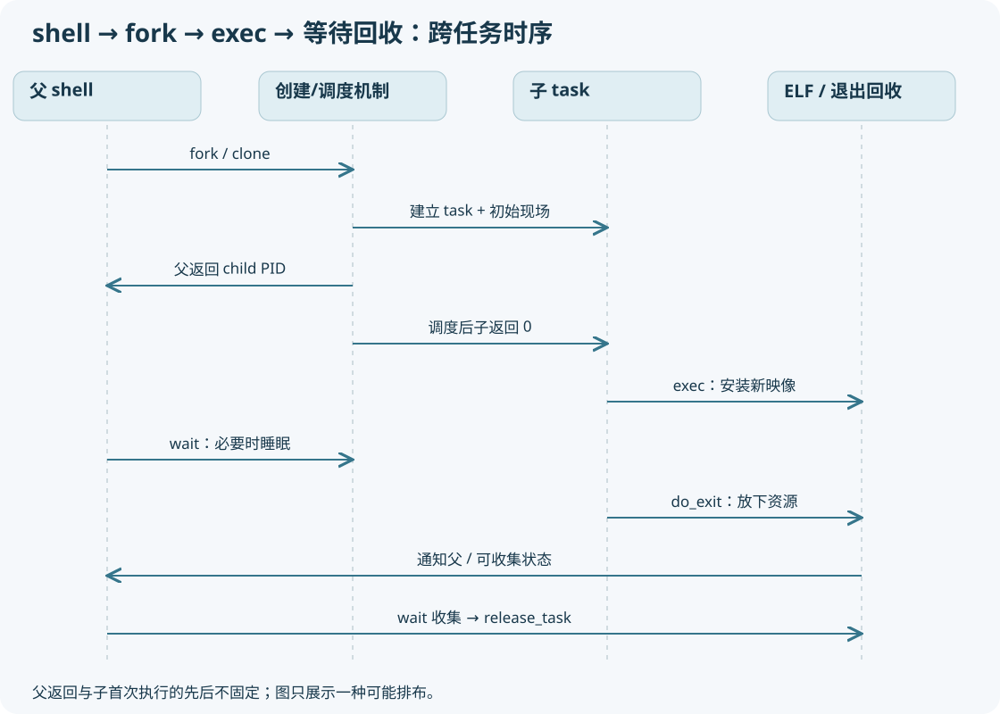

# 08 用户新增一个应用，内核如何让它运行



## 从 shell 输入 ./hello 开始

shell 解析命令、重定向、管道、环境变量与 PATH。外部命令常见路径是创建子进程再在子进程 exec；内建命令、shell 优化、posix_spawn 等可以不同。不能说每条 shell 命令都 fork。

你把 hello 拷进文件系统，只产生目录项和文件。运行它时，已有任务发起 execve。内核根据文件格式找到装载器，给**当前任务**安装新程序映像。成功 exec 不回到旧程序调用后的语句。

## 与 fork 的根本区别

fork 增加 task，普通情况增加 mm；exec 通常保留同一进程身份和 task，替换 mm 和用户执行现场。教材中“PID 不变”的实验限定为单线程进程。多线程进程若非组长线程 exec，`de_thread` 会消除其他线程并处理组长身份交接，调用线程的 TID 可能变化，而进程 TGID 语义保持。这是不能忽略的例外。

## 实际调用树

```text
用户 execve
  → __x64_sys_execve / SYSCALL_DEFINE3(execve)
  → do_execve → do_execveat_common
      → alloc_bprm / bprm_mm_init
      → 计数、复制 argv/envp 字符串到暂存的新 mm
      → bprm_execve
          → 打开可执行文件、权限/安全检查
          → exec_binprm
              → search_binary_handler
                  ├─ load_script：#! 解释器参数重写
                  └─ load_elf_binary
                      → 检查 ELF 头、读取 program headers
                      → 处理 PT_INTERP（动态链接器）
                      → begin_new_exec
                          → de_thread / unshare_files
                          → exec_mmap(bprm->mm)
                          → 清除 PF_KTHREAD 等 / CLOEXEC
                      → setup_arg_pages
                      → 映射 PT_LOAD、处理 bss/brk
                      → load_elf_interp（如需要）
                      → create_elf_tables（argc/argv/envp/auxv）
                      → START_THREAD → x86 start_thread
  → 内核返回用户态 → ELF 入口/动态链接器入口 → _start → main
```

这是主线树；其中字符串复制、权限检查有多处分支，脚本会重新寻找解释器，且 kernel_execve 使用内核 argv/envp 路径。不能把 kernel_execve 的内核指针当成用户指针，直接代入用户 execve 的 uaccess 流程。

## linux_binprm 是装载过程对象

`linux_binprm` 是临时装载上下文，不是最终 task。它持有候选文件、将安装的 mm、参数栈位置、解释器信息及 `point_of_no_return`。此时 task 还可以持有旧 mm，而 bprm->mm 指向新 mm；“新地址空间存在”和“已替换旧程序”不是同一时刻。

`exec_mmap` 中实际出现：`tsk->active_mm=mm; tsk->mm=mm`，并协调 `activate_mm`、锁、membarrier、旧 mm 引用。这个位置适合 GDB 拍替换前后两张照片。

## exec 不是绝对可回滚事务

`begin_new_exec` 先计算凭据，然后设置 `bprm->point_of_no_return=true`，接着 de_thread。过了提交边界，旧执行环境可能已不可恢复，后续失败可导致致命信号，不能都当成 execve 返回 -1 然后旧程序继续。早期找不到文件等失败，才是常见可返回路径。

## ELF 哪些数据真的变成内存

ELF header 说明类型、机器、入口和 program header 表位置。装载主要关注 **program headers** 的 PT_LOAD，不是依赖 `.text/.data` 的 section header 名字。section 更偏链接/分析用途。

每个 PT_LOAD 描述文件偏移、虚拟地址、文件大小、内存大小及权限。`p_memsz > p_filesz` 的尾部涉及零填充/BSS。建立映射不意味着整个文件立即从磁盘读入物理内存；许多页以后按需缺页。静态 ELF 直接进入自身入口；带 PT_INTERP 的动态 ELF 一般先进入动态链接器。

`create_elf_tables` 在用户栈布置 argc、argv 指针、envp 指针和 auxiliary vector，例如 AT_ENTRY、AT_PHDR、AT_PAGESZ 等。`main` 是 C 运行库调用约定中的后续入口，内核不会查找名为 main 的符号去调用。

## 三种栈重新区分

|栈|fork 后|exec 后|
|---|---|---|
|任务内核栈|新 task 有自己的内核栈|同一 task 继续使用内核执行设施，不是照搬旧用户栈|
|用户主线程栈|复制地址空间布局，页通常 COW|重新构造新程序用户栈|
|pthread 用户栈|库分配并通过 clone 传入|线程组被规整后进入新映像|

## 常见“文件明明在却运行不了”

文件权限、CPU 架构不匹配、ELF 损坏、挂载 noexec、脚本 shebang 解释器缺失、动态 ELF 的 PT_INTERP 路径缺失，都可能导致失败。内网 BusyBox 根文件系统常没有 `/lib64/ld-linux-x86-64.so.2`；本套实验提供静态二进制正是为了减少该依赖。静态链接只影响用户程序依赖，不会改变 fork/exec 的内核基本机制。

检查题：exec 前后的 mm 指针不同是否表示 PID 也变？不表示。看 task/PID 与 mm 两条线。首次缺页和调度发生在 exec 之后也正常，新程序的物理页面往往尚未全部准备。
