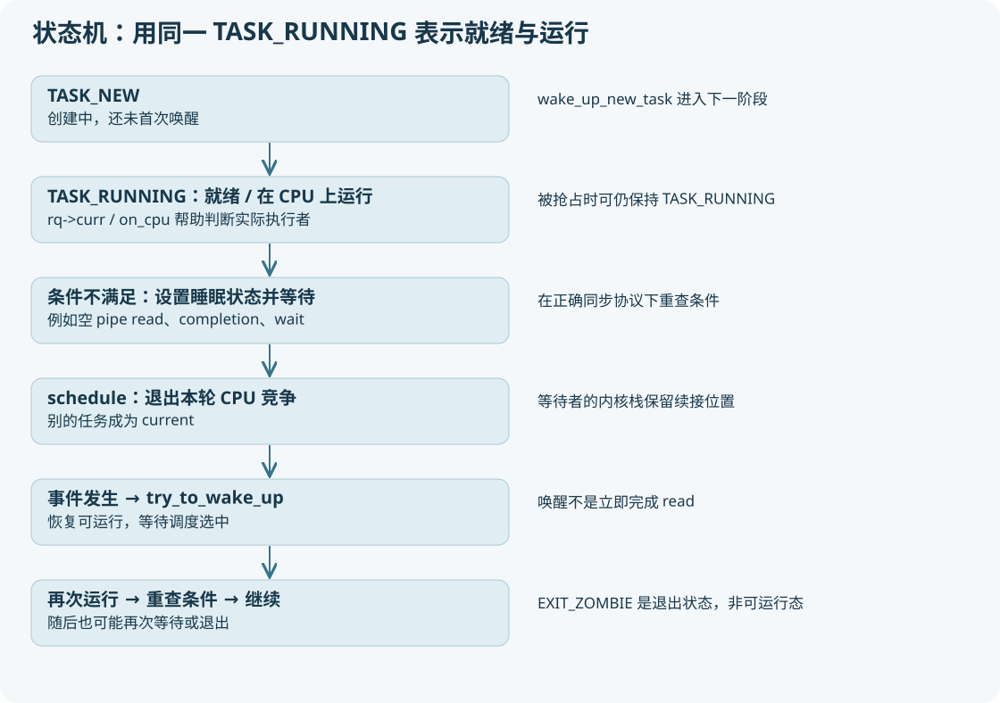

# 10 谁获得 CPU：状态、队列和调度类



## 可运行不等于正在运行

单 CPU 同一时刻只有一个普通任务占用该 CPU 的执行位置，但多个任务都可以为 TASK_RUNNING。调度器维护每 CPU 的 rq；当前任务由 rq->curr 表示；阻塞任务等待条件满足，一般不参与该 CPU 当前可运行竞争。

|名字|在本版的含义|常见误读|
|---|---|---|
|TASK_NEW|正在建立，还没有初次唤醒|不是用户可持续观察的“新进程态”|
|TASK_RUNNING|正在运行或可运行|R 不等于此刻占用 CPU|
|TASK_INTERRUPTIBLE|可被对应信号/事件唤醒的睡眠|不是每次睡眠都会收到信号|
|TASK_UNINTERRUPTIBLE|通常不因普通信号直接结束等待|不应简单等同所有磁盘 IO|
|TASK_KILLABLE|结合唤醒标志处理致命信号的等待|不是普通可中断睡眠的同义词|
|EXIT_ZOMBIE|退出状态待收集|不是会再次参与调度的任务|
|TASK_DEAD|最终离开调度的状态|与 exit_state 的 EXIT_DEAD 分清|

## schedule 不总是发生切换

`kernel/sched/core.c:__schedule` 取 prev，检查它是否因等待而需要出队，调用 `pick_next_task` 选 next，清 need_resched。当 prev != next 才执行 context_switch；若仍选自己，就释放锁继续。

`schedule()` 不是时钟中断唯一调用的函数。任务因 pipe/read、锁等待、completion、wait 等主动让出 CPU，也会进入调度。定时器主要做记账、设置需要重调度等，后续在允许点推进切换。

## 本项目是 PREEMPT_VOLUNTARY

当前根 `.config` 和已有 kernel.config 都选 CONFIG_PREEMPT_VOLUNTARY。它不像完整内核抢占那样在所有可抢占内核执行点都尽快打断；内核显式调度点/cond_resched 与返回用户态等路径很重要。关闭中断、持自旋锁和 preempt_count 等限制会影响何时能真正调度。

因此“时间片到了马上在任意 C 语句切换”是错误模型。阻塞路径本身当然也可主动 schedule；调试时看真实调用栈分辨 voluntary 与 involuntary 统计。

## 调度类比 CFS 更上一层

概念优先关系是 stop、deadline、实时、fair、idle，具体链接顺序看本版 `include/asm-generic/vmlinux.lds.h` 的调度类布局和各类定义。普通应用通常走 fair，但不能把整个 Linux 调度器等于 CFS。

rq 中有 cfs_rq、rt_rq、dl_rq 等类状态，task 中有 se、rt、dl 等实体。idle 是没有合适普通任务时的兜底。不要把普通任务设置 SCHED_IDLE 策略和每 CPU idle task 混在一起。

## 5.15 的 CFS 主线

`kernel/sched/fair.c` 使用调度实体、红黑树、虚拟运行时间与权重。核心直觉：谁相对其权重获得的 CPU 服务更少，通常更应获得下一段服务。`update_curr` 根据实际执行时间推进统计和 vruntime；nice 对应权重使相同墙钟执行时间产生不同虚拟时间增量。

```text
scheduler_tick
  → 当前 sched_class->task_tick
      → task_tick_fair
          → entity_tick
              → update_curr
              → check_preempt_tick → resched_curr

__schedule
  → pick_next_task
      → pick_next_task_fair
          → pick_next_entity 等，考虑层次/当前实体/候选规则
  → context_switch（如果选中不同 task）
```

“永远直接拿红黑树最左 task”是教学近似：当前实体、buddy 优化、组调度层次、节流与其他规则都会参与。不能拿新版本 EEVDF 的 deadline/eligibility 解释本版 CFS。

## SMP 比单 CPU 多什么

每 CPU 一套 rq，并不意味着任务永不迁移。创建/唤醒时选择 CPU，运行中负载均衡、亲和性和 CPU 热插拔可改变位置。迁移要协调队列锁、任务状态和缓存/NUMA 成本。

单 CPU 实验易看顺序；双 CPU 可让父子同时跑，GDB 某个 CPU 停点不能被当作全局串行故事。QEMU GDB 的 thread 列表通常首先描述 vCPU，不是 Linux 每个 task，内核 task 列表看 lx-ps 等。

## 一步一步验证

先跑 `process_lab pipe`，记录子 PID。通过 trace 看孩子从 R 切出时的 prev_state 是否是睡眠状态，随后由写端触发 sched_waking/sched_wakeup，再观察 sched_switch 切入孩子。阻塞到唤醒、唤醒到实际执行的延迟是两段不同时间。

在 `__schedule` 单步太嘈杂时，换成 `trace_sched_switch` 所在行附近，以 prev/next 的 pid 条件过滤。优化内联可能没有独立 `context_switch` 符号，不能看到 `Function not defined` 就断言没发生切换。

检查题：两个 pthread 共用 mm，为什么仍各自需要 se 和 __state？因为一个线程能阻塞，另一个线程仍可运行；调度实体必须独立。
