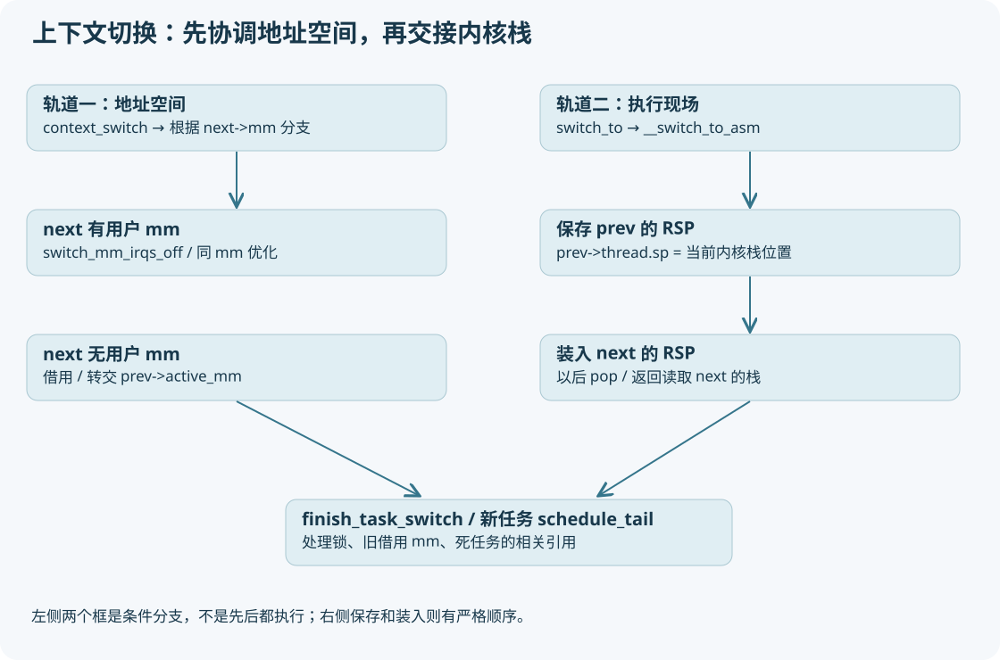

# 11 context_switch：页表与内核栈两次交接



## 第一轨：地址空间上下文

`kernel/sched/core.c:context_switch` 先做 prepare_task_switch 和体系结构准备，然后根据 next->mm 分支。

|prev → next|源码主要动作|理解|
|---|---|---|
|用户 → 用户|switch_mm_irqs_off(prev->active_mm,next->mm,next)|不同 mm 时切换地址空间；同 mm 有优化|
|用户 → 内核线程|next->active_mm=prev->active_mm；mmgrab|借用前者 mm 的描述对象引用|
|内核线程 → 内核线程|转交 active_mm；清 prev->active_mm|转移借用责任|
|内核线程 → 用户|切到 next->mm；旧借用放 rq->prev_mm|稍后 finish_task_switch 做 mmdrop|

这些分支讨论的是常规路径。内核线程显式使用 mm 的特殊情形要看实际字段，不可只凭 comm 名字分类。

`arch/x86/mm/tlb.c:switch_mm_irqs_off` 负责 x86 地址空间上下文、TLB/ASID/PCID 等协调。不能声称每次任务切换都完整清空 TLB、每次都无条件重写 CR3；同 mm、PCID、TLB generation 和 PTI 等会影响行为。页表切换不复制用户内容，改变的是 CPU 应如何解释虚拟地址。

## 第二轨：执行现场

`switch_to(prev,next,prev)` 宏进入 `__switch_to_asm`。最后一个 prev 是用于接收“实际刚切出的任务”的值，不是简单重复多余参数。栈换了，返回后的局部执行语境已经变成另一个任务。

```asm
pushq %rbp
pushq %rbx
pushq %r12
pushq %r13
pushq %r14
pushq %r15
movq %rsp, TASK_threadsp(%rdi)
movq TASK_threadsp(%rsi), %rsp
/* 栈保护/推测执行防护等条件编译代码 */
popq %r15
popq %r14
popq %r13
popq %r12
popq %rbx
popq %rbp
jmp __switch_to
```

RDI/RSI 在这个调用边界是 prev/next。第一条 mov 把当前内核 RSP 保存到 A->thread.sp；第二条 mov 从 B->thread.sp 装入 RSP。接下来的 pop 已从 B 的栈读取。栈里的返回地址因此也属于 B。

这段不是把所有寄存器都放进 task_struct：部分在内核栈，部分在 pt_regs，其他架构状态由 `arch/x86/kernel/process_64.c:__switch_to` 及 FPU/TLS 等协作处理。FPU 状态保存/恢复的具体策略依本版特性和运行状态，不能拿更老的“所有 FPU 都懒切换”故事替代源码。

## 为什么 A 调用 switch 后，B 从 switch 后继续

把 A、B 的内核栈画成两条纸带：A 纸带记录 A 走到 schedule 的返回地址，B 纸带记录 B 上次停下的返回地址。CPU 换到 B 的纸带，就从 B 的续接位置走。C 代码文本相同，不代表栈实例相同。

若 B 是新任务，它的纸带由 copy_thread 人工做出，返回地址是 ret_from_fork；若 B 曾运行，则恢复 B 历史栈。`finish_task_switch(prev)` 在切入后的任务上下文做收尾：解锁、内存借用引用释放、若切出任务已 TASK_DEAD 则处理任务/栈最终调度相关引用。

调度器不能在 A 仍使用 A 的内核栈时把这块栈释放。所以退出最后的调度与 next 上的收尾构成必要交接。

## 用户态如何回来

B 如果在一个系统调用中睡眠，现在恢复后先继续 B 的内核系统调用；它不是立刻跳到用户 main。只有处理完内核返回路径、信号、需要重调度等工作后才恢复用户寄存器并返回用户态。

系统调用入口在 `arch/x86/entry/entry_64.S`；通用返回工作在 `kernel/entry/common.c` 和 x86 entry 相关文件。SYSRET/IRET 的选择涉及状态合法性与特性。首次 fork 的返回路径不能机械等同所有普通 syscall 的快速出口。

## 可操作的 4 张照片

1. `__schedule` 选出 next 后：prev->pid、next->pid、prev->mm、next->mm。
2. `__switch_to_asm` 入口：RDI、RSI、RSP、两个 task->thread.sp。
3. 执行两条切栈 mov 后：RSP 应成为 next 保存的位置（周边 push/pop 会继续改变值）。
4. 切入后：current 对应 next，栈回溯属于 next；prev 参数表示刚刚交出的那个任务。

GDB 在汇编切栈中间展开 bt 可能暂时混乱，这是展开信息和中间态问题，优先看原始寄存器和栈内存。还没有理解内核栈前，不要据这一次 bt 的异常判定内核损坏。
