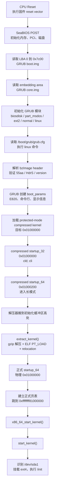
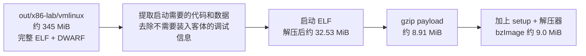
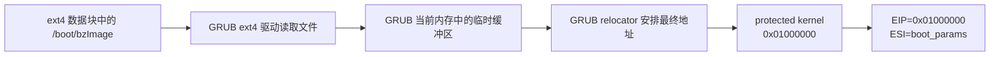
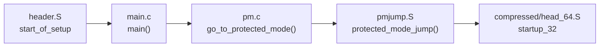
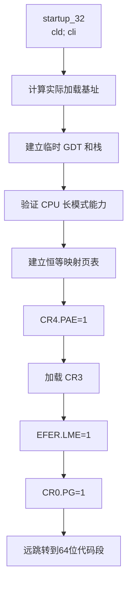
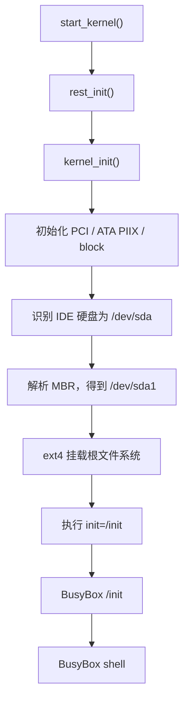
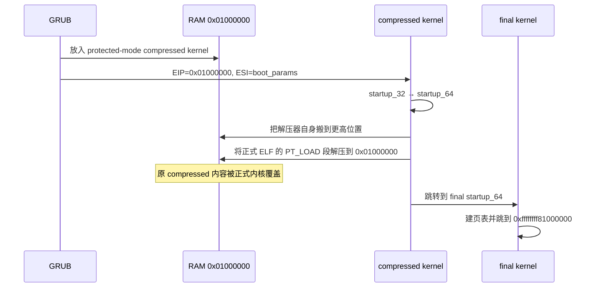

# Linux 5.15 GRUB BIOS 硬盘启动：从加电到 `start_kernel()` 学习手册

> 适用项目：`/Users/xuyu/Desktop/code/linux5.15_comment`  
> 适用镜像：`out/x86-lab/grub-bios-disk.img`  
> 适用启动方式：QEMU `-hda`，SeaBIOS + MBR + GRUB2 i386-pc + Linux x86_64  
> 当前产物快照：2026-07-14，Linux 5.15，GRUB 2.06，关闭 KASLR

本手册解释的不是“如何输入一条 QEMU 命令”，而是这条命令背后每一阶段实际做了什么：CPU 从哪里开始执行、BIOS 为什么把 MBR 放到 `0x7c00`、GRUB 如何读取 ext4 中的 `bzImage`、Linux 哪些 16 位 setup 代码被 GRUB 跳过、compressed kernel 如何进入 32 位和 64 位、正式内核怎样覆盖同一物理地址、何时切换到高半区虚拟地址，以及最终如何进入 `start_kernel()`、挂载 BusyBox 根文件系统。

文中有两类数字：

- **协议规定或源码定义**：例如 BIOS MBR 入口 `0x7c00`、compressed 64 位入口相对偏移 `0x200`。
- **当前构建产物的实测值**：例如 `pref_address=0x01000000`、`setup_sects=27`。重新配置或编译内核后，这些值可能改变，应重新读取 `bzImage` header。

---

## 目录

- [1. 先记住六个结论](#1-先记住六个结论)
- [2. 三种地址和三个 head 文件](#2-三种地址和三个-head-文件)
- [3. 当前完整硬盘镜像结构](#3-当前完整硬盘镜像结构)
- [4. 从加电到 start_kernel 的总流程](#4-从加电到-start_kernel-的总流程)
- [5. 阶段一：CPU Reset 与 SeaBIOS](#5-阶段一cpu-reset-与-seabios)
- [6. 阶段二：LBA 0、0x7c00 与 GRUB boot.img](#6-阶段二lba-00x7c00-与-grub-bootimg)
- [7. 阶段三：GRUB core.img、分区和 ext4](#7-阶段三grub-coreimg分区和-ext4)
- [8. 阶段四：grub.cfg 和 linux 命令](#8-阶段四grubcfg-和-linux-命令)
- [9. bzImage 的内部结构](#9-bzimage-的内部结构)
- [10. GRUB 如何加载当前 bzImage](#10-grub-如何加载当前-bzimage)
- [11. 为什么 Linux 的 16 位 setup 没有执行](#11-为什么-linux-的-16-位-setup-没有执行)
- [12. compressed startup_32：0x01000000 第一次出现](#12-compressed-startup_320x01000000-第一次出现)
- [13. compressed startup_64：进入长模式](#13-compressed-startup_64进入长模式)
- [14. 解压器搬家与正式内核解压](#14-解压器搬家与正式内核解压)
- [15. 正式 startup_64：0x01000000 第二次出现](#15-正式-startup_640x01000000-第二次出现)
- [16. x86_64_start_kernel 到 start_kernel](#16-x86_64_start_kernel-到-start_kernel)
- [17. start_kernel 之后如何进入 BusyBox](#17-start_kernel-之后如何进入-busybox)
- [18. 启动全过程的内存变化](#18-启动全过程的内存变化)
- [19. 推荐的 GDB/CLion 调试路线](#19-推荐的-gdbclion-调试路线)
- [20. 可重复的观察实验](#20-可重复的观察实验)
- [21. 常见误解](#21-常见误解)
- [22. 我的重点疑问逐条解答](#22-我的重点疑问逐条解答)
- [23. 源码阅读顺序](#23-源码阅读顺序)
- [24. 最终心智模型](#24-最终心智模型)

---

## 1. 先记住六个结论

### 结论一：`0x7c00` 运行的是 GRUB MBR，不是 Linux

SeaBIOS 从启动硬盘读取 LBA 0，把 512 字节放到物理地址 `0x7c00`，然后跳过去执行。当前镜像的 LBA 0 是 GRUB 的 `boot.img` 加 MBR 分区表。

### 结论二：当前 GRUB 不执行 Linux 5.15 的 16 位 setup 主流程

当前 `grub.cfg` 使用：

```grub
linux /boot/bzImage root=/dev/sda1 rw console=ttyS0,115200 init=/init
```

GRUB 的 `linux` 模块使用 Linux 32 位 boot protocol，自己建立 `boot_params`、E820 内存表和命令行，然后直接进入 compressed kernel 的 32 位入口。因此下面这些代码不执行：

```text
arch/x86/boot/header.S:start_of_setup
arch/x86/boot/main.c:main
arch/x86/boot/pm.c:go_to_protected_mode
arch/x86/boot/pmjump.S:protected_mode_jump
```

### 结论三：当前第一条 Linux 指令位于 `0x01000000`

当前 `bzImage` 声明：

```text
relocatable_kernel = 1
pref_address       = 0x01000000
kernel_alignment   = 0x00200000
```

GRUB 因而把 protected-mode compressed kernel 安排到 16 MiB，并设置：

```text
EIP = 0x01000000
ESI = boot_params 的物理地址
CPU = 32 位保护模式
```

入口对应：

```asm
arch/x86/boot/compressed/head_64.S:startup_32
    cld
    cli
```

### 结论四：`compressed/head_64.S` 的第一入口仍然是 32 位

文件名包含 `head_64`，不等于第一条指令就是 64 位。它包含：

```text
startup_32：偏移 0x000，32 位入口
startup_64：偏移 0x200，64 位入口
```

当前地址因此是：

```text
compressed startup_32 = 0x01000000
compressed startup_64 = 0x01000200
```

### 结论五：`0x01000000` 在不同时刻装着两套代码

```text
第一次：compressed/head_64.S:startup_32，开头是 cld; cli
第二次：kernel/head_64.S:startup_64，开头是 lea ..., %rsp
```

解压器先从 `0x01000000` 启动，再把自己搬到高处，最后把正式内核解压回 `0x01000000`。

### 结论六：本地 345 MiB 的 vmlinux 不会被完整装进客体

`out/x86-lab/vmlinux` 含完整 ELF、符号表和 DWARF，主要供 GDB 使用。启动硬盘中保存的是约 9 MiB 的 `/boot/bzImage`。其中约 8.91 MiB 的 gzip payload 解压后是约 32.53 MiB 的启动 ELF，解压器再把其可加载段放进客体物理内存。

---

## 2. 三种地址和三个 `head` 文件

### 2.1 不要混淆 1 MiB 和 16 MiB

```text
0x00100000 =  1 MiB = 1,048,576
0x01000000 = 16 MiB = 16,777,216
```

当前 header 中原始 `code32_start` 是 `0x00100000`，但由于内核可重定位且 `pref_address=0x01000000`，GRUB 把实际入口修正为 `0x01000000`。

### 2.2 文件偏移、物理地址和虚拟地址

| 名称 | 示例 | 含义 |
|---|---:|---|
| 磁盘 LBA | `LBA 0` | 第几个 512 字节磁盘扇区 |
| 文件偏移 | `bzImage+0x3c0d` | 数据在文件内部的位置 |
| 物理地址 | `0x01000000` | 客体 RAM 中的位置 |
| 虚拟地址 | `0xffffffff81000000` | 开启分页后 CPU 使用的内核地址 |

正式内核入口的典型对应关系是：

```text
物理地址：0x01000000
虚拟地址：0xffffffff81000000
```

### 2.3 本启动链中的三个重要汇编入口

| 文件 | 入口 | 模式 | 当前是否执行 |
|---|---|---|---|
| `arch/x86/boot/header.S` | `start_of_setup` | 16 位实模式 | GRUB `linux` 路径不执行 |
| `arch/x86/boot/compressed/head_64.S` | `startup_32` / `startup_64` | 32 位 → 64 位 | 执行 |
| `arch/x86/kernel/head_64.S` | `startup_64` | 正式内核 64 位 | 执行 |

名字相似，但它们不是同一段代码。

---

## 3. 当前完整硬盘镜像结构

镜像由 `tools/x86-lab/build-grub-disk-in-vm.sh` 制作，QEMU 只接收：

```bash
-hda out/x86-lab/grub-bios-disk.img
```

没有 `-kernel`、`-append` 或 `-initrd`。

### 3.1 当前实测磁盘布局

```text
grub-bios-disk.img：512 MiB
逻辑扇区：512 字节
总扇区数：1,048,576

LBA 0                 GRUB boot.img + MBR 分区表 + 55 AA
LBA 1～546             GRUB core.img，当前非零数据约 273 KiB
LBA 547～2047          对齐间隙，当前为空
LBA 2048～1048575      ext4 主分区，Linux 中为 /dev/sda1
```

```text
磁盘开始                                                                 磁盘末尾
│                                                                            │
├────────┬──────────────────┬──────────────────────┬─────────────────────────┤
│ LBA 0  │ LBA 1～546       │ LBA 547～2047        │ LBA 2048～末尾          │
│ MBR    │ GRUB core.img    │ 未使用/对齐间隙       │ ext4 /dev/sda1          │
│ 512 B  │ 约 273 KiB       │                      │                         │
└────────┴──────────────────┴──────────────────────┴─────────────────────────┘
                                                    │
                                                    ├── /boot/bzImage
                                                    ├── /boot/grub/grub.cfg
                                                    ├── /bin/busybox
                                                    ├── /init
                                                    └── BusyBox rootfs
```

### 3.2 LBA 0 的 512 字节

```text
偏移 0x000～0x1b7   GRUB MBR 启动代码及数据
偏移 0x1b8～0x1bd   磁盘签名/保留字段
偏移 0x1be～0x1fd   4 项 MBR 分区表，每项 16 字节
偏移 0x1fe～0x1ff   启动签名 55 aa
```

当前只有一个主分区，起点是 LBA 2048，即 1 MiB 对齐。

### 3.3 `/boot/bzImage` 没有固定磁盘 LBA

`/boot/bzImage` 是 ext4 文件。GRUB 需要先读取：

```text
MBR 分区表 → ext4 superblock → inode → extent → 文件数据块
```

因此不能简单说“内核从硬盘第 N 字节开始”。它在 `bzImage` 文件内部有稳定偏移，但文件对应的磁盘块由 ext4 分配决定，重新制作文件系统后可能改变。

---

## 4. 从加电到 `start_kernel` 的总流程



按“谁在执行”划分：

```text
SeaBIOS 阶段：Reset → MBR
GRUB 阶段：0x7c00 → GRUB linux boot handoff
Linux compressed 阶段：startup_32 → extract_kernel
Linux 正式内核阶段：kernel startup_64 → start_kernel → /init
```

---

## 5. 阶段一：CPU Reset 与 SeaBIOS

QEMU 创建的是传统 x86 PC：

```text
-machine pc
-boot c
-hda grub-bios-disk.img
```

CPU 复位后从固件 reset vector 开始执行。SeaBIOS 完成：

1. CPU 和芯片组的早期初始化。
2. 检查低端内存和扩展内存。
3. 枚举 PCI 设备。
4. 初始化 QEMU 模拟的 IDE 硬盘。
5. 根据启动顺序选择第一块硬盘。
6. 通过 BIOS 磁盘服务读取硬盘第一个扇区。
7. 检查扇区末尾是否为 `55 aa`。
8. 把控制权交给 `0x7c00`。

这一阶段还没有 Linux，也没有 GRUB 菜单。CLion 加载的 `vmlinux` 符号不能解释 BIOS 代码。

---

## 6. 阶段二：LBA 0、`0x7c00` 与 GRUB boot.img

### 6.1 为什么是 `0x7c00`

传统 PC BIOS 约定把启动扇区放到物理地址 `0x7c00`。实模式物理地址计算方式是：

```text
physical = segment × 16 + offset
```

所以：

```text
0000:7c00 → 0x0000 × 16 + 0x7c00 = 0x7c00
07c0:0000 → 0x07c0 × 16 + 0x0000 = 0x7c00
```

### 6.2 当前 MBR 的入口

当前镜像开头字节：

```text
0x7c00  eb 63       jmp 0x7c65
0x7c02  90          nop
```

正确反汇编必须使用 16 位模式。若 CLion 从 `0x7c01` 或按 x86-64 模式解码，就会出现 `movsxd`、`%rax`、`cpu_tss_rw+...` 等无意义结果。

### 6.3 MBR 能做的事情很少

MBR 只有 512 字节，还要保留分区表。GRUB `boot.img` 主要负责：

1. 规范化段寄存器和栈。
2. 保存 BIOS 在 `DL` 中传入的启动磁盘号。
3. 使用 BIOS `INT 13h` 读取 embedding area 中的 GRUB core image。
4. 跳转到 core.img 的入口。

MBR 并不理解 ext4，也不会直接读取 `/boot/bzImage`。

---

## 7. 阶段三：GRUB core.img、分区和 ext4

构建脚本安装了这些核心模块：

| 模块 | 作用 |
|---|---|
| `biosdisk` | 通过 BIOS 磁盘服务访问硬盘 |
| `part_msdos` | 解析 DOS/MBR 分区表 |
| `ext2` | 读取 ext2、ext3、ext4 文件系统 |
| `serial` | 使用 COM1 串口 |
| `normal` | 提供 normal mode、菜单和配置解析 |
| `linux` | 解析和加载 x86 Linux `bzImage` |

core.img 启动后建立比 MBR 完整得多的运行环境，找到：

```text
(hd0,msdos1)/boot/grub/grub.cfg
```

当前配置首先把 GRUB 输入输出切到串口，然后显示唯一菜单项。

---

## 8. 阶段四：`grub.cfg` 和 `linux` 命令

当前关键配置：

```grub
menuentry "Linux 5.15 x86_64 + BusyBox (GRUB2 BIOS)" {
    insmod part_msdos
    insmod ext2
    set root=(hd0,msdos1)
    linux /boot/bzImage root=/dev/sda1 rw console=ttyS0,115200 init=/init
}
```

`linux` 命令完成两类工作：

### 8.1 文件工作

```text
找到 /boot/bzImage
读取并验证 setup header
确定 setup 大小、payload 大小和加载要求
读取 protected-mode compressed kernel
```

### 8.2 启动协议工作

```text
分配 protected kernel 目标内存
创建 boot_params/zero page
写入内核命令行地址
写入 E820 内存表
写入 video/screen 信息
写入 type_of_loader
有 initrd 时写入 initrd 地址和大小
准备 32 位寄存器状态
把控制权交给 code32_start
```

当前没有 `initrd` 命令，根文件系统直接来自同一硬盘的 `/dev/sda1`。

---

## 9. `bzImage` 的内部结构

### 9.1 当前实测 header

| 字段 | 当前值 | 含义 |
|---|---:|---|
| 文件大小 | `0x8fa0c0`，9,412,800 B | 完整 `bzImage` |
| `setup_sects` | `0x1b`，27 | boot sector 后的 setup 扇区数 |
| setup 总长度 | `0x3800`，14,336 B | `(27 + 1) × 512` |
| `boot_flag` | `0xaa55` | Linux boot image 标志 |
| `header` | `HdrS` | 新式 x86 boot protocol |
| `version` | `0x020f` | protocol 2.15 |
| `loadflags` | `0x01` | `LOAD_HIGH`，bzImage |
| `code32_start` | `0x00100000` | 协议中的传统 32 位入口基准 |
| `kernel_alignment` | `0x00200000` | 2 MiB 对齐 |
| `relocatable_kernel` | `1` | 可重定位 |
| `pref_address` | `0x01000000` | 首选物理地址 16 MiB |
| `payload_offset` | `0x40d` | 相对 protected-mode 区域的 payload 偏移 |
| `payload_length` | `0x8e9911` | gzip payload 长度 9,345,297 B |
| `init_size` | `0x020f5000` | 解压启动阶段所需内存区域 |

### 9.2 文件内部结构

```text
bzImage 文件偏移

0x000000
┌───────────────────────────────────────────────┐
│ legacy boot sector + Linux boot header        │
│ header.S 的 bootsect/setup 相关内容            │
├───────────────────────────────────────────────┤ 0x000200
│ 16 位 setup                                   │
│ header.S:start_of_setup                       │
│ main.c / pm.c / pmjump.S                      │
├───────────────────────────────────────────────┤ 0x003800
│ protected-mode 区域起点                       │
│ compressed startup_32                         │
│ compressed startup_64                         │
│ 解压器代码和数据                              │
├───────────────────────────────────────────────┤ 0x003c0d
│ gzip payload，开头 1f 8b 08                   │
│ 压缩的正式内核 ELF                            │
├───────────────────────────────────────────────┤ 0x8ed51e
│ 尾部对齐/构建数据                              │
└───────────────────────────────────────────────┘ 0x8fa0c0
```

gzip payload 的绝对文件偏移：

```text
protected-mode 起点 + payload_offset
= 0x3800 + 0x040d
= 0x3c0d
```

### 9.3 `bzImage`、启动 ELF 和调试 `vmlinux`



`vmlinux` 留在 Mac/Lima 供 GDB 解释符号；硬盘里只有 `/boot/bzImage`。

---

## 10. GRUB 如何加载当前 `bzImage`

### 10.1 GRUB 先验证格式

GRUB 检查：

```text
boot_flag == 0xaa55
header == "HdrS"
protocol version 足够新
LOAD_HIGH 已设置
setup_sects 合法
```

### 10.2 GRUB 选择 16 MiB，而不是固定使用 1 MiB

Linux header 中：

```text
原始 code32_start = 0x00100000
pref_address       = 0x01000000
relocatable        = 1
```

当前 GRUB 优先在 `pref_address` 分配 protected kernel 区域，然后调整入口：

```text
new_code32_start
= prot_mode_target + old_code32_start - 0x00100000
= 0x01000000 + 0x00100000 - 0x00100000
= 0x01000000
```

所以本次实际结果是：

```text
prot_mode_target = 0x01000000
code32_start     = 0x01000000
```

这不是所有内核、所有 GRUB 环境都固定如此。如果首选区域不可用，GRUB 可以寻找其他满足 alignment 的位置。

### 10.3 GRUB 不是简单地让 BIOS把整个文件直接读到 16 MiB

更准确的过程：



### 10.4 handoff 时的关键状态

GRUB 使用 32 位 Linux boot protocol，最终准备：

```text
CPU：32 位保护模式
EIP：0x01000000
ESI：GRUB 创建的 boot_params 物理地址
EBP/EDI/EBX：清零
```

然后进入 `compressed/head_64.S:startup_32`。

---

## 11. 为什么 Linux 的 16 位 setup 没有执行

### 11.1 被跳过的路径

若使用一个只会装载文件的简单 16 位 loader，Linux 可以从：

```text
0x90200 → arch/x86/boot/header.S:start_of_setup
```

开始执行，然后依次经过：



当前 GRUB 路径直接从右侧进入 `startup_32`，所以左侧四段不会运行。

### 11.2 “不执行”不等于“GRUB 完全没读过”

GRUB 必须读取 `bzImage` 前部才能取得 boot header，但它只复制需要的 header 字段到自己创建的 `boot_params`，不会把整套 16 位 setup 当程序执行。

### 11.3 GRUB 替代了哪些 setup 工作

| Linux 16 位 setup 原本负责 | 当前 GRUB 的替代方式 |
|---|---|
| 获取命令行 | 从 `linux ...` 参数生成 |
| 创建 boot parameter 数据 | GRUB 创建 zero page/`boot_params` |
| 获取 BIOS E820 | GRUB 获取并填入 E820 map |
| 显示信息 | GRUB 写入 screen/video 信息 |
| loader 身份 | 写入 `type_of_loader` |
| initrd 信息 | 有 `initrd` 命令时由 GRUB填写；当前没有 |
| 进入保护模式 | GRUB relocator 完成 |
| 跳转 32 位入口 | 设置 `EIP=code32_start` |
| 传递 boot parameters | 设置 `ESI=boot_params` |

### 11.4 哪些工作 GRUB 没有替 Linux 完成

GRUB 只把 CPU 带到 32 位入口。Linux compressed kernel 仍须完成：

```text
CPU 长模式能力验证
compressed kernel 自己的 GDT
临时页表
PAE 和 EFER.LME
打开分页并进入长模式
解压正式内核
ELF 段装载和重定位
正式内核页表和高半区切换
```

---

## 12. compressed `startup_32`：`0x01000000` 第一次出现

源码：

```text
arch/x86/boot/compressed/head_64.S
```

入口：

```asm
.code32
startup_32:
    cld
    cli
```

当前运行地址：

```text
0x01000000
```

主要步骤：

1. `cld` 清除方向标志，保证字符串操作向高地址进行。
2. `cli` 关闭可屏蔽中断。
3. 根据当前位置计算 compressed image 的实际装载基址。
4. 使用 `ESI` 访问 GRUB 传入的 `boot_params`。
5. 建立 compressed kernel 自己的 GDT。
6. 准备临时栈。
7. 验证 CPU 是否支持所需特性。
8. 建立早期恒等映射页表。
9. 设置 CR4.PAE。
10. 把页表物理地址写入 CR3。
11. 设置 EFER.LME，允许长模式。
12. 设置 CR0.PG，打开分页。
13. 远跳转到 64 位代码段。



---

## 13. compressed `startup_64`：进入长模式

compressed 64 位入口相对 `startup_32` 固定为 `0x200`：

```text
0x01000000 + 0x200 = 0x01000200
```

源码开头也是：

```asm
.code64
startup_64:
    cld
    cli
```

到达这里说明：

```text
CPU 已进入 64 位长模式
当前仍在 compressed kernel/解压器中
正式 vmlinux 尚未完成解压
```

它随后计算正式内核输出地址。当前关闭 KASLR，且首选物理地址为 16 MiB，因此输出目标仍是：

```text
0x01000000
```

---

## 14. 解压器搬家与正式内核解压

### 14.1 为什么解压器必须先搬走

解压器最初位于 `0x01000000`，正式内核也要输出到 `0x01000000`。如果直接解压，输出会覆盖仍在运行的指令和压缩输入。

所以 compressed `startup_64` 先把自己的代码、数据和压缩输入搬到初始化缓冲区的高端，再从新位置继续运行。

### 14.2 三个时间快照

#### 快照 A：刚从 GRUB 进入

```text
低地址                                                        高地址
0x01000000
┌──────────────────────────────────────────────────────────────┐
│ startup_32 / startup_64 / 解压器 / gzip payload             │
└──────────────────────────────────────────────────────────────┘
```

#### 快照 B：解压器搬家后

```text
0x01000000                              初始化缓冲区较高位置
┌──────────────────────────────┬───────────────────────────────┐
│ 正式内核输出目标，准备被写入  │ 搬移后的解压器 + gzip payload │
└──────────────────────────────┴───────────────────────────────┘
```

#### 快照 C：解压完成

```text
0x01000000                              初始化缓冲区较高位置
┌──────────────────────────────┬───────────────────────────────┐
│ 正式 Linux 内核              │ 即将失去作用的解压器副本       │
│ kernel/head_64.S             │                               │
│ .text/.rodata/.data/.bss     │                               │
└──────────────────────────────┴───────────────────────────────┘
```

### 14.3 `extract_kernel()` 做了什么

`arch/x86/boot/compressed/misc.c:extract_kernel()` 的主线是：

1. 检查输出目标是否可用、大小和对齐是否正确。
2. 在启用 KASLR 时选择随机物理/虚拟位置；当前 `RANDOMIZE_BASE` 已关闭。
3. 调用对应解压算法；当前 payload 是 gzip。
4. 得到以 `7f 45 4c 46` 开头的 ELF。
5. 解析 ELF program headers。
6. 把 `PT_LOAD` 段复制到最终目标地址。
7. 处理内核重定位。
8. 返回正式内核入口地址。

当前数据大小：

```text
gzip payload       = 9,345,297 B ≈ 8.91 MiB
解压后的启动 ELF    = 34,109,864 B ≈ 32.53 MiB
init_size          = 34,557,952 B ≈ 32.96 MiB
```

`init_size` 是启动、搬移和解压阶段需要预留的区域，不应简单理解为最终常驻内核文件大小。

---

## 15. 正式 `startup_64`：`0x01000000` 第二次出现

解压完成后，物理地址 `0x01000000` 已经被正式内核覆盖。入口对应：

```text
arch/x86/kernel/head_64.S:startup_64
```

当前正式 `vmlinux` 的地址：

```text
ELF entry physical address = 0x01000000
startup_64 virtual symbol  = 0xffffffff81000000
```

当前入口机器码不再是 `fc fa`，而是以类似下面的指令开始：

```asm
lea ..., %rsp
lea ..., %rdi
push %rsi
call startup_64_setup_env
```

主要步骤：

1. 设置正式内核早期栈。
2. 调用 `startup_64_setup_env()` 建立正式早期环境。
3. 切换到正确的内核代码段。
4. 调用 `verify_cpu()`。
5. 调用 `__startup_64()` 修正重定位和早期页表。
6. 形成新的 CR3 地址并切换页表。
7. 确保后续从内核高半区虚拟地址执行。
8. 加载内核 GDT，清理段寄存器。
9. 设置 GS/per-CPU 基址。
10. 切换 boot CPU 正式早期栈。
11. 安装 bring-up IDT。
12. 把 `boot_params` 指针作为 C 函数参数。
13. 远转移到 `x86_64_start_kernel()`。

### 15.1 物理地址到虚拟地址


在这一段核心映射中可用下面的关系帮助理解：

```text
virtual = 0xffffffff81000000 + (physical - 0x01000000)
```

例如：

```text
physical 0x01000230
virtual  0xffffffff81000230
```

---

## 16. `x86_64_start_kernel` 到 `start_kernel`

当前符号地址：

```text
x86_64_start_kernel = 0xffffffff82b50472
start_kernel        = 0xffffffff82b50b07
```

重新编译后精确地址可能改变，应以当前 `vmlinux` 符号为准，而不要永久写死地址断点。

### 16.1 `x86_64_start_kernel()`

源码：

```text
arch/x86/kernel/head64.c
```

主要工作：

```text
建立和验证极早期内核执行环境
重置临时页表
清除 BSS
初始化早期异常处理
复制 GRUB 传入的 boot_params
进行 CPU/微码/平台早期初始化
调用 x86_64_start_reservations()
```

### 16.2 `x86_64_start_reservations()`

它处理体系结构早期保留信息，最终调用：

```c
start_kernel();
```

### 16.3 `start_kernel()`

源码：

```text
init/main.c
```

这里开始通常意义上的 Linux 通用内核初始化：

```text
boot CPU 和体系结构初始化
setup_arch()
解析内核命令行
memblock、zone、buddy、slab 等内存管理
异常、中断和时钟
调度器
RCU
workqueue
VFS
驱动模型和设备初始化
创建 kernel_init 线程
准备挂载根文件系统
```

---

## 17. `start_kernel` 之后如何进入 BusyBox

当前命令行：

```text
root=/dev/sda1 rw console=ttyS0,115200 init=/init
```

当前没有 initramfs，根文件系统就在启动硬盘第一个 ext4 分区。



GRUB 和 Linux 对同一个分区使用不同名字：

```text
GRUB：  (hd0,msdos1)
Linux： /dev/sda1
```

---

## 18. 启动全过程的内存变化

### 18.1 时间线总表

| 时间 | CPU 模式 | 关键执行地址 | 地址中的内容 |
|---|---|---:|---|
| CPU reset | 固件状态 | reset vector | SeaBIOS |
| BIOS 交接 | 16 位实模式 | `0x00007c00` | GRUB boot.img |
| GRUB core | 逐步建立 GRUB 环境 | 动态 | core.img 和模块 |
| GRUB handoff | 32 位保护模式 | `0x01000000` | compressed `startup_32` |
| Linux 长模式 | 64 位 | `0x01000200` | compressed `startup_64` |
| 解压阶段 | 64 位 | 初始化缓冲区高处 | 搬移后的解压器 |
| 正式内核入口 | 64 位 | `0x01000000` | kernel `startup_64` |
| 高半区内核 | 64 位分页 | `0xffffffff81000000` | 同一正式内核物理页 |
| C 入口 | 64 位分页 | 符号地址 | `x86_64_start_kernel()` |
| 通用入口 | 64 位分页 | 符号地址 | `start_kernel()` |

### 18.2 地址 `0x01000000` 的生命周期



### 18.3 为什么一个硬件断点可能命中两次

```gdb
hbreak *0x01000000
```

第一次命中：

```text
字节：fc fa ...
指令：cld; cli
含义：compressed startup_32
```

第二次命中：

```text
字节：48 8d 25 ...
指令：lea ..., %rsp
含义：正式 kernel startup_64
```

硬件断点监视的是地址，不关心该地址在不同时间被写成了什么内容。

---

## 19. 推荐的 GDB/CLion 调试路线

### 19.1 启动调试 QEMU

```bash
cd /Users/xuyu/Desktop/code/linux5.15_comment
tools/x86-lab/run-grub-debug.sh
```

QEMU 使用 `-S` 从 reset vector 前暂停，GDB 连接地址为：

```text
127.0.0.1:1234
```

### 19.2 第一阶段：MBR

```gdb
hbreak *0x7c00
continue
p/x $pc
x/16bx 0x7c00
```

BIOS/MBR 是 16 位实模式。CLion 可能按 64 位错误反汇编，最可靠的离线查看方式是：

```bash
~/.local/bin/limactl shell linux-x86-builder -- \
  x86_64-linux-gnu-objdump \
  -D -b binary -m i8086 \
  --adjust-vma=0x7c00 \
  /Users/xuyu/Desktop/code/linux5.15_comment/out/x86-lab/grub-mbr.bin
```

### 19.3 第二阶段：compressed startup_32

```gdb
hbreak *0x01000000
continue
p/x $pc
x/16bx $pc
x/10i $pc
```

第一次应看到：

```asm
cld
cli
```

### 19.4 第三阶段：compressed startup_64

```gdb
hbreak *0x01000200
continue
```

命中表示 compressed kernel 已完成从 32 位到 64 位的关键切换。

### 19.5 第四阶段：正式内核入口

保留 `0x01000000` 硬件断点并继续。第二次命中后：

```gdb
x/16bx 0x01000000
x/10i 0x01000000
```

若看到 `48 8d 25 ...`，说明正式内核已经覆盖该地址。

### 19.6 第五阶段：符号断点

加载 `out/x86-lab/vmlinux` 后使用符号，不要写死每次构建都会变化的 C 函数地址：

```gdb
hbreak x86_64_start_kernel
hbreak start_kernel
continue
```

### 19.7 建议观察的寄存器

```gdb
info registers
p/x $cr0
p/x $cr3
p/x $cr4
p/x $efer
p/x $esi
p/x $rsi
```

注意 GDB 是否允许直接显示控制寄存器取决于 QEMU remote stub 和当前体系结构模式。

---

## 20. 可重复的观察实验

### 实验一：查看当前磁盘分区

```bash
~/.local/bin/limactl shell linux-x86-builder -- \
  parted -s \
  /Users/xuyu/Desktop/code/linux5.15_comment/out/x86-lab/grub-bios-disk.img \
  unit s print
```

### 实验二：提取并查看 MBR

构建脚本已经导出：

```text
out/x86-lab/grub-mbr.bin
out/x86-lab/grub-boot-region.bin
```

查看签名：

```bash
xxd -g1 -s 0x1f0 -l 16 out/x86-lab/grub-mbr.bin
```

末尾应出现：

```text
55 aa
```

### 实验三：读取 `bzImage` header

```bash
python3 - <<'PY'
from pathlib import Path
import struct

p = Path("out/x86-lab/bzImage").read_bytes()
setup_sects = p[0x1f1] or 4

print("setup_sects     =", setup_sects)
print("setup bytes     =", (setup_sects + 1) * 512)
print("boot flag       =", hex(struct.unpack_from("<H", p, 0x1fe)[0]))
print("header          =", p[0x202:0x206])
print("version         =", hex(struct.unpack_from("<H", p, 0x206)[0]))
print("code32_start    =", hex(struct.unpack_from("<I", p, 0x214)[0]))
print("pref_address    =", hex(struct.unpack_from("<Q", p, 0x258)[0]))
print("payload_offset  =", hex(struct.unpack_from("<I", p, 0x248)[0]))
print("payload_length  =", hex(struct.unpack_from("<I", p, 0x24c)[0]))
print("init_size       =", hex(struct.unpack_from("<I", p, 0x260)[0]))
PY
```

### 实验四：验证 gzip payload

当前绝对文件偏移：

```bash
xxd -g1 -s 0x3c0d -l 32 out/x86-lab/bzImage
```

开头应为：

```text
1f 8b 08
```

### 实验五：区分 `0x01000000` 的两次内容

第一次和第二次命中时都执行：

```gdb
p/x $pc
x/16bx 0x01000000
x/8i 0x01000000
```

把两次输出保存下来比较，能直接证明“compressed kernel 被正式内核覆盖”。

### 实验六：查看正式内核符号

```bash
~/.local/bin/limactl shell linux-x86-builder -- \
  x86_64-linux-gnu-nm -n \
  /Users/xuyu/Desktop/code/linux5.15_comment/out/x86-lab/vmlinux \
  | grep -E ' (startup_64|x86_64_start_kernel|start_kernel)$'
```

---

## 21. 常见误解

### 误解一：`head_64.S` 一开始就是 64 位

错误。`arch/x86/boot/compressed/head_64.S` 同时含 `.code32` 的 `startup_32` 和 `.code64` 的 `startup_64`。GRUB BIOS 当前先进入 `startup_32`。

### 误解二：`0x1000000` 就是 1 MiB

错误：

```text
0x100000  = 1 MiB
0x1000000 = 16 MiB
```

建议在笔记中写成带分组的形式：`0x0010_0000` 和 `0x0100_0000`。

### 误解三：GRUB 完全不读取 Linux setup

不准确。GRUB 会读取 setup header 并复制必要字段，但不执行 Linux 的 16 位 setup 主流程。

### 误解四：GRUB 直接进入 compressed `startup_64`

当前 i386-pc 的 `linux` 路径使用 32 位 boot protocol，先进入 compressed `startup_32`，Linux 自己再切到 compressed `startup_64`。

### 误解五：本地 345 MiB `vmlinux` 被装进虚拟机

没有。它主要供 GDB 使用。硬盘中是约 9 MiB `bzImage`，其中的压缩启动 ELF 在客体内解压。

### 误解六：第一次和第二次 `0x01000000` 是同一段代码

不是。同一物理地址在时间上被重用：先是解压器，后是正式内核。

### 误解七：在 `0x7c00` 看到 `%rax` 就说明 CPU 已是 64 位

不是。那通常是 GDB/CLion 以错误模式反汇编 16 位字节。MBR 阶段应按 i8086/16 位方式解释。

### 误解八：GRUB 跳过 setup，所以所有 CPU 模式切换都由 GRUB完成

GRUB 只把控制权交给 32 位入口。32 位到 64 位、临时页表、正式内核页表和高半区切换仍由 Linux 完成。

---

## 22. 我的重点疑问逐条解答

这一章集中记录实验过程中最容易卡住的疑问。每一项都按“疑问来源 → 正确答案 → 如何验证”组织，便于以后复习时直接定位。

### 疑问一：Ubuntu 和 Mac 都断在 `0x7c00`，为什么显示的汇编不同？

首先检查两张图中的当前 PC 是否真的相同。之前的实际情况是：

```text
Ubuntu：PC = 0x7c00
Mac：   PC = 0x7c01
```

当前 MBR 开头三个字节是：

```text
地址       字节
0x7c00    eb
0x7c01    63
0x7c02    90
```

必须按指令边界解释为：

```asm
0x7c00: eb 63    jmp 0x7c65
0x7c02: 90       nop
```

Mac 从 `0x7c01` 开始，就落在了两字节 `jmp` 的第二个字节中间。后面所有指令边界都会错位。

```text
正确：  [eb 63] [90] [...]    → jmp 0x7c65; nop
错误：  eb [63 90 ...]        → 从一条指令中间重新解码
```

另外，CLion/GDB 还可能按 x86-64 模式解释 BIOS 16 位实模式字节，因此即使起点正确，后续也可能显示错误。

验证：

```gdb
p/x $pc
x/16bx 0x7c00
```

如果 PC 是 `0x7c01`，调试观察时可恢复到真实指令边界：

```gdb
set $pc = 0x7c00
si
p/x $pc
```

执行完整的 `jmp` 后，预期 PC 是 `0x7c65`，不可能正常停在 `0x7c01`。x86 指令不会以“执行了一半”的状态完成单步。

### 疑问二：Ubuntu 截图中 `0x7c00` 后面的汇编全部正确吗？

不完全正确。下面两条与当前 MBR 字节一致：

```asm
0x7c00: jmp 0x7c65
0x7c02: nop
```

但截图后面大量出现：

```asm
add %al,(%rax)
```

`%rax` 是 64 位寄存器，而 MBR 正在 16 位实模式运行。这说明后续字节被按错误的 x86-64 模式反汇编，不能当作真实 GRUB 指令理解。

正确查看方法：

```bash
x86_64-linux-gnu-objdump \
  -D -b binary -m i8086 \
  --adjust-vma=0x7c00 \
  grub-mbr.bin
```

### 疑问三：为什么 `0x7c00` 附近会显示 `cpu_tss_rw+...`？GRUB 调用了 Linux 符号吗？

没有。GDB 已经加载了 Linux `vmlinux` 符号表，但当前执行的是没有 Linux ELF 符号的 BIOS/GRUB 低地址代码。错误解码产生的数值地址恰好被 GDB套到了最近的 Linux 符号名称上。

所以这些显示：

```text
cpu_tss_rw+7124
movsxd
%rax
fmuls
```

在 `0x7c00` 阶段都不能据此推断真实调用关系。应以原始字节、CPU 模式和正确的 i8086 反汇编为准。

### 疑问四：`0x7c00` 对应硬盘镜像中的哪里？

它不是硬盘文件偏移 `0x7c00`。对应关系是：

```text
硬盘位置：LBA 0，镜像文件偏移 0
数据大小：512 字节
BIOS 动作：复制到客体物理内存 0x7c00
执行入口：0x7c00
```


因此：

```text
镜像文件中的位置 = 0
加载后的内存位置 = 0x7c00
```

### 疑问五：GRUB 是否识别 `bzImage`，然后把 compressed kernel 放到内存？

是。GRUB 的 `linux` 模块不是把 `bzImage` 当普通二进制，而是理解 Linux x86 boot protocol。它会读取 `HdrS`、版本、`setup_sects`、`loadflags`、`code32_start`、`pref_address`、`init_size` 等字段。

当前内核允许重定位，并声明首选地址为：

```text
pref_address = 0x01000000
```

所以 GRUB 把 protected-mode compressed kernel 安排到 16 MiB，最后从该地址进入 `startup_32`。

### 疑问六：GRUB 是直接从硬盘把数据读进 `0x01000000` 吗？

从结果上看，handoff 时 compressed kernel 确实位于 `0x01000000`；但底层过程不宜简化成“一次 BIOS 读盘直接到目标地址”。GRUB 先通过 ext4 驱动找到并读取文件，使用自己的内存管理保存数据，再由 relocator 把 protected kernel 安排到最终物理地址并切换执行状态。

准确流程：

```text
ext4 文件块
  → GRUB 文件系统层
  → GRUB 临时内存
  → GRUB relocator
  → 物理 0x01000000
  → EIP=0x01000000
```

### 疑问七：为什么 header 中写 `code32_start=0x00100000`，实际却从 `0x01000000` 启动？

因为当前内核可重定位：

```text
code32_start       = 0x00100000
relocatable_kernel = 1
pref_address       = 0x01000000
```

GRUB 选择 `prot_mode_target=0x01000000` 后修正入口：

```text
new code32_start
= target + old code32_start - standard bzImage base
= 0x01000000 + 0x00100000 - 0x00100000
= 0x01000000
```

这也解释了为什么不能把“bzImage 永远加载到 1 MiB”当作绝对规则。

### 疑问八：`compressed/head_64.S` 为什么从 `startup_32` 开始？它不是 64 位文件吗？

文件名表示它负责引导 x86-64 内核，不代表其中只有64位指令。当前文件包含两个 ABI 入口：

```text
offset 0x000：startup_32，.code32
offset 0x200：startup_64，.code64
```

GRUB BIOS 的 `linux` 路径先把 CPU 交给32位入口。Linux 自己建立临时页表、打开 PAE/LME/PG，再远跳转到64位入口。

### 疑问九：我在 `0x01000000` 看到 `cld; cli`，它是哪一个 `head_64.S`？

第一次看到时是：

```text
arch/x86/boot/compressed/head_64.S:startup_32
```

因为该入口源码就是：

```asm
.code32
startup_32:
    cld
    cli
```

它不是正式内核 `arch/x86/kernel/head_64.S:startup_64`。当前正式入口的开头是设置栈和环境的 `lea` 等指令，不是这一对 `cld; cli`。

### 疑问十：compressed kernel 到底在哪里？

分硬盘和内存回答：

```text
硬盘：ext4:/boot/bzImage 中 protected-mode 区域
      gzip payload 在当前 bzImage 文件偏移 0x3c0d

内存：GRUB handoff 时从物理 0x01000000 开始
      gzip payload 初始约在物理 0x0100040d
```

继续执行后，解压器会搬家，因此这些初始内存位置的内容会改变。

### 疑问十一：正式完整内核在哪里？

同样分三种含义：

```text
GDB 完整调试文件：out/x86-lab/vmlinux，约 345 MiB，不装入客体
硬盘启动文件：    /boot/bzImage，约 9 MiB
客体运行内核：    解压到物理 0x01000000，映射到虚拟 0xffffffff81000000
```

`vmlinux` 很大主要因为包含 DWARF。启动时解压的是去掉大量调试信息后的启动 ELF，当前约 32.53 MiB。

### 疑问十二：为什么 `0x01000000` 既是 compressed kernel，又是正式内核？

因为这是随时间复用的物理地址：

```text
T1：GRUB 把 compressed kernel 放到 0x01000000
T2：compressed kernel 建立长模式环境
T3：解压器把自己从目标区搬到更高位置
T4：正式内核被解压回 0x01000000
T5：跳入正式 kernel startup_64
```

所以不能只看地址判断代码身份，还必须看时间和当前机器码。

### 疑问十三：在 `0x01000000` 设置硬件断点，为什么可能命中两次？

硬件断点监视地址，不监视“这个地址属于哪个文件”。第一次地址里是 compressed `startup_32`，第二次已被正式 `startup_64` 覆盖。

每次命中都检查：

```gdb
x/16bx 0x01000000
x/8i 0x01000000
```

判断依据：

```text
fc fa ...       → compressed startup_32：cld; cli
48 8d 25 ...    → 正式 startup_64：lea ..., %rsp
```

### 疑问十四：使用 GRUB 时 `header.S`、`main.c`、`pm.c` 是否会加载和运行？

需要区分读取、加载和执行：

- GRUB会读取 `bzImage` 前部 header，取得 boot protocol 字段。
- GRUB把需要的字段复制到自己创建的 `boot_params`。
- GRUB不会把 Linux 16位 setup 主流程作为程序执行。
- `header.S:start_of_setup`、`main.c:main()`、`pm.c:go_to_protected_mode()`、`pmjump.S:protected_mode_jump()` 当前都不会运行。
- GRUB加载并进入的是 setup 后面的 protected-mode compressed kernel。

### 疑问十五：GRUB 是否把“前面所有启动细节”都替 Linux 做完了？

只替代了一部分。GRUB替代了 Linux 的16位 setup 信息收集和实模式到32位保护模式交接，但没有替代：

```text
compressed startup_32
32位到64位的转换
临时页表
解压正式内核
正式 startup_64
正式页表和高半区跳转
x86_64_start_kernel
start_kernel
```

所以 GRUB 路径仍然包含大量 Linux 早期启动细节，只是看不到 Linux 自己那段16位 BIOS setup。

### 疑问十六：能否完全不用 GRUB，让 Linux 5.15 自己从 `0x7c00` 加载自身？

未经修改的 Linux 5.15 不行。其 `arch/x86/boot/header.S:bootsect_start` 只会规范化环境并打印：

```text
Use a boot loader.
```

它不会从磁盘继续读取 setup 和 compressed kernel。要观察 Linux 5.15 的16位 setup，最接近原生的方案是写一个极小教学 loader：

```text
0x7c00 最小 loader
  → setup 装到 0x90000
  → compressed kernel 装到高内存
  → 跳到 0x90200
  → Linux header.S:start_of_setup
```

这里 `0x7c00～0x90200` 仍然必须有一个 loader；从 `0x90200` 开始才是 Linux 5.15 自身的16位 setup。如果要求 `0x7c00` 代码本身也是 Linux 官方早期 loader，应研究 Linux 0.11 等保留 `bootsect.s` 自加载逻辑的老内核。

### 疑问十七：GRUB 路径和最小16位 loader 路径的核心差别是什么？

```text
GRUB 路径：
SeaBIOS → GRUB → 32位 compressed startup_32

最小16位 loader 路径：
SeaBIOS → 最小 loader → Linux 16位 start_of_setup
        → main.c → pm.c → pmjump.S → compressed startup_32
```

两条路径从 compressed `startup_32` 开始汇合，后面的进入长模式、解压和正式内核流程基本相同。

### 疑问十八：我应该怎样判断当前处于哪个启动阶段？

同时检查四项：

| 检查项 | 示例 |
|---|---|
| 当前 PC | `0x7c00`、`0x01000000`、高半区地址 |
| CPU 模式 | 16位、32位、64位 |
| 当前字节 | `eb 63`、`fc fa`、`48 8d 25` |
| 符号归属 | GRUB 无 Linux 符号、compressed 地址断点、正式 `vmlinux` 符号 |

不要仅凭文件名、单个地址或 CLion 自动显示的符号下结论。

---

## 23. 源码阅读顺序

建议不要直接从 `start_kernel()` 向前乱跳，而按启动时间阅读。

### 23.1 当前真正执行的主线

1. GRUB 2.06：`grub-core/loader/i386/linux.c`
2. `arch/x86/boot/compressed/head_64.S:startup_32`
3. `arch/x86/boot/compressed/head_64.S:startup_64`
4. `arch/x86/boot/compressed/misc.c:extract_kernel`
5. `arch/x86/kernel/head_64.S:startup_64`
6. `arch/x86/kernel/head64.c:x86_64_start_kernel`
7. `arch/x86/kernel/head64.c:x86_64_start_reservations`
8. `init/main.c:start_kernel`

### 23.2 为理解被跳过的原生 setup 路径再读

1. `Documentation/x86/boot.rst`
2. `arch/x86/boot/header.S:start_of_setup`
3. `arch/x86/boot/main.c:main`
4. `arch/x86/boot/pm.c:go_to_protected_mode`
5. `arch/x86/boot/pmjump.S:protected_mode_jump`

这部分代码对将来编写“最小 16 位教学 loader，跳到 `0x90200`”非常重要，但当前 GRUB `linux` 路径不会执行它。

---

## 24. 最终心智模型

可以把整个过程压缩成四位“搬运工”：


对应最关键的一条执行链：

```text
CPU Reset
  → SeaBIOS
  → LBA 0 / 0x7c00 / GRUB boot.img
  → GRUB core.img
  → ext4:/boot/grub/grub.cfg
  → GRUB linux 模块解析 bzImage
  → GRUB 创建 boot_params，跳过 Linux 16 位 setup
  → physical 0x01000000 compressed startup_32
  → physical 0x01000200 compressed startup_64
  → 解压器搬家
  → 正式内核解压到 physical 0x01000000
  → kernel/head_64.S:startup_64
  → virtual 0xffffffff81000000
  → x86_64_start_kernel()
  → start_kernel()
  → /dev/sda1
  → /init
  → BusyBox shell
```

只要始终回答下面四个问题，早期启动就不会混乱：

1. **当前是谁的代码？** BIOS、GRUB、compressed kernel，还是正式内核？
2. **CPU 当前是什么模式？** 16 位实模式、32 位保护模式，还是 64 位长模式？
3. **当前地址是哪一种地址？** 磁盘 LBA、文件偏移、物理地址，还是虚拟地址？
4. **这块内存在这个时间点装着什么？** 尤其注意 `0x01000000` 会被复用和覆盖。

---

## 参考资料

- 项目内 Linux x86 boot protocol：`Documentation/x86/boot.rst`
- Linux setup header：`arch/x86/boot/header.S`
- Linux 16 位 setup 主函数：`arch/x86/boot/main.c`
- Linux setup 保护模式切换：`arch/x86/boot/pm.c`、`arch/x86/boot/pmjump.S`
- Linux 解压入口：`arch/x86/boot/compressed/head_64.S`
- Linux 解压实现：`arch/x86/boot/compressed/misc.c`
- 正式 64 位内核入口：`arch/x86/kernel/head_64.S`
- x86 C 入口：`arch/x86/kernel/head64.c`
- 通用内核入口：`init/main.c`
- [GNU GRUB Manual](https://www.gnu.org/software/grub/manual/grub/grub.html)
- [GNU GRUB 2.06 i386 Linux loader 源码](https://git.savannah.gnu.org/cgit/grub.git/plain/grub-core/loader/i386/linux.c?h=grub-2.06)
