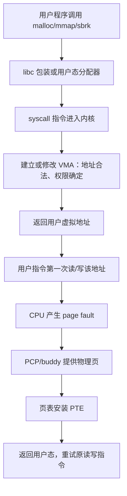

# 统一大程序：从用户态申请到内核物理页

## 0. 这次只围绕一个程序

主源码是：[`00_memory_tour.c`](../../tools/x86-lab/memory-practice/src/00_memory_tour.c)。

它不是把六个分支一次性搅在一起，而是“一个 ELF、一个源码文件、六个可单独选择的入口”：

```sh
/mnt/mm/bin/00_memory_tour mmap
/mnt/mm/bin/00_memory_tour brk
/mnt/mm/bin/00_memory_tour malloc
/mnt/mm/bin/00_memory_tour populate
/mnt/mm/bin/00_memory_tour cow
/mnt/mm/bin/00_memory_tour file
```

每个入口对应一个明确的 C 函数：

| 命令 | 用户源码函数 | 主要内核问题 |
|---|---|---|
| `mmap` | `tour_mmap_lazy` | VMA 何时出现？读零页和首次写怎样分流？ |
| `brk` | `tour_brk` / `tour_brk_child` | program break 怎样扩大 heap VMA？ |
| `malloc` | `tour_malloc` | libc 何时复用 chunk，何时选择 brk/mmap？ |
| `populate` | `tour_populate` | 为什么物理页可能在 mmap 返回前准备？ |
| `cow` | `tour_cow` | fork 后子进程第一次写为什么进入 `do_wp_page`？ |
| `file` | `tour_file` | 文件 fault、page cache、shared 写回和 private COW 怎样关联？ |

启动期 `E820/memblock/free_area_init` 不再是这条学习路线的前置内容。运行用户程序时，buddy 确实已经初始化完成；我们从“现成的 buddy 怎样被一次用户缺页使用”开始追。如果追到 `__alloc_pages` 后想知道库存来源，再回看启动附录。

## 1. 先建立唯一正确的分层模型

一句“程序申请内存”至少包含四件不同的事：



四个问题必须分别回答：

1. 谁决定返回哪个用户虚拟地址？
2. 哪个系统调用建立或扩大 VMA？
3. 哪一次用户访问真正需要物理页？
4. free/munmap 后，地址范围、PTE、物理页分别怎样结束生命周期？

## 2. 构建和启动

先退出旧实验 QEMU。Mac 终端 A：

```bash
cd /Users/xuyu/Desktop/code/linux5.15_comment
bash tools/x86-lab/memory-practice/build.sh
bash tools/x86-lab/memory-practice/run.sh --gdb
```

guest 出现 shell 后：

```sh
mkdir -p /mnt/mm
mount -o ro /dev/sdb /mnt/mm
/mnt/mm/start-observer-console
```

Mac 终端 B：

```bash
bash tools/x86-lab/memory-practice/connect-observer.sh
```

终端 B 只观察目标 PID：

```sh
/mnt/mm/mm-observe PID
cat /proc/PID/maps
cat /proc/PID/smaps_rollup
```

## 3. CLion 同时认识用户程序和内核

CLion Remote Debug 保持：

```text
target remote: 127.0.0.1:1236
Symbol file: /Users/xuyu/Desktop/code/linux5.15_comment/out/x86-lab/vmlinux
Remote path: /home/xuyu.guest/x86-linux-lab-work/linux-src
Local path:  /Users/xuyu/Desktop/code/linux5.15_comment
```

`vmlinux` 让 CLion 认识内核符号，但默认不认识 `00_memory_tour` 的用户符号。连接成功后，在 CLion 的 GDB Console 输入：

```gdb
source /Users/xuyu/Desktop/code/linux5.15_comment/tools/x86-lab/memory-practice/gdb/clion-tour.gdb
```

这个文件执行：

```gdb
add-symbol-file /Users/xuyu/Desktop/code/linux5.15_comment/out/x86-lab/memory-practice/00_memory_tour
```

因为用户 ELF 使用 `-fno-pie -no-pie`，代码地址固定，可以和内核 `vmlinux` 符号同时加载。检查：

```gdb
info address tour_mmap_lazy
info address checked_mmap
info address mmap
info address __x64_sys_mmap
```

前面三个地址通常在低地址用户空间，`__x64_sys_mmap` 在高地址内核空间。不要把它们看成同一个 `mmap` 函数。

QEMU stub 控制整台虚拟机，不是只跟踪一个 Linux PID。用户程序尚未映射时，普通软件断点可能无法写入该地址；本实验快捷命令使用 `hbreak` 硬件断点。硬件断点按虚拟指令地址命中，所以必须在正确 CHECKPOINT 时启用，并在完成一段后删除，避免其他静态程序碰巧使用相同地址。

## 4. 第一轮只调 mmap：从 C 到 VMA

### 4.1 用户程序先停在系统调用前

终端 A：

```sh
/mnt/mm/bin/00_memory_tour mmap
```

停在 `L0-before-mmap`，暂时不要按 Enter。CLion GDB Console：

```gdb
delete breakpoints
tour-break-mmap
continue
```

回终端 A 按 Enter，预期依次观察：

```text
tour_mmap_lazy                 本程序的实验函数
→ checked_mmap                lab.h 中的错误检查包装
→ glibc mmap / __mmap64       用户态 libc 包装器
→ syscall                     CPU 特权级切换
→ __x64_sys_mmap              内核系统调用包装入口
→ arch/x86/.../sys_x86_64.c   SYSCALL_DEFINE6(mmap)
→ ksys_mmap_pgoff
→ vm_mmap_pgoff
→ do_mmap
→ get_unmapped_area           选择地址
→ mmap_region                 建立或合并 VMA
```

在 `checked_mmap` 可以看六个用户参数：

```gdb
info args
p/x address
p length
p/x prot
p/x flags
p fd
p offset
```

在 glibc `mmap` 没有配套 C 源码时看汇编：

```gdb
disassemble mmap
```

x86-64 关键动作是把系统调用号 9 放进 RAX，然后执行 `syscall`。系统调用参数使用 RDI、RSI、RDX、R10、R8、R9。libc 包装器很薄；VMA 逻辑在内核，不在 `<sys/mman.h>`。

### 4.2 mmap 返回后先证明“只有地址范围”

程序到 `L1-mmap-returned` 后打印 `MMAP_BASE`。终端 B：

```sh
cat /proc/PID/maps
/mnt/mm/mm-observe PID
```

找到覆盖 `[MMAP_BASE, MMAP_END)` 的 `rw-p` 区间。此时通常看到：

```text
VMA：有
PTE：目标数据页通常还没有
mincore：000
```

这一步只证明 mmap 建立合法匿名区间，不要说成“已经拿到三个物理页”。

## 5. 第二轮调访问：zero page、匿名页、PTE

### 5.1 第一次只读

在 `L1` 抄下 BASE。删除 mmap 断点，然后给实际 BASE 下条件断点：

```gdb
delete breakpoints
set $base = 0x本轮实际MMAP_BASE
break handle_mm_fault if address == $base
continue
```

终端 A 按 Enter，执行：

```c
first_read = p[0];
```

内核主线：

```text
用户 load 指令
→ CPU #PF
→ asm_exc_page_fault
→ exc_page_fault
→ do_user_addr_fault
→ handle_mm_fault
→ __handle_mm_fault
→ handle_pte_fault
→ do_anonymous_page
→ 安装共享只读 zero page PTE
→ 返回并重试用户 load
```

命中后检查：

```gdb
p/x address
p/x vma->vm_start
p/x vma->vm_end
p/x vma->vm_flags
set $tour_mm = vma->vm_mm
bt 10
```

### 5.2 对同一地址第一次写

程序停到 `L2-zero-page-read`。地址仍是 BASE，但现在是写。可在 `do_wp_page` 和 `wp_page_copy` 下断点：

```gdb
delete breakpoints
break do_wp_page if vmf->address == $base
break wp_page_copy if vmf->address == $base
continue
```

终端 A 按 Enter，执行 `p[0] = 0x11`。共享零页 PTE 不可写，所以 CPU 再次 fault；内核为当前 mm 准备私有可写页，并让 PTE 指向它。

### 5.3 第 2 页第一次就是写

程序停在 `L3-private-page0`。目标地址是 `BASE + 2 * 4096`：

```gdb
delete breakpoints
set $page2 = $base + 2 * 4096
break handle_mm_fault if address == $page2
break do_anonymous_page if vmf->address == $page2
continue
```

这次没有先安装 zero page，常见主线是：

```text
do_anonymous_page
→ alloc_zeroed_user_highpage_movable
→ alloc_pages_vma
→ __alloc_pages
→ get_page_from_freelist
→ rmqueue
→ PCP 命中，或 PCP 从 buddy 补货
→ mk_pte
→ set_pte_at
```

只有在已经停住本次目标 fault 后，才临时增加 `__alloc_pages` 断点。它是全系统高频函数；不结合调用栈就不能证明某次命中属于目标数据页。页表页本身也会调用页分配器。

## 6. brk：显式扩大传统 heap

运行：

```sh
/mnt/mm/bin/00_memory_tour brk
```

该实验先 fork 一个短命子进程，再由子进程执行 sbrk/brk。原因是直接改变 program break 可能干扰 glibc malloc 对 heap 的管理；子进程退出后，它的整个 mm 被回收，不污染主程序后续分支。

在 `B0-before-sbrk`：

```gdb
delete breakpoints
tour-break-brk
continue
```

用户到内核：

```text
tour_brk_child
→ glibc sbrk
→ glibc brk wrapper
→ syscall
→ __x64_sys_brk
→ mm/mmap.c: SYSCALL_DEFINE1(brk)
→ 增长时 do_brk_flags
→ vma_merge，或分配并链接新 VMA
```

在 `B1-brk-grown`，heap 范围已经扩大，但两页数据仍可能未驻留。下一次按 Enter 执行 `p[0]` 和 `p[ps]`，才分别触发缺页。观察终端查看子 PID 的 `[heap]`，不要误看父 PID。

## 7. malloc：先在用户态决定，再选择 brk/mmap

运行：

```sh
/mnt/mm/bin/00_memory_tour malloc
```

在 `M0`：

```gdb
delete breakpoints
tour-break-malloc
continue
```

你要记录的不是“malloc 必然走哪条路”，而是本轮事实：

| 阶段 | 看什么 | 判断 |
|---|---|---|
| M0→M1 | 是否命中 `__x64_sys_brk/mmap`；BREAK 是否变化 | 小块复用还是向内核扩展 |
| M2→M3 | LARGE 是否落在独立 maps 区间 | 1 MiB 是否由 mmap 支撑 |
| M3→M4 | 只写首尾，RSS 怎样变化 | 虚拟长度不等于全部驻留 |
| M4→M5 | 是否命中 munmap；BREAK 是否回退 | 大块归还和小块缓存的区别 |

用户态 glibc 可观察：

```gdb
info address malloc
info functions _int_malloc
info functions sysmalloc
disassemble malloc
```

当前 ELF 有 libc 函数符号，但没有匹配 glibc 源码调试包，所以这一层通常以函数符号和汇编观察；到 `brk/mmap` 边界后继续读完整 Linux 源码。

## 8. 三个重要分支

### 8.1 MAP_POPULATE

```sh
/mnt/mm/bin/00_memory_tour populate
```

```gdb
delete breakpoints
tour-break-populate
continue
```

普通映射常在返回时 `000`；populate 映射常在返回时 `111`。关键区别是内联包装 `mm_populate` 进入可断点的 `__mm_populate`，在 mmap 返回用户态前主动 fault-in。它不承诺物理连续，也不等于永久锁页。

### 8.2 fork COW

```sh
/mnt/mm/bin/00_memory_tour cow
```

在 C1 记录 `COW_BASE` 和 `COW_CHILD_PID`，再设置 `do_wp_page/wp_page_copy` 地址条件。子写 `C` 后，父必须仍读到 `P`。相同虚拟地址属于不同 mm；地址相同不代表写后继续指向同一个 PFN。

### 8.3 文件映射

```sh
/mnt/mm/bin/00_memory_tour file
```

读取时追 `filemap_fault`；写 shared 后文件变 `S`；写 private 后私有视图变 `P`，文件和 shared 仍为 `S`。这把 page cache 和匿名 COW 放到同一实验中。

## 9. 每轮只保留这些证据

建议抄到笔记：

```text
模式：mmap / brk / malloc / populate / cow / file
用户函数：
CHECKPOINT：
PID：
目标虚拟地址：
VMA 起止和 flags：
当前 mm：
触发动作：系统调用 / 用户读 / 用户写 / free
命中的内核函数：
调用栈：
动作前 maps/mincore/RSS：
动作后 maps/mincore/RSS：
结论：改变的是 allocator、VMA、PTE、struct page 还是 free list？
```

如果结论没有绑定本轮 PID、地址、CHECKPOINT 和调用栈，就只是源码猜测，不是调试证据。

## 10. 最推荐的学习节奏

第一天只调 `mmap` 的 L0→L1，确认用户态到内核系统调用和 VMA。第二天调 L1→L4，确认读零页、同页写 COW、另一页首次写。第三天调 `brk` 和 `malloc`，理解 libc 与内核的边界。最后再做 populate、fork COW 和文件映射。

不要一开始运行 `all` 并给十几个高频函数下断点。`all --auto` 只用于验证程序完整性，不是源码学习方式。
