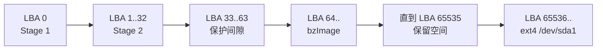
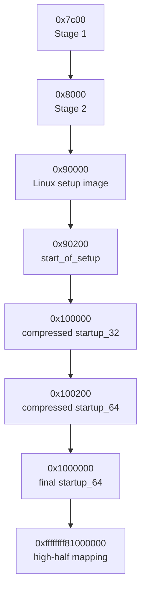

# Linux 5.15 无 GRUB 原生 setup 启动实验

本目录实现一个完全独立的两阶段 BIOS 教学 loader。它不修改 Linux 5.15 源码、不替换现有 GRUB 脚本，也不使用 QEMU `-kernel`、`-append` 或 `-initrd`。

最终目标是从完整 raw 硬盘启动，并观察 GRUB 32 位 boot protocol 会跳过的 Linux 16 位 setup 主线：

```text
SeaBIOS
  → Stage 1 @ 0x7c00
  → Stage 2 @ 0x8000
  → Linux start_of_setup @ 0x90200
  → arch/x86/boot/main.c
  → arch/x86/boot/pm.c
  → arch/x86/boot/pmjump.S
  → compressed startup_32 @ 0x100000
  → compressed startup_64 @ 0x100200
  → 正式内核 startup_64 @ 0x1000000
  → x86_64_start_kernel()
  → start_kernel()
  → /dev/sda1:/init
```

这里常见的地址是：

```text
0x00007c00 = BIOS MBR 入口
0x00008000 = Stage 2
0x00090200 = Linux 16 位 setup 入口
0x00100000 = 1 MiB，compressed startup_32
0x00100200 = 1 MiB + 0x200，compressed startup_64
0x01000000 = 16 MiB，解压后的正式 kernel startup_64
```

请特别区分：

```text
0x00100000 = 1 MiB
0x01000000 = 16 MiB
```

---

## 1. 为什么需要一个自制 loader

Linux 5.15 的 `arch/x86/boot/header.S:bootsect_start` 不再包含完整磁盘加载逻辑。如果直接把 `bzImage` 放到 LBA 0，代码只会打印：

```text
Use a boot loader.
```

因此“完全不需要 loader，让 Linux 5.15 从 `0x7c00` 自己读取自身”不可行。

本实验采用最小折中：

- `0x7c00～0x90200` 是独立、带源码的教学 loader；
- 从 `0x90200` 开始是未经修改的 Linux 5.15 16 位 setup；
- loader 不实现菜单、文件系统、模块、网络或通用操作系统加载；
- loader 只按固定 LBA 读取 `bzImage`，遵守 Linux x86 boot protocol。

这比修改 `header.S` 重新塞回历史 `bootsect.s` 更独立，也更容易与上游 Linux 对照。

---

## 2. 文件说明

```text
tools/x86-lab/native/
├── README.zh-CN.md                  本文档
├── build-disk.sh                    Mac 包装器
├── build-disk-in-vm.sh              Lima 中的实际构建/封装/校验
├── run.sh                           无 GDB 正常启动
├── run-debug.sh                     QEMU -S/-gdb 调试启动
└── loader/
    ├── stage1.S                     0x7c00 MBR，详细逐段注释
    ├── stage1.ld                    Stage 1 链接地址 0x7c00
    ├── stage2.S                     bzImage/setup 加载器，详细逐段注释
    └── stage2.ld                    Stage 2 链接地址 0x8000
```

所有现有 GRUB 文件保持不变。两种镜像可以同时存在：

```text
out/x86-lab/grub-bios-disk.img     原 GRUB 实验
out/x86-lab/native-bios-disk.img   新 native setup 实验
```

---

## 3. 一键构建和运行

先确保基础产物存在：

```bash
cd /Users/xuyu/Desktop/code/linux5.15_comment
tools/x86-lab/build/build.sh
```

构建 native 硬盘：

```bash
tools/x86-lab/native/build-disk.sh
```

启动：

```bash
tools/x86-lab/native/run.sh
```

退出 QEMU：

```text
按住 Ctrl 按 A
全部松开
按 X
```

实际 QEMU 命令的核心是：

```bash
qemu-system-x86_64 \
  -machine pc \
  -accel tcg,thread=single \
  -cpu max \
  -m 512M \
  -smp 1 \
  -hda out/x86-lab/native-bios-disk.img \
  -boot c \
  -nographic \
  -no-reboot
```

没有：

```text
-kernel
-append
-initrd
GRUB
```

---

## 4. 构建产物

```text
out/x86-lab/native-bios-disk.img       最终 512 MiB raw 硬盘
out/x86-lab/native-mbr.bin             从最终硬盘提取的真实 MBR
out/x86-lab/native-stage1.bin          Stage 1 512-byte 模板
out/x86-lab/native-stage1.elf          Stage 1 GDB 符号
out/x86-lab/native-stage1.map          Stage 1 链接 map
out/x86-lab/native-stage1.asm          16 位离线反汇编
out/x86-lab/native-stage2.bin          Stage 2 裸二进制
out/x86-lab/native-stage2.elf          Stage 2 GDB 符号
out/x86-lab/native-stage2.map          Stage 2 链接 map
out/x86-lab/native-stage2.asm          16 位离线反汇编
out/x86-lab/native-bzimage-layout.env  本次 bzImage header 摘要
out/x86-lab/native-bios-disk.SHA256SUMS
```

如果主内核构建的 `O=` 目录仍存在，还会额外导出：

```text
out/x86-lab/native-linux-setup.elf
out/x86-lab/native-linux-compressed-vmlinux
```

缺少这两个可选文件不影响启动；地址断点仍然有效。

---

## 5. 磁盘结构

固定布局：

```text
扇区大小 = 512 字节

LBA 0                 Stage 1 MBR
LBA 1～32             Stage 2 的 32 扇区预留区
LBA 33～63            空闲保护间隙
LBA 64～              原始 bzImage
LBA 65536～589823     256 MiB ext4，Linux /dev/sda1
LBA 589824～末尾      未分配
```



为什么 rootfs 从 LBA 65536 开始：

```text
65536 × 512 = 32 MiB
```

当前约 9 MiB 的 `bzImage` 可以安全放在分区前。构建脚本会动态检查其结束 LBA，若将来内核膨胀到碰到 rootfs，会直接失败，而不是生成相互覆盖的镜像。

---

## 6. 内存结构

### 6.1 Linux setup 交接前

```text
物理地址

0x00007c00  Stage 1 MBR
0x00008000  Stage 2
0x00010000  BIOS 读盘 bounce buffer，32 KiB
0x00090000  bzImage boot sector + real-mode setup
0x00090200  Linux start_of_setup
0x00098000  setup heap/stack 区开始附近
0x00099800  内核命令行
0x00100000  protected-mode compressed kernel
```

### 6.2 Linux setup 之后

Linux 从 `0x90200` 执行自己的 setup，随后跳到：

```text
0x00100000 compressed startup_32
0x00100200 compressed startup_64
```

compressed kernel 最终把正式内核解压到：

```text
物理 0x01000000
虚拟 0xffffffff81000000
```



---

## 7. Stage 1 原理

Stage 1 必须放进 MBR 可用启动代码区域。最终 MBR：

```text
0x000～0x1bd  启动代码和数据，前 446 字节
0x1be～0x1fd  parted 创建的 64 字节分区表
0x1fe～0x1ff  55 aa
```

执行流程：

1. 远跳转规范化 `CS=0`。
2. `DS=ES=SS=0`，`SP=0x7c00`。
3. 保存 BIOS 启动磁盘号 `DL`。
4. 初始化 COM1 115200 8N1。
5. `INT 13h AH=41h` 检查 EDD。
6. 构造 16-byte Disk Address Packet。
7. `INT 13h AH=42h` 从 LBA 1 读取 32 个扇区到 `0000:8000`。
8. 恢复 `DL`，远跳转到 `0000:8000`。

Stage 1 不理解 Linux。其成功标准只是串口出现：

```text
[NATIVE S1] 0x7c00: loading Stage 2...
[NATIVE S1] jump to 0x8000
```

---

## 8. Stage 2 原理

### 8.1 读取并验证 header

Stage 2 先把 `bzImage` 前两个扇区放到 `0x90000`，检查：

```text
offset 0x1f1  setup_sects
offset 0x1f4  syssize
offset 0x1fe  0xaa55
offset 0x202  "HdrS"
offset 0x206  protocol version >= 2.02
offset 0x211  LOAD_HIGH
```

### 8.2 加载完整 real-mode setup

```text
setup total sectors = (setup_sects or 4) + 1
```

当前为：

```text
(27 + 1) × 512 = 14,336 bytes
```

目标：

```text
0x90000～0x937ff
```

### 8.3 计算 protected kernel 大小

`syssize` 的单位是 16-byte paragraph：

```text
一个扇区 = 512 / 16 = 32 paragraphs
protected sectors = ceil(syssize / 32)
                  = (syssize + 31) >> 5
```

### 8.4 为什么需要 bounce buffer

普通 BIOS EDD DAP 使用 `segment:offset` 目标，最适合 1 MiB 以下内存。protected kernel 必须放到 1 MiB，因此 Stage 2 每次读取 64 个扇区：

```text
硬盘 32 KiB
  ↓ INT 13h
0x10000 bounce buffer
  ↓ unreal mode copy
0x100000 以上目标地址
```

### 8.5 unreal mode 是什么

实模式段寄存器有可见 selector 和 CPU 内部 hidden descriptor cache。Stage 2 短暂进入保护模式，把 `ES` 加载成：

```text
base = 0
limit = 4 GiB
```

然后退出保护模式但不立即重载 `ES`。CPU 暂时保留 4 GiB hidden limit，于是可用：

```asm
addr32 rep movsl
```

把 `DS:ESI=0x10000` 的数据复制到 `ES:EDI=0x100000` 以上。每次复制后恢复 `DS=ES=0`，下一次 BIOS 调用前不保留 unreal 状态。

### 8.6 写入 boot protocol 字段

```text
type_of_loader = 0xff
loadflags     |= CAN_USE_HEAP
heap_end_ptr   = 0x9600
cmd_line_ptr   = 0x00099800
ramdisk_image  = 0
ramdisk_size   = 0
vid_mode       = 0xffff
```

命令行：

```text
root=/dev/sda1 rw console=ttyS0,115200 init=/init debug
```

### 8.7 交给 Linux

```text
DS=ES=FS=GS=SS=0x9000
SP=0x9800
DL=启动磁盘号
IF=0
```

远跳转：

```asm
ljmp $0x9020, $0x0000
```

物理地址：

```text
0x9020 × 16 + 0 = 0x90200
```

---

## 9. 和 GRUB 路径的区别

| 阶段 | GRUB `linux` | native loader |
|---|---|---|
| `0x7c00` | GRUB boot.img | Stage 1 |
| 后续 loader | GRUB core.img | Stage 2 |
| 读取内核 | ext4 文件 | 固定 LBA 64 |
| `boot_params` | GRUB 完整构造 | loader 填最少字段，setup 自己检测 |
| `header.S:start_of_setup` | 不执行 | 执行 |
| `main.c:main()` | 不执行 | 执行 |
| `pm.c` | 不执行 | 执行 |
| `pmjump.S` | 不执行 | 执行 |
| compressed `startup_32` | 当前 16 MiB | 1 MiB |
| compressed `startup_64` | 当前 16 MiB+0x200 | 1 MiB+0x200 |
| 正式内核 | 16 MiB | 16 MiB |

两条路径从 compressed kernel 开始重新汇合。

---

## 10. GDB/CLion 调试

启动：

```bash
tools/x86-lab/native/run-debug.sh
```

CLion Remote Debug：

```text
target remote 127.0.0.1:1234
```

推荐断点：

```gdb
hbreak *0x7c00
hbreak *0x8000
hbreak *0x90200
hbreak *0x100000
hbreak *0x100200
hbreak *0x1000000
hbreak x86_64_start_kernel
hbreak start_kernel
```

不要在连接前一次设置全部低级断点后直接 Resume；第一次学习建议逐阶段增加。

### 10.1 Stage 1 符号

```gdb
symbol-file /Users/xuyu/Desktop/code/linux5.15_comment/out/x86-lab/native-stage1.elf
target remote 127.0.0.1:1234
hbreak _start
continue
```

Stage 1 ELF 已按实际 `0x7c00` 链接，不需要额外偏移。

### 10.2 添加 Stage 2 符号

```gdb
add-symbol-file /Users/xuyu/Desktop/code/linux5.15_comment/out/x86-lab/native-stage2.elf
hbreak *0x8000
```

Stage 2 ELF 已按 `0x8000` 链接。

### 10.3 Linux setup 符号

如果存在 `native-linux-setup.elf`，其链接 VMA 从 0 开始，而实际加载基址是 `0x90000`：

```gdb
add-symbol-file /Users/xuyu/Desktop/code/linux5.15_comment/out/x86-lab/native-linux-setup.elf -o 0x90000
hbreak *0x90200
```

GDB版本不支持 `-o` 时，先使用地址断点和离线 `setup.elf` 反汇编。

还有一个很重要的实模式显示细节：进入 Linux setup 时实际寄存器是

```text
CS:RIP = 0x9020:0x0000
物理地址 = CS × 16 + RIP = 0x90200
```

QEMU gdbstub/GDB 在这个时刻可能把停止位置显示为 `0x0`，因为它显示的是段内 `RIP=0`，并不代表 CPU 跳到了物理零地址。执行：

```gdb
info registers cs rip
p/x ($cs * 16 + $rip)
```

若看到：

```text
cs  = 0x9020
rip = 0x0
```

就已经正确命中物理 `0x90200`。本实验的实际 GDB 验证正是这个结果。

### 10.4 compressed kernel 符号

如果存在 `native-linux-compressed-vmlinux`：

```gdb
add-symbol-file /Users/xuyu/Desktop/code/linux5.15_comment/out/x86-lab/native-linux-compressed-vmlinux -o 0x100000
hbreak *0x100000
hbreak *0x100200
```

### 10.5 正式内核符号

进入正式内核阶段使用：

```gdb
symbol-file /Users/xuyu/Desktop/code/linux5.15_comment/out/x86-lab/vmlinux
hbreak x86_64_start_kernel
hbreak start_kernel
```

DWARF 编译路径仍需要 CLion Path Mapping：

```text
/home/xuyu.guest/x86-linux-lab-work/linux-src
→ /Users/xuyu/Desktop/code/linux5.15_comment
```

### 10.6 为什么 CLion 可能错误反汇编

一个 GDB 会话跨越：

```text
16 位实模式 → 32 位保护模式 → 64 位长模式
```

CLion 的反汇编模式不一定跟随 CPU 每个阶段。低端阶段若出现 `%rax`、`movsxd` 或内核符号套在 `0x7c00` 附近，不要相信显示结果。

Stage 1/Stage 2 的可靠离线反汇编已经由构建脚本生成：

```text
out/x86-lab/native-stage1.asm
out/x86-lab/native-stage2.asm
```

---

## 11. 调试 Bash 脚本

四个脚本都复用 `tools/x86-lab/common/debug-lib.sh`。

### 11.1 只检查语法

```bash
bash -n \
  tools/x86-lab/native/build-disk.sh \
  tools/x86-lab/native/build-disk-in-vm.sh \
  tools/x86-lab/native/run.sh \
  tools/x86-lab/native/run-debug.sh
```

### 11.2 查看关键变量

```bash
DEBUG_VARS=1 tools/x86-lab/native/build-disk.sh
```

你会看到：

```text
REPO_ROOT
BUILD_DIR
KERNEL_LBA
ROOTFS_LBA
bzimage_bytes
kernel_end_lba
rootfs_end_lba
```

### 11.3 在阶段边界暂停

```bash
DEBUG_VARS=1 DEBUG_STEP=1 tools/x86-lab/native/build-disk.sh
```

`DEBUG_STEP` 是脚本学习断点，不是 CPU 断点。每次出现提示时，可以在另一个终端检查中间文件，再按 Enter 继续。

### 11.4 逐行 trace

```bash
DEBUG_TRACE=1 DEBUG_ERRORS=1 \
DEBUG_VM_LOG=out/x86-lab/native-build-vm.trace \
tools/x86-lab/native/build-disk.sh
```

trace 会显示：

```text
脚本名
行号
函数名
变量展开后的真实命令
```

### 11.5 错误现场

```bash
DEBUG_ERRORS=1 tools/x86-lab/native/build-disk.sh
```

若某条命令失败，ERR trap 会打印：

```text
退出码
源文件
行号
失败命令
Bash 调用栈
```

### 11.6 单独在 Lima 中调试实际构建脚本

```bash
~/.local/bin/limactl shell linux-x86-builder

cd /Users/xuyu/Desktop/code/linux5.15_comment
REPO_ROOT="$PWD" \
DEBUG_TRACE=1 DEBUG_ERRORS=1 \
bash tools/x86-lab/native/build-disk-in-vm.sh
```

### 11.7 哪些步骤不会修改真实磁盘

脚本只操作普通文件：

```text
$HOME/x86-native-loader-work/native-bios-disk.img
out/x86-lab/native-bios-disk.img
```

没有使用 `/dev/disk*`、Mac 物理磁盘或 Lima 物理系统盘，也不需要 loop mount 和 sudo。

---

## 12. 调试汇编 loader

### 12.1 查看 ELF section 和符号

```bash
~/.local/bin/limactl shell linux-x86-builder -- \
  x86_64-linux-gnu-readelf -a \
  /Users/xuyu/Desktop/code/linux5.15_comment/out/x86-lab/native-stage2.elf
```

### 12.2 查看链接 map

```bash
less out/x86-lab/native-stage1.map
less out/x86-lab/native-stage2.map
```

### 12.3 查看原始字节

```bash
xxd -g1 -l 64 out/x86-lab/native-mbr.bin
xxd -g1 -l 64 out/x86-lab/native-stage2.bin
```

### 12.4 验证 MBR 分区表没有被代码覆盖

```bash
xxd -g1 -s 0x1b0 -l 80 out/x86-lab/native-mbr.bin
```

关注：

```text
0x1be  分区项开始
0x1fe  55 aa
```

### 12.5 最值得单步的 Stage 2 位置

通过 `native-stage2.map` 或 GDB 符号观察：

```text
_start
setup_loaded
load_protected_loop
bios_read
copy_bounce_to_high
protected_mode_16
unreal_mode_copy
protected_loaded
```

观察 unreal mode 时重点看：

```text
CR0.PE 的置位和清除
GDTR
ES selector
EDI 目标物理地址
ECX dword 数量
```

---

## 13. 构建脚本的安全校验

构建不会只依赖“QEMU 能不能碰巧启动”，还会提前检查：

1. Stage 1 必须严格为 512 字节。
2. Stage 1 `.org 446` 保证代码不越过分区表。
3. Stage 2 必须不超过 32 个扇区。
4. `bzImage` 必须包含 `0xaa55` 和 `HdrS`。
5. protocol 必须不低于 2.02。
6. `LOAD_HIGH` 必须设置。
7. setup 不得超过 loader 支持的 64 扇区。
8. `bzImage` 结束 LBA 不得碰到 rootfs。
9. rootfs 必须装得进最终磁盘。
10. `e2fsck -fn` 必须通过。
11. 最终 MBR 必须是 `55 aa`。
12. 最终 Stage 2、bzImage 必须与源文件逐字节一致。
13. rootfs superblock 必须包含 ext magic `53 ef`。
14. 导出 SHA-256 校验文件。

---

## 14. 实际验证结果

本实现已在当前 Apple Silicon Mac → Lima ARM64 → QEMU x86_64 环境实际验证。

loader 串口：

```text
[NATIVE S1] 0x7c00: loading Stage 2...
[NATIVE S1] jump to 0x8000
[NATIVE S2] 0x8000: parse bzImage
[NATIVE S2] setup -> 0x90000
[NATIVE S2] compressed kernel -> 0x100000
[NATIVE S2] compressed kernel loaded
[NATIVE S2] jump to Linux setup 0x90200
early console in setup code
```

Linux 后续确认：

```text
Command line: root=/dev/sda1 rw console=ttyS0,115200 init=/init debug
sda: sda1
EXT4-fs (sda1): mounted filesystem
VFS: Mounted root (ext4 filesystem) on device 8:1
Run /init as init process
```

最终进入：

```text
Linux 5.15 x86_64 + BusyBox 已从 QEMU IDE 硬盘启动
rootfs: /dev/sda1 (ext4)
~ #
```

---

## 15. 当前边界

这是教学 loader，不是通用 bootloader。它有意只支持：

```text
传统 PC BIOS
INT 13h Extensions
512-byte logical sectors
x86 bzImage protocol >= 2.02
LOAD_HIGH bzImage
固定 LBA 布局
无 initrd
rootfs=/dev/sda1
```

它没有：

```text
UEFI
GPT
ext4 文件查找
菜单
多内核选择
initrd
安全启动
签名验证
跨机器 BIOS 兼容性保证
```

这些限制不是遗漏，而是为了让实验保持小、透明、可单步。

---

## 16. 推荐学习顺序

1. 先运行一次 `tools/x86-lab/native/run.sh`，确认整条链成功。
2. 阅读 `stage1.S`，配合 `native-stage1.asm`。
3. 在 `0x7c00` 断点观察 `DL`、DAP 和 `INT 13h`。
4. 阅读 `stage2.S` 的 header 解析。
5. 在 `0x8000` 和 `load_protected_loop` 单步。
6. 理解 bounce buffer 和 unreal mode。
7. 在 `0x90200` 观察 Linux `start_of_setup`。
8. 跟进 `main.c → pm.c → pmjump.S`。
9. 在 `0x100000/0x100200` 观察 compressed kernel。
10. 在 `0x1000000` 观察正式内核。
11. 最后用 `vmlinux` 断在 `start_kernel()`。

这条顺序能把“磁盘加载”“CPU 模式切换”“解压”和“通用内核初始化”分开理解。
